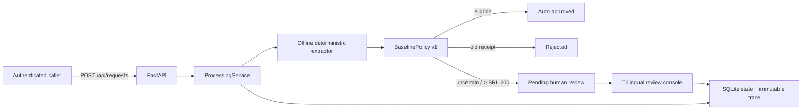

# Expense Agent

Expense Agent is an auditable Python service that receives reimbursement
requests, extracts receipt facts, applies a deterministic financial policy, and
routes exceptional cases to an internal human-review console.

The repository now contains a complete synchronous assessment path:



The model/extractor is evidence-producing infrastructure, never the authority
for money. `BaselinePolicy` is deterministic, versioned, and explainable.

## Implemented scope

- Strict authenticated intake through `POST /api/requests`.
- Exact-ID, all-status results through `GET /api/requests/{request_id}`.
- Idempotency by `request_id` plus a canonical SHA-256 submission fingerprint:
  the same normalized payload replays the stored result; a different payload
  under the same ID returns `409 Conflict`.
- Synchronous processing with visible versions: `received` v1, `processing` v2,
  automated final route v3, and human decision v4.
- A deterministic offline receipt parser for the assignment input shape and a
  separately configurable, bounded HTTPS+JSON extractor adapter.
- Baseline BRL policy with exact `Decimal` money, 90-day age validation in
  `America/Sao_Paulo`, amount/category consistency checks, and explicit reason
  codes plus rule evaluations.
- One-to-many immutable processing attempts with provider/model/prompt/input/
  output hashes, timing, parameters, protected raw response, and status.
- Business, technical, and security audit-event scopes. The normal reviewer
  timeline exposes only a sanitized business projection.
- Server-side searched, filtered, sorted, cursor-paginated pending queue; table,
  cards, detail view, and Portuguese/English/Spanish presentation.
- Atomic human approve/reject with mandatory rationale, server-derived actor,
  `ETag`/`If-Match`, immutable decision, status transition, and audit event.
- HTTP Basic/PBKDF2, CSRF, exact-origin checks, restrictive browser headers,
  HTTPS enforcement outside explicitly configured local development, and CI.

The assessment deliberately does **not** implement receipt-byte upload or
download, a submitter portal, a privileged audit UI, asynchronous queues, or
AWS infrastructure. Attachment strings are references only. SQLite and HTTP
Basic are local assessment adapters.

Release gates prevent real monetary use: the caller currently supplies the
timestamp that anchors receipt age; the caller supplies OCR text without a
checksum-bound original file and controlled OCR; every configured Basic account
has global scope without object authorization or separation of duties; not all
authentication/read/search/error/access operations are audited; and a crash can
leave processing v2 stranded without recovery. The
[final report](docs/final-report.md) treats these as production blockers, not
optional polish.

## Run locally

Requirements: Python 3.11+ and [`uv`](https://docs.astral.sh/uv/).

```bash
uv sync --all-groups
uv run expense-agent-hash-password
```

The password helper asks for a local password and prints a PBKDF2 hash. Export
the following values in the shell that will run the service; replace the sample
hash and keep the plaintext password for the browser/curl login:

```bash
export EXPENSE_AGENT_DATABASE_PATH=./data/expense-agent.sqlite3
export EXPENSE_AGENT_REVIEWERS_JSON='[{"username":"reviewer","reviewer_id":"local:reviewer","email":"reviewer@example.com","display_name":"Finance Reviewer","password_hash":"paste-generated-hash"}]'
export EXPENSE_AGENT_CSRF_SECRET='local-demo-only-change-this-secret-123456'
export EXPENSE_AGENT_REQUIRE_HTTPS=false
export EXPENSE_AGENT_ALLOWED_HOSTS=localhost,127.0.0.1
export EXPENSE_AGENT_FORWARDED_ALLOW_IPS=127.0.0.1
export EXPENSE_AGENT_HOST=127.0.0.1
export EXPENSE_AGENT_PORT=8000
uv run expense-agent-review
```

Open `http://127.0.0.1:8000/reviews` and authenticate with `reviewer` and the
plaintext password used to create the hash. Local HTTP is intentional only for
this demonstration; production keeps HTTPS enabled.

### End-to-end intake and review demo

In another shell, set the same local username/password and request a CSRF token:

```bash
export EA_BASE_URL=http://127.0.0.1:8000
export EA_REVIEW_USER=reviewer
export EA_REVIEW_PASSWORD='the-local-plaintext-password'
export EA_CSRF_TOKEN="$(
  curl --silent --user "$EA_REVIEW_USER:$EA_REVIEW_PASSWORD" \
    "$EA_BASE_URL/api/session" \
  | python -c 'import json, sys; print(json.load(sys.stdin)["csrf_token"])'
)"
```

Submit the third assignment sample. It is routed to human review because it is
above BRL 200 and its hotel date extraction carries explicit uncertainty:

```bash
python -c 'import json; print(json.dumps(json.load(open("examples/sample_requests.json"))[2]))' \
| curl --silent --show-error \
    --user "$EA_REVIEW_USER:$EA_REVIEW_PASSWORD" \
    --header "Content-Type: application/json" \
    --header "Origin: $EA_BASE_URL" \
    --header "X-CSRF-Token: $EA_CSRF_TOKEN" \
    --header "X-Correlation-ID: local-intake-demo" \
    --data-binary @- \
    "$EA_BASE_URL/api/requests"
```

Refresh `/reviews`, open `REQ-0003`, inspect the claim, OCR facts, rule evidence,
and business timeline, then approve or reject it with a rationale. The decision
moves the reimbursement from pending v3 to its final v4 state. The safe all-
status result can also be retrieved directly:

```bash
curl --silent --user "$EA_REVIEW_USER:$EA_REVIEW_PASSWORD" \
  "$EA_BASE_URL/api/requests/REQ-0003"
```

To demonstrate only the review screen with fictional cases, use a fresh
database and run `uv run expense-agent-seed-demo` before starting the service.

## API summary

| Method | Path | Purpose |
| --- | --- | --- |
| `GET` | `/api/session` | Authenticated reviewer identity and short-lived CSRF token. |
| `POST` | `/api/requests` | Strict intake, synchronous extraction/policy, idempotent result. |
| `GET` | `/api/requests/{request_id}` | Safe exact-ID lookup across every retained status. |
| `GET` | `/api/reviews` | Bounded server-side pending-queue discovery. |
| `GET` | `/api/reviews/{request_id}` | Review evidence plus ETag. |
| `GET` | `/api/reviews/{request_id}/events` | Sanitized cursor-paginated business timeline. |
| `POST` | `/api/reviews/{request_id}/decisions` | Atomic human decision; requires CSRF, origin, and `If-Match`. |

OpenAPI routes are disabled in the shipped HTTP adapter. See
[feature documentation](docs/features.md) for request/response and error
semantics.

## Verify

```bash
uv run --frozen pytest
uv run --frozen ruff check src tests
uv build
```

The final local quality run passed **140/140 tests with warnings treated as
errors**, Ruff, JavaScript syntax validation, and `git diff --check`. The GitHub
Actions workflow uses commit-pinned actions, a frozen lockfile, and pinned
build-system dependencies; it runs tests, Ruff, and sdist/wheel build on every
push and pull request. Dependabot monitors both Python and Actions dependencies.

## Documentation

Start at the [documentation index](docs/README.md). The
[final report](docs/final-report.md) summarizes requirements, decisions,
evidence, trade-offs, and honest production gaps. The accepted AWS hybrid
serverless architecture remains a documented target only; no cloud resources
or IaC are present in this repository.
