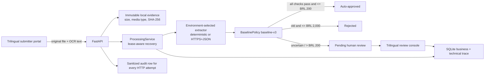

# Expense Agent

Expense Agent is an auditable Python service that receives reimbursement
requests, preserves original receipt evidence, extracts receipt facts, applies
a deterministic financial policy, and routes exceptional cases to an internal
human-review console. It is a complete code-assessment implementation and an
executable AWS sandbox, not a production payment system.

The repository now contains a complete synchronous assessment path:



The model/extractor is evidence-producing infrastructure, never the authority
for money. `BaselinePolicy` is deterministic, versioned, and explainable.

## Implemented scope

- Standalone trilingual submitter portal at `/submit`, with original-file
  upload, strict intake, and exact-ID status tracking.
- Strict authenticated intake through `POST /api/requests`; public HTTP intake
  accepts only application-managed evidence references.
- Exact-ID, all-status results through `GET /api/requests/{request_id}`.
- Idempotency by `request_id` plus a canonical SHA-256 submission fingerprint:
  the same normalized payload replays the stored result; a different payload
  under the same ID returns `409 Conflict`.
- Synchronous processing with visible versions: without lease recovery,
  `received` is v1, `processing` v2, the automated route v3, and a human
  decision v4. Every recovered run consumes another version.
- A deterministic offline receipt parser for the assignment input shape and an
  environment-selectable, bounded HTTPS+JSON extractor adapter.
- `baseline-v3` BRL policy with exact `Decimal` money, a receipt-evidence gate,
  90-day age validation in `America/Sao_Paulo`, amount/category consistency,
  and explicit reason codes plus versioned rule evaluations.
- A non-bypassable `> BRL 2,000` review gate. If deterministic rejection
  evidence also exists, the reviewer must confirm rejection and cannot approve.
- One-to-many immutable processing attempts with provider/model/prompt/input/
  output hashes, timing, parameters, protected raw response, and status.
- Business, technical, and security event scopes plus a separate append-only
  operational row for every HTTP attempt. The normal reviewer timeline exposes
  only a sanitized business projection.
- Server-side searched, filtered, sorted, cursor-paginated pending queue; table,
  cards, detail view, and Portuguese/English/Spanish presentation.
- Atomic human approve/reject with mandatory rationale, server-derived actor,
  `ETag`/`If-Match`, a durable `Idempotency-Key`, immutable decision, status
  transition, and audit event. Approval revalidates every original at decision
  time; a missing/corrupt/unverifiable original can only support rejection and
  its integrity state is recorded.
- Explicit assessment roles (`submitter`, `reviewer`, `auditor`, `admin`),
  owner-only submitter result access, and a self-review prohibition enforced in
  both the HTTP and application-service boundaries.
- Immutable JPEG/PNG/PDF envelopes with opaque IDs, media/signature validation,
  SHA-256 verification on every read, case-scoped authenticated download, and
  evidence-access auditing.
- Five-minute processing leases: an identical retry can recover an expired run,
  append abandonment/resume evidence, and fence the stale worker.
- HTTP Basic/PBKDF2, CSRF, exact-origin checks, restrictive browser headers,
  HTTPS enforcement outside explicitly configured local development, and CI.
- A tested Mangum Lambda adapter and one-command AWS SAM assessment sandbox
  package with an HTTPS API, private VPC, encrypted/retained EFS, bounded
  concurrency, logs, alarms, automatic sample seed, and explicit safety labels.
- A reproducible execution identity: policy version, immutable build ID, and a
  secret-safe effective-configuration SHA-256 are retained with processing,
  human decisions, timelines, and every HTTP-operation event.

The assessment deliberately does **not** implement binary OCR bound to the
stored file, malware scanning/quarantine, an audit-administration UI,
asynchronous queues, or the accepted production AWS infrastructure. SQLite,
filesystem evidence, HTTP Basic, configuration-backed roles, and the direct API
Gateway/Lambda/EFS sandbox are assessment adapters; they are not approved
financial-production components.

Release gates still prevent real monetary use: the client supplies the
timestamp that anchors receipt age and the OCR text; the local evidence has no
malware state, S3 object version, retention workflow, or cryptographic binding
to the OCR invocation; authorization has no team/tenant/assignment/value
policy; recovery is retry-triggered rather than supervised; and the local audit
has no transactional outbox or approved off-host WORM export. The
[final report](docs/final-report.md) treats these as production blockers.
Cross-request receipt reuse is also not yet classified: production must index
the object checksum/version and route policy-approved possible duplicates to
review instead of silently treating equal bytes under different request IDs as
independent evidence.

## Run locally

Requirements: Python 3.11+ and [`uv`](https://docs.astral.sh/uv/).

```bash
uv sync --all-groups
uv run expense-agent-hash-password
```

The password helper asks for a local password and prints a PBKDF2 hash. Export
the following values in the shell that will run the service; replace the sample
hash and keep the plaintext password for the browser/curl login:

```bash
export EXPENSE_AGENT_DATABASE_PATH=./data/expense-agent.sqlite3
export EXPENSE_AGENT_BUILD_ID=local-unversioned
export EXPENSE_AGENT_REVIEWERS_JSON='[{"username":"reviewer","reviewer_id":"local:reviewer","email":"reviewer@example.com","display_name":"Finance Reviewer","password_hash":"paste-generated-hash","roles":["admin"]}]'
export EXPENSE_AGENT_CSRF_SECRET='local-demo-only-change-this-secret-123456'
export EXPENSE_AGENT_REQUIRE_HTTPS=false
export EXPENSE_AGENT_ALLOWED_HOSTS=localhost,127.0.0.1
export EXPENSE_AGENT_FORWARDED_ALLOW_IPS=127.0.0.1
export EXPENSE_AGENT_ATTACHMENT_ROOT=./data/attachments
export EXPENSE_AGENT_ATTACHMENT_MAX_BYTES=4194304
export EXPENSE_AGENT_EXTRACTOR_MODE=deterministic
export EXPENSE_AGENT_HOST=127.0.0.1
export EXPENSE_AGENT_PORT=8000
uv run expense-agent-review
```

Open `http://127.0.0.1:8000/submit` to upload and track a synthetic request, or
`http://127.0.0.1:8000/reviews` to inspect the review queue. Authenticate with
`reviewer` and the plaintext password used to create the hash. Local HTTP is
intentional only for this demonstration; production keeps HTTPS enabled.

Credential JSON may contain multiple principals with separate roles. Use one
`submitter` identity and another `reviewer` identity when demonstrating the
four-eyes flow. The one-account `admin` quick start can exercise both screens,
but it cannot decide a request submitted under its own email.

### End-to-end intake and review demo

For the complete browser path:

1. Open `/submit`, select a synthetic JPEG, PNG, or PDF, paste the corresponding
   OCR text, and submit the claim. The browser uploads the bytes first and then
   sends only the opaque managed reference in the strict JSON command.
2. Keep the generated request ID. The same screen can find its authorized state
   across pending and final statuses without walking queue pages.
3. Sign in as a distinct `reviewer` principal, open `/reviews`, and search for
   the request ID. Open the case to inspect the original file, OCR text,
   extracted object, deterministic rules, problems, and business timeline.
4. Record approve/reject plus rationale. The command uses `If-Match` and one
   durable idempotency key, so an ambiguous browser retry cannot create a second
   decision.

To demonstrate the reviewer screen with two local synthetic pending fixtures,
use a fresh database and run `uv run expense-agent-seed-demo` before starting
the service. The command creates managed PDF evidence and is idempotent. The
separate AWS seed exercises all three assignment cases through HTTPS.

## Deploy the assessment sandbox on AWS

The repository now contains a deliberately non-production, plug-and-play AWS
deployment for reviewers who need a real HTTPS URL. After installing Python
3.11+, AWS CLI, SAM CLI, Docker, uv, Git, and OpenSSL, run:

```bash
./deploy/aws/deploy.sh
```

The script validates and builds the Lambda artifact in the AWS Python 3.12
x86_64 build container, deploys API Gateway/Lambda/VPC/EFS through
CloudFormation, derives an auditable build identity from a clean Git commit and
`uv.lock`, prompts for a reviewer password without echoing it, creates a
separate one-run synthetic seed actor, and submits the three assignment
examples through HTTPS. It does not require an existing RecargaPay service.

Use only a dedicated AWS sandbox account and synthetic data. SQLite over EFS is
an experimental packaging bridge with bounded concurrency, not an authoritative
financial database or a million-request design. The accepted production target
still requires Aurora/outbox, Cognito/BFF, private versioned S3 evidence,
SQS/DLQ workers, CloudFront/WAF, object authorization, and the documented
governance/recovery gates. See the complete [AWS sandbox runbook](deploy/aws/README.md).

## API summary

| Method | Path | Purpose |
| --- | --- | --- |
| `GET` | `/submit` | Framework-free submit/upload/track portal for submitter or admin. |
| `GET` | `/reviews` | Framework-free review console for reviewer, auditor, or admin. |
| `GET` | `/api/session` | Authenticated principal, roles, and short-lived CSRF token. |
| `POST` | `/api/attachments` | Raw allowlisted receipt upload; returns an opaque managed reference. |
| `POST` | `/api/requests` | Strict managed-evidence intake, extraction/policy, and request-ID idempotency. |
| `GET` | `/api/requests/{request_id}` | Safe exact-ID lookup across every retained status. |
| `GET` | `/api/reviews` | Bounded server-side pending-queue discovery. |
| `GET` | `/api/reviews/{request_id}` | Review evidence plus ETag. |
| `GET` | `/api/reviews/{request_id}/attachments/{attachment_id}` | Integrity-checked original file for an authorized case reader. |
| `GET` | `/api/reviews/{request_id}/events` | Sanitized cursor-paginated business timeline. |
| `POST` | `/api/reviews/{request_id}/decisions` | Atomic human decision; requires CSRF, origin, `If-Match`, and `Idempotency-Key`. |

OpenAPI routes are disabled in the shipped HTTP adapter. See
[feature documentation](docs/features.md) for request/response and error
semantics.

## Verify

```bash
uv run --frozen pytest -W error
uv run --frozen ruff check src tests
uv build
```

The final local quality run passed **254/254 tests with warnings treated as
errors**, Ruff, JavaScript syntax validation, and `git diff --check`. The SAM
template passed `sam validate --lint`; the x86_64 ZIP built successfully in the
AWS Python 3.12 build container and imported inside the matching Lambda runtime;
ShellCheck passed for the deployment script. The GitHub
Actions workflow uses commit-pinned actions, a frozen lockfile, and pinned
build-system dependencies; it runs tests, Ruff, and sdist/wheel build on every
push and pull request. Dependabot monitors both Python and Actions dependencies.

## Documentation

Start at the [documentation index](docs/README.md), use the
[central diagram gallery](docs/diagrams.md) for the status-labeled system views,
and read the [final report](docs/final-report.md) for requirements, decisions,
evidence, trade-offs, and honest production gaps. The accepted AWS hybrid
serverless **production** architecture remains a documented target only. The
repository includes deployable SAM IaC for the restricted assessment sandbox,
but no AWS account was mutated and no production Cognito, Aurora, S3 evidence,
SQS, outbox, WAF, or CloudFront resource is claimed.
