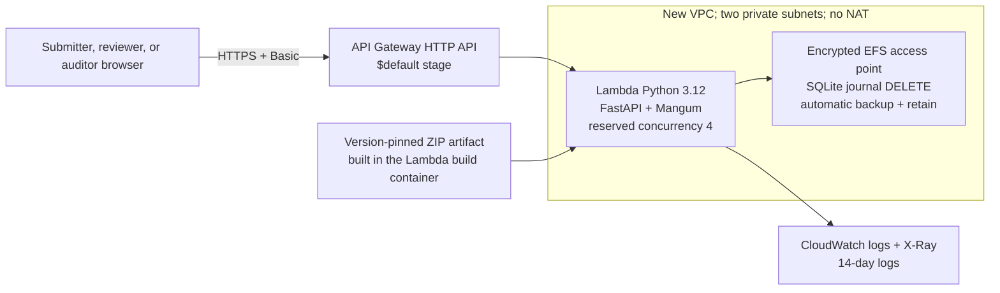

# AWS deployment

This directory provides a one-command **assessment sandbox** deployment and a
production migration checklist. They are deliberately different things:

- `./deploy/aws/deploy.sh` deploys the executable repository as it exists today
  so reviewers can exercise it over an AWS HTTPS URL with synthetic data.
- The accepted financial-production target remains CloudFront/WAF, a private S3
  shell and evidence store, API Gateway/Lambda/SQS, Cognito/BFF, and Aurora with
  an outbox. That target is documented, but its missing adapters are not hidden
  behind a misleading deployment command.

Never send real receipts, personal data, or monetary decisions to the sandbox.
SQLite over EFS is an experimental packaging bridge, not an approved financial
database.

## What the sandbox creates



The direct API Gateway URL is the sandbox HTTPS edge. The application still
provides its own Basic/PBKDF2 identity, CSRF protection, exact Host/Origin
checks, closed assessment roles, object authorization for submitter results,
self-review denial, immutable business/model events, and reviewer attribution.
A separate sanitized ledger records every HTTP attempt, including denied
access, searches, errors, uploads, and original-file reads. API access logs do
not include request bodies, OCR text, credentials, or authorization headers.
Every operational row also carries the immutable build ID and a SHA-256 of the
effective configuration. Processing runs bind policy, build, and configuration
so the executable context can be reconstructed without persisting secrets.

EFS is encrypted, mounted in two Availability Zones, backed up, and retained if
the stack is deleted. Lambda has no NAT route and the default deterministic
extractor makes no provider call. Four concurrent Lambda invocations allow the
browser to load its assets and related case requests, but they also reinforce
why this is not a safe high-scale SQLite design. CloudWatch alarms surface any
Lambda error or throttle; they intentionally have no notification target until
an accountable sandbox operator supplies one.

The EFS Access Point enforces POSIX UID/GID `1000`. The SAM environment passes
that owner as `EXPENSE_AGENT_ATTACHMENT_OWNER_UID`, so the evidence adapter
validates directories against the access-point identity instead of incorrectly
assuming the Lambda process effective UID. Local execution omits the setting
and trusts its own effective UID.

## Prerequisites

Install and configure:

1. [AWS CLI v2](https://docs.aws.amazon.com/cli/latest/userguide/getting-started-install.html)
2. [AWS SAM CLI](https://docs.aws.amazon.com/serverless-application-model/latest/developerguide/install-sam-cli.html)
3. [Docker](https://docs.docker.com/engine/install/) with its daemon running
4. [uv](https://docs.astral.sh/uv/getting-started/installation/)
5. Python 3.11 or newer, available as `python3`
6. Git
7. OpenSSL

The selected AWS principal needs permission to create a CloudFormation stack,
the generated IAM role, VPC/subnets/security groups, Lambda, API Gateway, EFS,
S3 deployment artifacts, CloudWatch Logs, and X-Ray resources. Use a dedicated non-production AWS
account or sandbox OU with a budget alarm. The default region is `sa-east-1`.

Verify the local session before creating resources:

```bash
aws sts get-caller-identity
docker info
sam --version
uv --version
git --version
```

## Deploy in one command

From the repository root:

```bash
./deploy/aws/deploy.sh
```

The script requires a clean Git worktree unless an accountable CI pipeline
supplies `EA_BUILD_ID`. It combines the commit SHA and `uv.lock` SHA-256 into the
default build identity. This prevents a deployment from being labeled with a
commit that does not match the packaged source.

The script:

1. verifies the tools, clean source/build identity, Docker daemon, and current
   AWS identity;
2. warns that the resources are billable and asks for confirmation;
3. reads and confirms a reviewer password without echoing it;
4. generates the interactive password hash, a random CSRF secret, and a random
   one-run credential for a distinct synthetic seed actor locally;
5. validates the SAM template, builds a pinned x86_64 Lambda ZIP inside AWS's
   Python 3.12 build container, and deploys it;
6. reads the HTTPS URL from CloudFormation;
7. generates a valid synthetic PDF in memory for each absent sample, uploads it
   through the managed evidence route, and submits the three provided examples
   through the real HTTPS API;
8. prints the `/reviews` and `/submit` URLs and username.

Neither plaintext password is sent to CloudFormation, and both are unset before
the script exits. The two PBKDF2 hashes and CSRF secret are `NoEcho` stack
parameters, but they remain Lambda environment configuration in this sandbox.
Production must move identity and secret lifecycle to the accepted Cognito/BFF
design.

Typical overrides:

```bash
EA_AWS_PROFILE=my-sandbox \
EA_AWS_REGION=sa-east-1 \
EA_AWS_STACK_NAME=expense-agent-luigy \
EA_ENVIRONMENT_NAME=expense-agent-luigy \
EA_REVIEWER_USERNAME=luigy \
EA_REVIEWER_ID=assessment-luigy \
EA_REVIEWER_EMAIL=luigy@example.com \
EA_REVIEWER_DISPLAY_NAME="Luigy Gabriel" \
./deploy/aws/deploy.sh
```

For non-interactive CI, set `EA_AUTO_APPROVE=true`,
`EA_REVIEWER_PASSWORD_HASH`, and optionally `EA_CSRF_SECRET` and an audited
`EA_BUILD_ID`. The script never accepts a plaintext password environment
variable. It still generates the separate seed credential locally, so sample
seeding works when only the interactive account hash is supplied. Set
`EA_SEED_DEMO=false` to leave the deployment empty.

## Re-seed, update, and inspect

Run `./deploy/aws/deploy.sh` again from a clean committed tree to update the
same stack and idempotently check/seed the samples. The dedicated seed password
is intentionally random and discarded after each run; do not reuse the
interactive reviewer to reseed, because a submitter cannot decide their own
request. Each run rotates the synthetic seed credential and, unless explicitly
provided, the CSRF secret, so the stack parameters are updated even when the
infrastructure template is unchanged. The seed helper reports existing cases
without creating new attachments. Missing samples use in-memory synthetic PDFs;
no PDF is written to or committed in the repository.

Useful inspection commands:

```bash
aws cloudformation describe-stacks --stack-name expense-agent-sandbox --region sa-east-1
aws logs tail /aws/lambda/expense-agent-sandbox-web --follow --region sa-east-1
aws logs tail /aws/http-api/expense-agent-sandbox --follow --region sa-east-1
```

The plug-and-play sandbox provisions one interactive `admin` plus one
non-interactive synthetic seed actor. The interactive operator can inspect and
decide the three cases submitted by the distinct seed actor. If that same admin
creates a new request in `/submit`, four-eyes enforcement correctly prevents
them from deciding it; demonstrating a new end-to-end submission therefore
requires a second configured interactive principal. Multi-operator account
lifecycle is deliberately left to the production Cognito/BFF target.

The reviewer flow is:

1. enter the configured username and password in the browser Basic prompt;
2. open `/reviews` to use pending-case search, filters, sorting, and cursor
   pagination;
3. open a card to inspect OCR, extracted object, problems, deterministic rules,
   business timeline, and the managed original file;
4. record an individual decision with a mandatory reason. The browser supplies
   `If-Match` and a command `Idempotency-Key`; an ambiguous transport retry can
   replay only the identical committed result.

Original bytes are implemented only through the assessment filesystem adapter
on EFS. Upload validates a bounded JPEG/PNG/PDF signature and stores an immutable
checksum envelope. New HTTP intake accepts only returned managed references;
an empty list is allowed but cannot auto-approve. Reviewer/auditor file reads
are case-bound, checksum-verified, `no-store`, and operationally audited. This
is not S3 object versioning, malware scanning, quarantine, or an approved
retention lifecycle.

Immediately before a human decision, the service re-reads every managed
original and verifies its envelope, size, SHA-256, and media signature.
Approval is fail-closed unless the result is `verified`. Missing, corrupt, or
legacy/unverifiable evidence may only be rejected with a rationale, and that
integrity state is stored in the human-decision audit event.

## Delete without silently destroying evidence

First capture the `FileSystemId` output and confirm that the sandbox contains no
data that must be retained. Then delete the CloudFormation stack:

```bash
sam delete --stack-name expense-agent-sandbox --region sa-east-1
```

The EFS filesystem has `DeletionPolicy: Retain`; stack deletion intentionally
leaves it behind and it continues to incur storage/backup charges. Delete the
retained filesystem separately in the AWS console only after resolving its
mount targets and confirming destruction is authorized. The S3 deployment
bucket created by `--resolve-s3` follows SAM's managed lifecycle.

## Why this is not the production deployment

The sandbox has explicit blockers:

- SQLite's own documentation warns that remote/network filesystems can have
  locking and sync failures. Rollback journal mode removes the literal WAL
  incompatibility but does not make EFS an authoritative financial database.
- bounded Lambda concurrency makes a small demonstration usable, not scalable;
  it is neither a million-request test nor a latency/SLO result;
- HTTP Basic has no MFA, invite/recovery lifecycle, team-scoped authorization,
  or BFF session revocation. The configured sandbox administrator has all
  assessment roles, although self-review remains denied;
- there is no WAF, controlled custom domain, private static shell, versioned S3
  evidence lifecycle/quarantine, asynchronous queue, DLQ, provider OCR, or LLM;
- expired SQLite processing leases are recoverable and human decisions are
  idempotent, but those controls do not provide SQS durability, multi-instance
  scale, or a disaster-recovery result;
- CloudWatch/X-Ray are operational evidence and never replace the SQLite
  business timeline or the target Aurora/outbox ledger;
- EFS backup/retention has not been approved by Legal, Privacy, Security, or the
  accountable data owner.

See the [accepted AWS architecture and cost study](../../docs/aws-deployment-study.md)
for the target and [SQLite's network-filesystem guidance](https://sqlite.org/useovernet.html)
for the storage limitation.

## Production migration gates

Before a production IaC command can honestly exist, implement and verify:

1. PostgreSQL repository and migrations for Aurora, preserving atomic state,
   decision, audit, and transactional-outbox writes.
2. S3 attachment store with checksum/version identity, quarantine, encryption,
   signed upload/download authorization, lifecycle approved by Legal, and
   evidence-access audit.
3. Durable `202 Accepted` intake plus idempotent SQS/DLQ workers for OCR, model,
   and deterministic policy stages.
4. Cognito Authorization Code + PKCE, MFA, opaque BFF sessions, application
   roles/teams/limits, CSRF, revocation, and four-eyes rules.
5. CloudFront/WAF/private S3 shell, controlled API origin, custom domains,
   disabled default API endpoint, alarms, dashboards, KMS ownership, CloudTrail,
   backup/restore, and disaster-recovery tests.
6. Load, concurrency, accuracy, failure-injection, security, privacy, retention,
   and cost validation against approved SLO/RTO/RPO and traffic assumptions.

Only after those gates should a production pipeline promote immutable images
through dev/staging/production accounts with reviewed CloudFormation changesets
and rollback/restore procedures.
