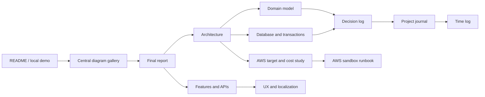
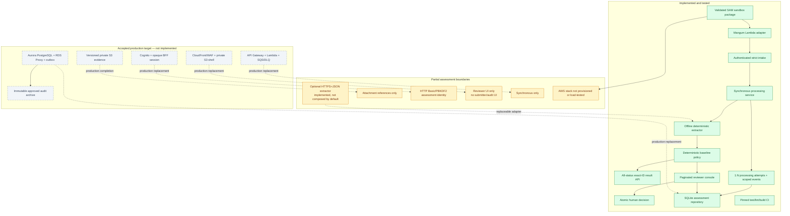

# Expense Agent documentation

This documentation describes the executable assessment, its validated but
unprovisioned AWS sandbox package, the deliberately limited boundaries, and the
accepted but unimplemented AWS production target.
Status labels are used consistently:

- **Implemented:** executable and covered by automated tests.
- **Partial:** a useful assessment slice exists but lacks a production control
  or user surface.
- **Target:** accepted production direction, not built in this repository.
- **Open:** requires accountable product, security, legal, finance, or platform
  input.

## Reading map

| Document | Purpose |
| --- | --- |
| [Diagram gallery](diagrams.md) | Central status-labeled system, lifecycle, data, processing, review/audit, AWS-target, and sandbox views. |
| [Final report](final-report.md) | Concise assignment narrative, compliance matrix, evidence, trade-offs, and roadmap. |
| [System architecture](architecture.md) | Executable components, dependency direction, trust boundaries, processing flow, and AWS replacement boundary. |
| [Database model](database.md) | SQLite schema, cardinalities, idempotency, version transitions, immutable traces, and atomic writes. |
| [Domain model](domain-model.md) | Reimbursement, extraction, policy, workflow, review, identity, and audit objects and invariants. |
| [Feature catalog](features.md) | Intake/results APIs, review console, policy behavior, security, errors, and verification. |
| [UX and localization](ux-and-localization.md) | High-volume queue design and PT-BR/EN/ES presentation boundaries. |
| [AWS deployment and cost study](aws-deployment-study.md) | Accepted hybrid serverless target, storage/cost sensitivities, and rejected EKS alternative. |
| [AWS assessment sandbox runbook](../deploy/aws/README.md) | One-command SAM deployment, prerequisites, safety boundary, inspection, cleanup, and production migration gates. |
| [Decision log](decision-log.md) | Current, proposed, open, and superseded architecture decisions. |
| [Project journal](project-journal.md) | Chronological questions, feedback, implementation results, and rationale. |
| [Assumptions register](assumptions.md) | Explicit interpretations and validation needs. |
| [Time log](time-log.md) | User-reported total effort, the precisely measured subset inside it, and honestly unmeasured historical rows. |
| [Report outline](final-report-outline.md) | Earlier planning artifact retained for history; superseded by the final report. |

## Current implementation status

## Assignment coverage

| Requirement | Status | Evidence / boundary |
| --- | --- | --- |
| Receive reimbursement requests | **Implemented** | Strict authenticated `POST /api/requests`; normalized submission persisted at v1. |
| Extract receipt information | **Implemented for supplied OCR text** | Default offline parser plus optional bounded HTTPS+JSON adapter; receipt-byte OCR is not implemented. |
| Validate receipt and claim | **Implemented** | Versioned deterministic amount, category, currency, age, quality, and threshold rules. |
| Auto-approve eligible requests at or below BRL 200 | **Implemented** | Only when every rule passes. |
| Review requests above BRL 2,000 | **Implemented interpretation** | All claims above BRL 200 route to review; `> 2,000` has a distinct reason. The literal threshold/collision policy still needs stakeholder validation. |
| Reject receipts older than 90 days | **Implemented interpretation** | Age uses the caller-supplied submission date in `America/Sao_Paulo`; exactly 90 is valid; rejection currently wins over review. Both the authoritative timestamp and collision precedence block production until validated/corrected. |
| Explain and trace every operation | **Partial** | Processing/decision trace is implemented with input hashes, runs, 1:N attempts, rules, scoped events, and human rationale. Authentication success/failure, reads, searches, validation/orchestration errors, and evidence-access audit are not comprehensively recorded. |
| Human judgment and recorded reviewer | **Implemented** | Internal UI/API, server-derived assessment identity, mandatory rationale, atomic v3→v4 transaction. |
| Safe high-volume review navigation | **Implemented contract; unproven production SLO** | Database-scoped search/filter/sort and signed keyset cursors; no million-row load test or PostgreSQL adapter. |
| Original receipt access | **Not implemented** | Only caller-supplied attachment references are stored/displayed. |
| Standalone submitter experience | **API only** | Intake/result endpoints exist; no upload/tracking web screen. |
| AWS serverless deployment | **Assessment sandbox implemented; production target only** | SAM can package API Gateway/Lambda/VPC/EFS with synthetic seed data. The template/build are validated but no account was provisioned. It deliberately lacks production Cognito, Aurora/outbox, S3 evidence, SQS/DLQ, WAF, and CloudFront adapters. |

## Verification snapshot

- 151/151 automated tests passed with warnings treated as errors in the final
  local run.
- Ruff, JavaScript syntax validation, `git diff --check`, ShellCheck, SAM lint,
  a containerized x86_64 SAM build, and Lambda-runtime artifact import passed.
- Acceptance tests preserve the three assignment objects and expected routes:
  `REQ-0001` and `REQ-0002` auto-approved, `REQ-0003` pending review.
- Boundary tests cover BRL 200.00, 200.01, 2,000.00, 2,000.01, exactly 90
  days, and an old high-value collision.
- Integration tests cover real FastAPI → processing → SQLite behavior,
  idempotent replay, payload conflict, extraction exception, rollback, human
  v3→v4 decision, safe serialization, and 1:N immutable attempts.
- The GitHub Actions workflow uses commit-pinned actions, frozen/pinned Python
  build inputs, and runs tests, Ruff, and package build on pushes/pull requests;
  monthly Dependabot updates cover pip and Actions dependencies.

This evidence validates the assessment behavior. It does not establish a
production accuracy rate, million-request latency SLO, disaster-recovery
objective, legal retention period, or cloud security approval.
