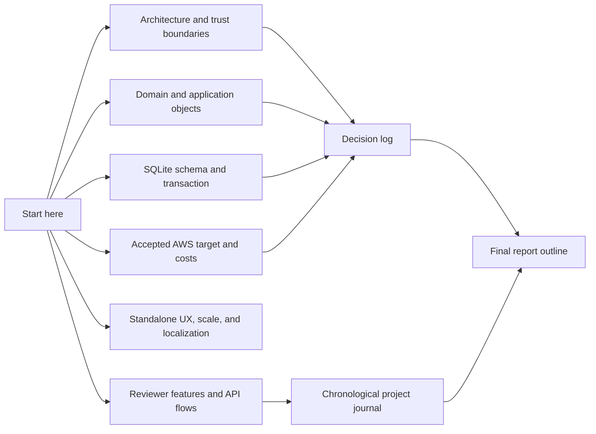

# Expense Agent documentation

These documents describe the repository as implemented. Each page explicitly
separates executable assessment behavior from production replacements and from
features that remain outside the current slice.

## Documentation map

| Document | Purpose |
| --- | --- |
| [System architecture](architecture.md) | Runtime components, code boundaries, trust boundaries, and current versus production responsibilities. |
| [Domain object model](domain-model.md) | Aggregate, extraction, review, decision, identity, and audit objects with their invariants. |
| [Database model](database.md) | The implemented normalized SQLite schema, immutable records, and atomic decision algorithm. |
| [Feature catalog](features.md) | Screen behavior, endpoints, security controls, test evidence, and known gaps. |
| [Standalone UX, scale, and localization](ux-and-localization.md) | Role-specific surfaces, high-volume queue navigation, localization boundaries, and usability validation. |
| [Accepted AWS serverless target and cost study](aws-deployment-study.md) | CloudFront/Cognito/API Gateway/Lambda/SQS/S3/Aurora target, evaluated EKS alternative, VPN, retention, compression, and parametric São Paulo cost analysis. |
| [Project journal](project-journal.md) | Chronological questions, feedback, implementation results, and validation. |
| [Decision log](decision-log.md) | Accepted, open, proposed, and superseded architecture decisions. |
| [Assumptions register](assumptions.md) | Explicit interpretations that still require production validation. |
| [Final report outline](final-report-outline.md) | Evidence-backed structure for the final assignment report. |
| [Time log](time-log.md) | Recorded work areas and honest unknown durations. |

## Implementation status

```mermaid
flowchart TB
    subgraph Implemented["Implemented and tested"]
        Domain["Domain objects and state machine"]
        ReviewApp["ReviewService and repository port"]
        SQLite["Normalized SQLite review and audit persistence"]
        HTTP["Authenticated FastAPI JSON endpoints"]
        UI["Trilingual operations console\nfilters + detail + business timeline"]
        Security["PBKDF2 Basic adapter, CSRF, ETag, browser headers"]
        Tooling["Password helper and deterministic demo seed"]
    end

    subgraph Partial["Modeled or deliberately limited"]
        Extraction["Extraction result and complete model trace"]
        AuditScope["Two-event reviewer timeline only"]
        Attachment["Attachment references, not content delivery"]
        Auth["Assessment authentication adapter"]
    end

    subgraph Planned["Not implemented"]
        SubmitterUI["Standalone submitter portal"]
        Intake["Submission intake API"]
        OCR["OCR/LLM provider adapter"]
        Policy["Baseline deterministic policy engine"]
        AuditAdminUI["Audit / administration surface"]
        ProductionIdentity["Accepted Cognito/BFF identity target"]
        ProductionRuntime["Accepted AWS serverless runtime target"]
        ProductionData["Accepted Aurora/S3/outbox target"]
    end

    UI --> HTTP --> ReviewApp --> Domain
    ReviewApp --> SQLite
    Extraction --> SQLite
    SubmitterUI -. future .-> Intake
    Intake -. future .-> Domain
    OCR -. future .-> Extraction
    Policy -. future .-> Domain
    AuditAdminUI -. future .-> ProductionData
    ProductionIdentity -. replaces .-> Auth
    ProductionData -. replaces or extends .-> SQLite
    ProductionRuntime -. deploys .-> HTTP

    classDef implemented fill:#dcfce7,stroke:#15803d,color:#14532d
    classDef partial fill:#fef3c7,stroke:#d97706,color:#78350f
    classDef planned fill:#f1f5f9,stroke:#64748b,color:#334155,stroke-dasharray: 5 5
    class Domain,ReviewApp,SQLite,HTTP,UI,Security,Tooling implemented
    class Extraction,AuditScope,Attachment,Auth partial
    class SubmitterUI,Intake,OCR,Policy,AuditAdminUI,ProductionIdentity,ProductionRuntime,ProductionData planned
```

Status terminology:

- **Implemented:** present in executable code and covered by automated tests.
- **Partial:** a usable slice exists, but its production scope is intentionally
  narrower than the full service requirement.
- **Planned:** required for a complete end-to-end production service but absent
  from this repository.

## Assignment coverage snapshot

Option 2 completes the Human Review slice, not the full assignment:

| PDF requirement | Status in this repository |
| --- | --- |
| Receive and process reimbursement requests | Not implemented; there is no intake endpoint or processing orchestrator. |
| OCR/AI extraction and validation | Partial contract and persisted trace; no live provider adapter. |
| Auto-approve eligible requests at or below BRL 200 | Planned; no baseline policy executor. |
| Always review requests above BRL 2,000 | Planned; the domain route exists but no amount rule runs. |
| Reject receipts older than 90 days | Planned; the age rule and precedence are not implemented. |
| Classify and explain every request | Partial; objects/persistence exist for supplied cases, not an end-to-end classifier. |
| Human review with recorded reviewer decision | Implemented for the internal review slice. |
| Full traceability | Partial; enqueue and decision lifecycle events are durable and available through a sanitized reviewer timeline, while the authoritative intake/provider/policy pipeline, technical 1:N trace, access audit, and original-file integrity path are absent. |

## Quality snapshot

- Python 3.11 or newer.
- FastAPI and Uvicorn runtime; SQLite and security primitives use the Python
  standard library.
- 60 automated tests passing in the latest recorded run.
- Ruff static check passing in the latest recorded run.
- Browser validation: PT-BR/English/Spanish, category filtering, table/cards,
  evidence detail, 10 + 6 item cursor pages without overlap, and one decision
  returning HTTP 201; the queue/KPIs refreshed, the audit-event toast appeared,
  and no console errors were observed.
- Timeline validation: authenticated HTTP contract, whitelist projection,
  decision-to-event integration, tamper-resistant request/limit/purpose-bound
  cursors, restart-safe pagination, safe DOM wiring, and trilingual catalog
  parity. No new manual browser run was performed for this increment.
- Packaging validation: `uv build` produced sdist and wheel; the wheel contains
  all three static review assets and three CLI entry points.
