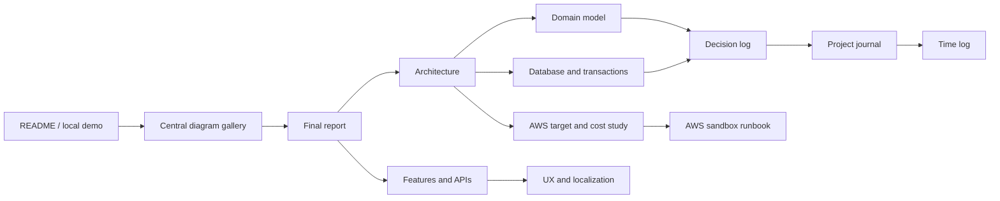
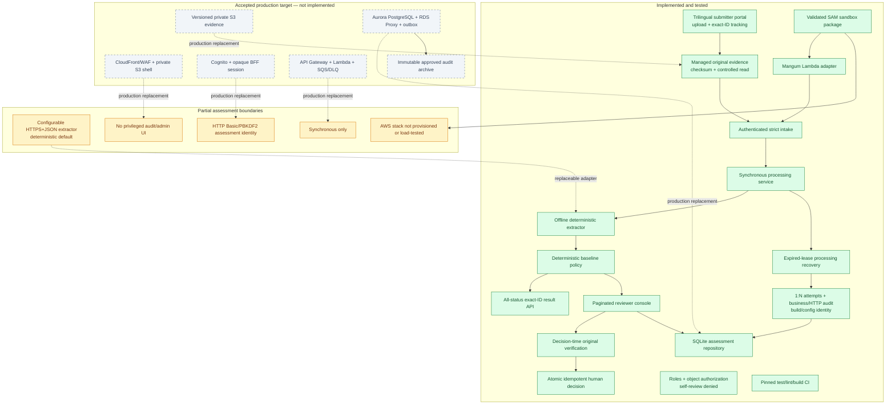

# Expense Agent documentation

This documentation describes the executable assessment, its validated but
unprovisioned AWS sandbox package, the deliberately limited boundaries, and the
accepted but unimplemented AWS production target.
Status labels are used consistently:

- **Implemented:** executable and covered by automated tests.
- **Partial:** a useful assessment slice exists but lacks a production control
  or user surface.
- **Target:** accepted production direction, not built in this repository.
- **Open:** requires accountable product, security, legal, finance, or platform
  input.

## Reading map

| Document | Purpose |
| --- | --- |
| [Diagram gallery](diagrams.md) | Central status-labeled system, lifecycle, data, processing, review/audit, AWS-target, and sandbox views. |
| [Final report](final-report.md) | Concise assignment narrative, compliance matrix, evidence, trade-offs, and roadmap. |
| [System architecture](architecture.md) | Executable components, dependency direction, trust boundaries, processing flow, and AWS replacement boundary. |
| [Database model](database.md) | SQLite schema, cardinalities, idempotency, version transitions, immutable traces, and atomic writes. |
| [Domain model](domain-model.md) | Reimbursement, extraction, policy, workflow, review, identity, and audit objects and invariants. |
| [Feature catalog](features.md) | Intake/results APIs, review console, policy behavior, security, errors, and verification. |
| [UX and localization](ux-and-localization.md) | High-volume queue design and PT-BR/EN/ES presentation boundaries. |
| [AWS deployment and cost study](aws-deployment-study.md) | Accepted hybrid serverless target, storage/cost sensitivities, and rejected EKS alternative. |
| [AWS assessment sandbox runbook](../deploy/aws/README.md) | One-command SAM deployment, prerequisites, safety boundary, inspection, cleanup, and production migration gates. |
| [Decision log](decision-log.md) | Current, proposed, open, and superseded architecture decisions. |
| [Project journal](project-journal.md) | Chronological questions, feedback, implementation results, and rationale. |
| [Assumptions register](assumptions.md) | Explicit interpretations and validation needs. |
| [Time log](time-log.md) | User-reported total effort, the precisely measured subset inside it, and honestly unmeasured historical rows. |
| [Report outline](final-report-outline.md) | Earlier planning artifact retained for history; superseded by the final report. |

## Current implementation status

## Assignment coverage

| Requirement | Status | Evidence / boundary |
| --- | --- | --- |
| Receive reimbursement requests | **Implemented** | Strict authenticated `POST /api/requests`; normalized submission persisted at v1. |
| Extract receipt information | **Implemented for supplied OCR text** | Default offline parser plus optional bounded HTTPS+JSON adapter; receipt-byte OCR is not implemented. |
| Validate receipt and claim | **Implemented** | Versioned deterministic amount, category, currency, age, quality, and threshold rules. |
| Auto-approve eligible requests at or below BRL 200 | **Implemented** | Only when every rule passes. |
| Review requests above BRL 2,000 | **Implemented interpretation** | The non-bypassable high-value gate routes these claims to a human even when another rule requires rejection. The mandatory rejection is preserved and prevents a human approval. |
| Reject receipts older than 90 days | **Implemented interpretation** | Age uses the caller-supplied submission date in `America/Sao_Paulo`; exactly 90 is valid. A normal old receipt is rejected; an old claim above BRL 2,000 still traverses the non-bypassable review gate and cannot be approved. The authoritative timestamp remains a production blocker. |
| Explain and trace every operation | **Implemented assessment boundary** | Processing/decision traces include hashes, runs, attempts, rules, rationale, build ID, and effective-configuration hash. A separate sanitized append-only ledger records every HTTP attempt, including authentication failures, reads, searches, validation/errors, and managed-file access. Production still needs an externally immutable export. |
| Human judgment and recorded reviewer | **Implemented** | Internal UI/API, server-derived identity, mandatory rationale, decision-time evidence state, application-layer self-review denial, optimistic versioning, and a durable idempotency key in the atomic decision transaction. Approval requires verified originals. |
| Safe high-volume review navigation | **Implemented contract; unproven production SLO** | Database-scoped search/filter/sort and signed keyset cursors; no million-row load test or PostgreSQL adapter. |
| Original receipt access | **Implemented assessment boundary** | Submitters upload JPEG/PNG/PDF bytes to an immutable filesystem adapter. HTTP intake accepts only returned `evidence:att_*` references; reviewers use a case-bound authenticated route and every decision re-verifies checksum/media. Degraded evidence can only be rejected. Malware scanning, versioned S3, and approved retention are production work. |
| Standalone submitter experience | **Implemented** | Trilingual upload/claim form, authenticated submitter identity, safe result, and exact-ID tracking across retained statuses. |
| Recovery and replay | **Implemented assessment boundary** | Request fingerprints prevent duplicate processing, expired processing leases create a traceable recovery run, late workers cannot commit, and human decision retries replay the original result only when the full command fingerprint matches. |
| Authorization and separation of duties | **Implemented assessment boundary** | Closed submitter/reviewer/auditor/admin roles, submitter-owned result lookup, reviewer/auditor read gates, reviewer-only decisions, and actor-bound self-review denial inside `ReviewService`. Production still needs managed identity, team scopes, MFA, and lifecycle administration. |
| AWS serverless deployment | **Assessment sandbox implemented; production target only** | SAM can package API Gateway/Lambda/VPC/EFS and seed synthetic managed PDFs through HTTPS. The template/build are locally validated but no account was provisioned. It deliberately lacks production Cognito, Aurora/outbox, versioned S3 evidence, SQS/DLQ, WAF, and CloudFront adapters. |

## Verification snapshot

- The full automated suite passed with warnings treated as errors in the latest
  local verification: **254 tests**.
- Ruff, JavaScript syntax validation, `git diff --check`, package build, SAM
  lint, ShellCheck, a containerized x86_64 SAM build, and import from the
  matching Lambda Python 3.12 runtime image passed in the release-candidate run.
- Acceptance tests preserve the three assignment objects and expected routes:
  `REQ-0001` and `REQ-0002` auto-approved, `REQ-0003` pending review.
- Boundary tests cover BRL 200.00, 200.01, 2,000.00, 2,000.01, exactly 90
  days, and an old high-value collision.
- Integration tests cover real FastAPI → upload → processing → SQLite behavior,
  managed-only evidence references, idempotent intake and human decisions,
  payload conflict, extraction exception, expired-lease recovery, rollback,
  authorization, safe serialization, and 1:N immutable attempts.
- The GitHub Actions workflow uses commit-pinned actions, frozen/pinned Python
  build inputs, and runs tests, Ruff, and package build on pushes/pull requests;
  monthly Dependabot updates cover pip and Actions dependencies.

This evidence validates the assessment behavior. It does not establish a
production accuracy rate, million-request latency SLO, disaster-recovery
objective, legal retention period, or cloud security approval.
