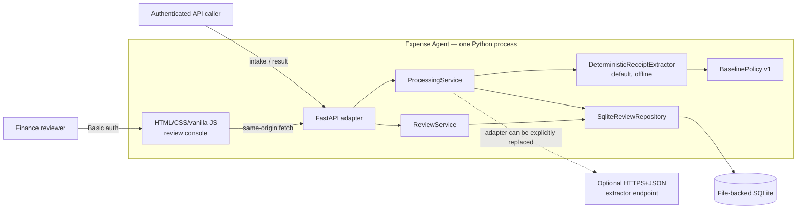
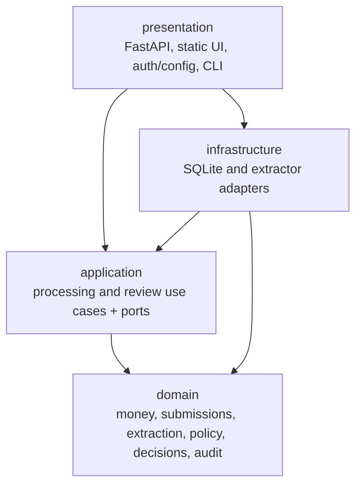
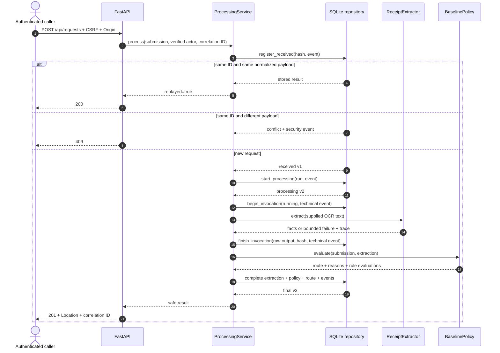
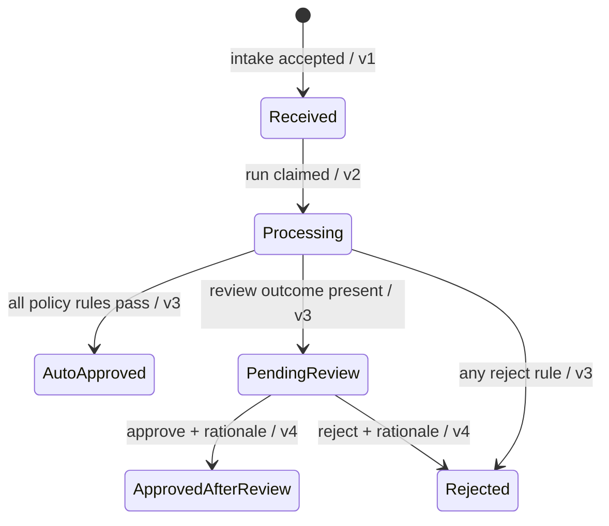
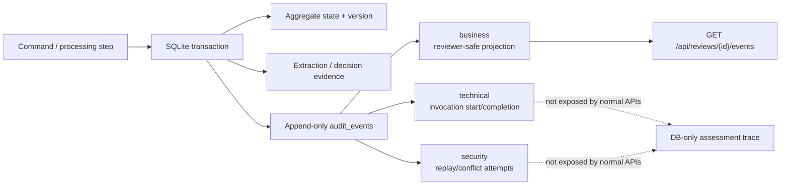
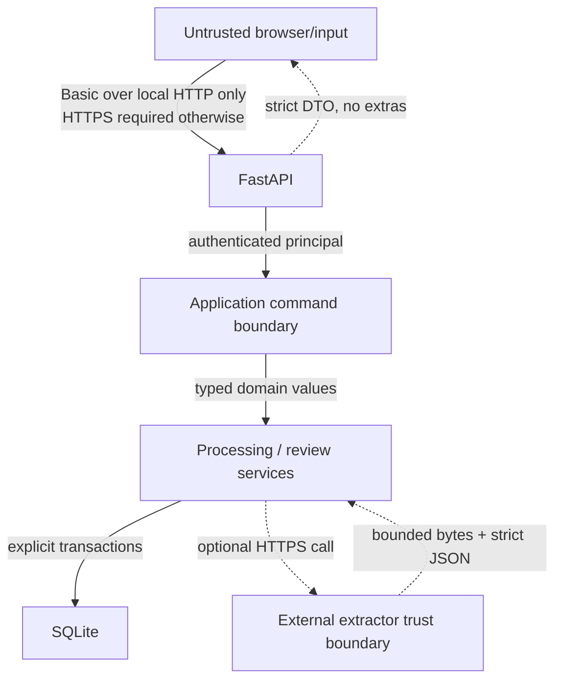
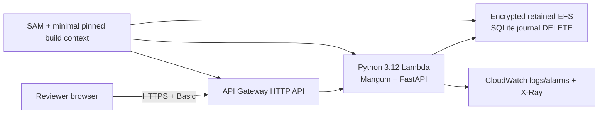
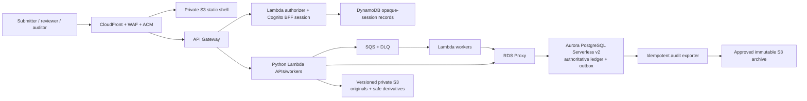

# System architecture

## Architectural position

Expense Agent is a layered, standalone reimbursement service. The executable
assessment owns intake, evidence extraction from supplied OCR text,
deterministic routing, exact-ID result lookup, and internal human review. It
does not depend on ClickUp, email, n8n, an existing RecargaPay application, or
an existing identity/database platform.

The key invariant is simple: probabilistic or heuristic components produce
evidence; versioned deterministic policy produces the financial route.

## Executable assessment context



### Current capabilities and boundaries

| Boundary | Current behavior |
| --- | --- |
| Presentation | Reviewer screen plus authenticated JSON APIs. There is no submitter or privileged audit screen. |
| Identity | HTTP Basic with configured PBKDF2 hashes. The verified principal becomes the audit actor; no actor ID is accepted in a command body. |
| Intake | Strict JSON with supplied OCR text and attachment reference strings. No binary upload or OCR engine. |
| Processing | One synchronous extraction attempt followed by deterministic policy. No SQS, retry scheduler, or secondary verifier. |
| Evidence | Structured receipt facts, protected raw extractor response, input/output hashes, and immutable attempt metadata. |
| Persistence | Normalized file-backed SQLite with explicit transactions and immutability triggers. |
| Result | Exact authenticated lookup across received, processing, automated final, and human final statuses; technical secrets/raw responses are omitted. |
| Review | Search/filter/sort/keyset-paginated pending queue, evidence detail, sanitized business timeline, and atomic individual decision. |

`HttpJsonReceiptExtractor` is implemented as a replaceable adapter with HTTPS-
only configuration, request timeout, response-size limit, strict JSON/schema
validation, redirect rejection, and bounded failures. The environment entry
point intentionally
composes the offline deterministic extractor, so no live provider or secret is
required for the assessment.

## Code layers and dependency direction



- The domain imports neither FastAPI nor SQLite.
- Application services depend on repository/extractor protocols and domain
  values.
- Infrastructure implements those ports and protects provider/database details.
- The composition root chooses concrete adapters.

## End-to-end processing flow

No database transaction is held while an extractor may perform network I/O.
Instead, intent and completion are durable transaction boundaries around the
call.



`complete_processing` atomically commits the immutable extraction projection,
automated decision, reasons, rule evaluations, terminal processing run, final
reimbursement status, business event, and—when needed—review case, problems,
and enqueue event. A late failure rolls the entire v2→v3 outcome back.

## State and version flow



At this version, any receipt older than 90 days creates a reject rule, and reject
outcomes take precedence over review outcomes. Thus an old receipt above BRL
2,000 is rejected, while retaining the high-value review reason/evaluation as
evidence. Exactly 90 days is valid. The assessment's age anchor is immutable
after intake but is still caller-supplied; a trusted server-owned `received_at`
is a mandatory production replacement. Reject-over-review precedence and the
literal high-value collision are implemented interpretations pending policy-
owner validation, not confirmed stakeholder rules.

## Audit architecture



Important identifiers remain distinct: request, submission hash, processing
run, invocation attempt, automated decision, human decision, event, correlation
ID, aggregate version, provider/model/prompt/input/output hashes. The current
reviewer timeline whitelists business event fields and never serializes raw
provider output, technical parameters, credentials, or attachment locations.

This is processing/decision traceability, not full traceability of every
operation. Authentication success/failure, ordinary reads, searches, validation
failures, every orchestration exception, and evidence-access facts are not
comprehensively audited. In addition, a crash can leave v2/a running attempt
stranded; no lease, watchdog, resume, retry, or replay recovery exists. Both
gaps block production use.

## Trust boundaries and controls



Implemented controls include explicit allowed hosts and proxy IPs, HTTPS fail-
closed configuration, HSTS on HTTPS, CSP, no framing, `nosniff`, `no-store`,
same-origin resource policy, CSRF tokens bound to the authenticated reviewer,
exact `Origin` validation, strict JSON input, capped strings/collections,
timezone-aware timestamps, exact money, ETag preconditions, and safe DOM text
rendering.

Assessment limitations remain material: every configured Basic user currently
has the same effective scope; there is no role/team/case authorization,
four-eyes constraint, session revocation, MFA, account lifecycle, attachment-
object authorization, or protected technical-trace API.

## AWS assessment sandbox — packaged, not provisioned



The repository includes a one-command SAM deployment for synthetic assessment
use. Its template, x86_64 build artifact, shell script, and Lambda import are
locally validated; no AWS account or stack was mutated. API Gateway supplies a
direct HTTPS origin. Lambda runs with bounded concurrency in two private
subnets, while EFS persists the SQLite file through an access point.

This bridge is not production persistence. SQLite warns about remote filesystem
locking/sync behavior; `DELETE` journal removes the literal WAL incompatibility
but not the NFS risk. Basic authentication, global reviewer scope, synchronous
processing, attachment references, and lack of live load/restore evidence keep
the sandbox outside the financial-production trust boundary. See the
[sandbox runbook](../deploy/aws/README.md).

## Accepted AWS production target — not implemented



Production keeps the same domain/application boundaries but replaces local
adapters and synchronous execution:

| Assessment | Accepted production replacement |
| --- | --- |
| HTTP Basic/PBKDF2 | Application-owned Cognito OIDC, MFA, opaque secure BFF cookie, RBAC/ABAC. |
| One FastAPI process | Same-origin CloudFront/WAF edge, API Gateway, short Lambda paths. |
| Synchronous extraction | S3 event/intake + SQS/DLQ workers with idempotent delivery and backpressure. |
| SQLite | Aurora PostgreSQL Serverless v2 through RDS Proxy, authoritative transactions and outbox. |
| Attachment reference string | Private versioned S3 object, SHA-256/version/media/scan metadata, authorized access audit. |
| DB-only audit | Transactional outbox plus approved immutable export; CloudTrail/observability are complementary. |

No production Cognito pool/BFF, SQS queue, Aurora cluster/repository, receipt S3
store, CloudFront/WAF edge, outbox/exporter, DNS, or provisioned cloud resource
exists in this repository. The SAM assessment sandbox above is deliberately not
the production IaC described here. Region, account/network layout, workload,
SLO, RPO/RTO, retention, legal hold, provider approval, and production cost
still require accountable validation. Kubernetes/EKS was evaluated and
explicitly not selected.

## Repository map

```text
expense-agent/
├── .github/workflows/ci.yml
├── examples/sample_requests.json
├── deploy/aws/                    # non-production SAM sandbox and runbook
├── src/expense_agent/
│   ├── domain/                 # deterministic financial model and policy
│   ├── application/            # processing/review use cases and ports
│   ├── infrastructure/
│   │   ├── extraction/         # offline and optional HTTPS+JSON adapters
│   │   └── review/             # SQLite workflow/review repository
│   └── presentation/           # FastAPI, Lambda adapter, security, UI, CLIs
├── tests/                       # domain, adapter, integration, API, AWS assets
└── docs/                        # architecture, decisions, evidence, report
```
