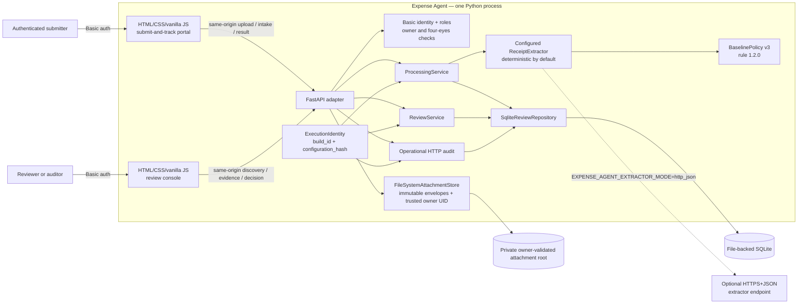
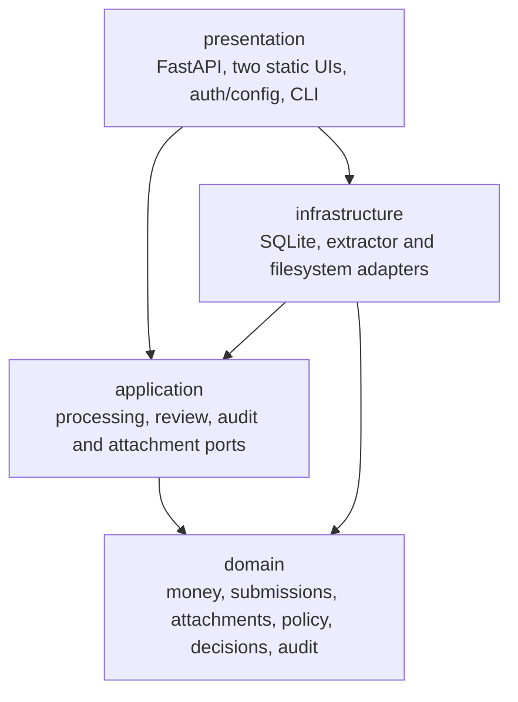
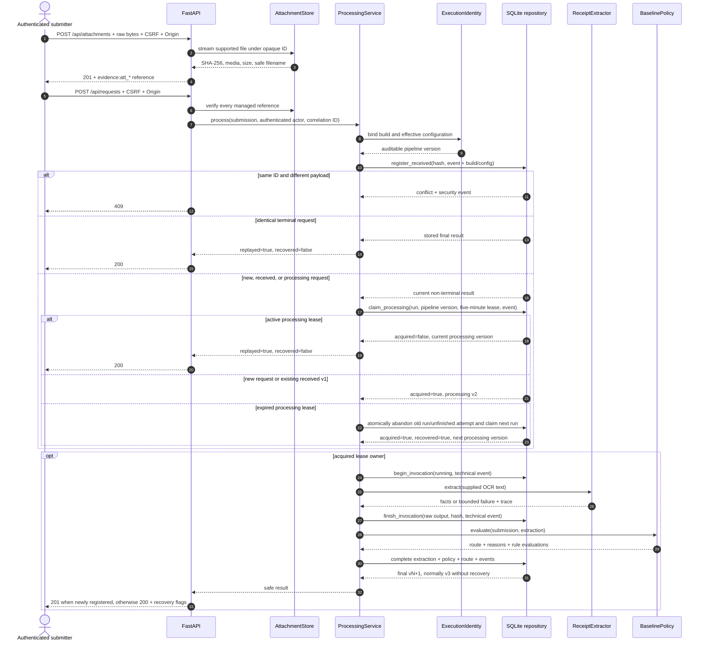
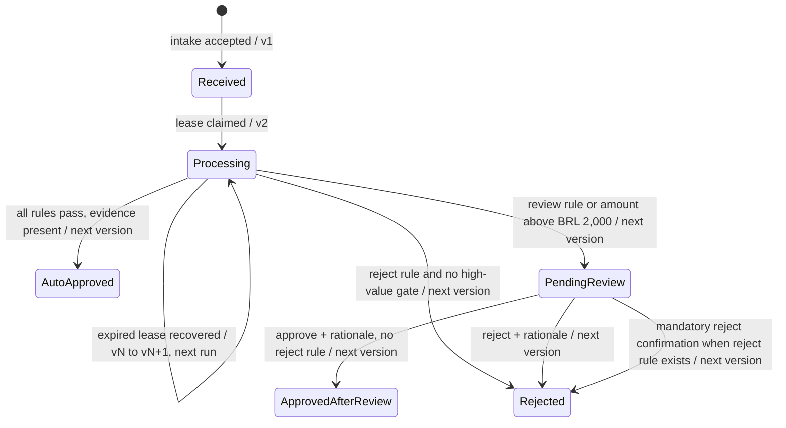
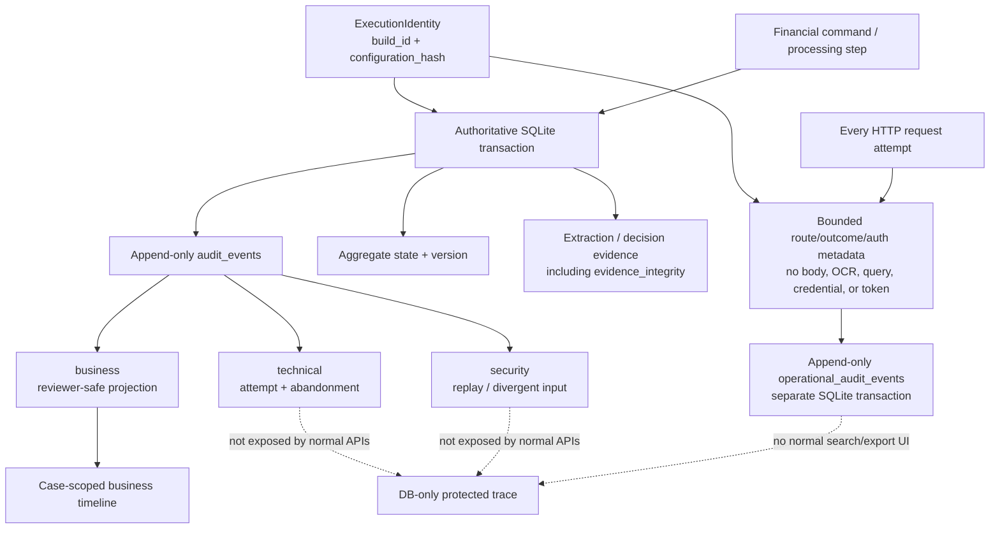
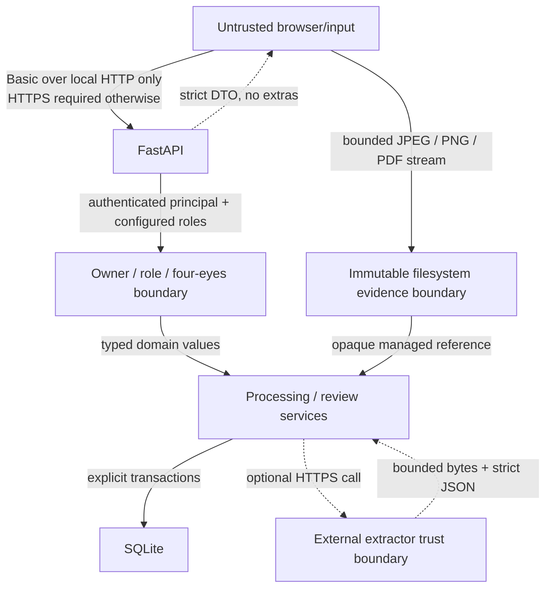
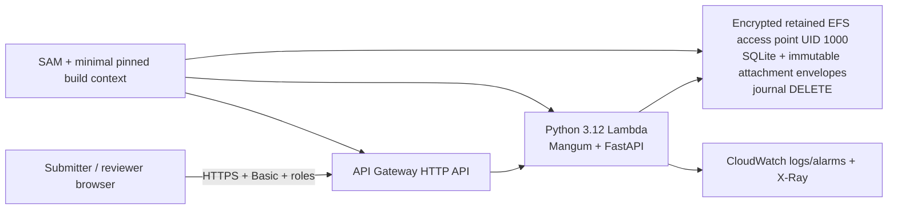
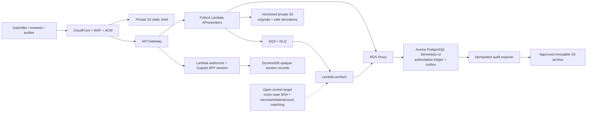

# System architecture

## Architectural position

Expense Agent is a layered, standalone reimbursement service. The executable
assessment owns a trilingual submit-and-track portal, immutable local receipt
upload, evidence extraction from supplied OCR text, deterministic routing,
owner-aware exact-ID result lookup, and internal human review. It does not
depend on ClickUp, email, n8n, an existing RecargaPay application, or an
existing identity/database platform.

The key invariant is simple: probabilistic or heuristic components produce
evidence; versioned deterministic policy produces the financial route.

## Executable assessment context



### Current capabilities and boundaries

| Boundary | Current behavior |
| --- | --- |
| Presentation | Separate trilingual submit-and-track and review screens plus authenticated JSON/binary APIs. A privileged cross-case audit/administration screen is not implemented. |
| Identity and authorization | HTTP Basic with configured PBKDF2 hashes and closed `submitter`, `reviewer`, `auditor`, and `admin` roles. Credentials upgraded without a `roles` field retain the historical submitter+reviewer pair. Submitters read their own results by email; reviewer/auditor/admin roles read review evidence; reviewer/admin roles decide. Both the HTTP adapter and `ReviewService` enforce four-eyes separation against the immutable intake actor, and no role—including admin—may self-review. Team, tenant, assignment, value, and purpose policies remain absent. |
| Intake | Submitters stream one allowlisted JPEG/PNG/PDF to obtain an opaque managed reference, then send strict JSON containing supplied OCR text. New HTTP intake rejects arbitrary legacy references with `422`; an empty attachment list is valid but routes to review. A controlled OCR engine and OCR-to-byte binding are not implemented. |
| Processing | One synchronous primary extraction attempt followed by deterministic policy. Each run's `pipeline_version` binds `baseline-v3`, `build_id`, and the effective `configuration_hash`. A five-minute lease allows an identical later request to recover an expired processing run. There is no background watchdog, SQS/DLQ scheduler, retry cap, or secondary verifier. |
| Evidence | Exact local bytes are stored under an opaque ID with filename, media type, size, and SHA-256; reads revalidate content. Store directories must be private, non-symlink directories owned by a configured trusted POSIX UID (local default: effective UID). Immediately before a new human decision, every managed original is read again and other reference states are classified. Approval requires `verified`; rejection may close a case with `missing`, integrity `failed`, `unverifiable`, or `invalid_reference`, and that state is recorded in the decision event. Identical bytes receive distinct IDs; there is no content deduplication or cross-case matching. Malware scanning, safe derivatives, retention, uploader ownership, and production object versions are absent. |
| Persistence | Normalized file-backed SQLite with explicit transactions, immutable financial/audit records, processing leases, and decision-command idempotency. Attachment bytes and their envelope metadata remain in a separate private filesystem tree. |
| Result | Exact lookup covers every retained status. Submitters receive only their own safe result; review/audit roles may inspect authorized support results. Technical secrets/raw responses and attachment locations remain omitted. |
| Review | Server-side search/filter/sort/keyset pagination, evidence detail, managed original access, sanitized business timeline, decision-time evidence verification, service-level four-eyes enforcement, and an atomic idempotent individual decision. |
| Operational audit | Every HTTP attempt appends one bounded sanitized record with route, outcome, authentication, actor when known, correlation, duration, `build_id`, `configuration_hash`, and safe metadata. It has no normal query UI, query-payload replay, or immutable off-host export. |

`HttpJsonReceiptExtractor` is implemented as a replaceable adapter with HTTPS-
only configuration, request timeout, response-size limit, strict JSON/schema
validation, redirect rejection, and bounded failures. The composition root
selects it only when `EXPENSE_AGENT_EXTRACTOR_MODE=http_json` and all required
provider settings pass fail-closed validation. Deterministic mode remains the
default and rejects stray provider variables, so no live provider or secret is
required for the assessment. The SAM sandbox has no NAT and deliberately stays
in deterministic mode.

`ExecutionIdentity` validates a portable `build_id` and a lowercase SHA-256
`configuration_hash` computed from the canonical effective settings without
persisting their cleartext values. Processing runs store
`baseline-v3;build=<build_id>;config=<configuration_hash>` as `pipeline_version`.
Intake, processing-start, human-decision, and operational HTTP evidence also
carry the applicable identity. Local execution defaults to `local-unversioned`;
the AWS deployment script derives a commit-and-lock identity unless CI supplies
an audited override.

## Code layers and dependency direction



- The domain imports neither FastAPI nor SQLite.
- Application services depend on repository/extractor protocols and domain
  values.
- Infrastructure implements those ports and protects provider/database details.
- The composition root chooses concrete adapters.

## End-to-end processing flow

No database transaction is held while an extractor may perform network I/O.
Instead, intent and completion are durable transaction boundaries around the
call.



`complete_processing` atomically commits the immutable extraction projection,
automated decision, reasons, rule evaluations, terminal processing run, final
reimbursement status, business event, and—when needed—review case, problems,
and enqueue event. A late failure rolls the entire processing-to-final outcome
back to the current processing version.

Human decisions require both the case `If-Match` value and an
`Idempotency-Key`. Before a new decision, the adapter derives
`submission_actor_id` from the earliest immutable `reimbursement_received`
business event whose actor type is literally `submitter`; both the adapter and
`ReviewService` reject a missing or matching actor. The adapter then rereads all
managed originals. Approval fails closed with `409` unless every object is
`verified`; rejection may close an unavailable or unverifiable case, preserving
the observed evidence-integrity state in `human_review_decided` together with
the execution identity. A failed approval attempt records its integrity state in
the operational HTTP event but creates no financial decision.

The application hashes the idempotency key and fingerprints the complete
normalized command, including request, reviewer, outcome, rationale, and
expected version. The repository commits that binding in the same transaction
as the immutable decision, next-version transition, and business event. Retrying
the exact already-committed command returns the original result with `200` and
creates no second decision, event, or new evidence-verification act; reusing the
key for different content returns `409`.

## State and version flow



Without recovery the familiar sequence is received v1, processing v2,
automated final v3, and—when needed—human final v4. Every recovered lease is an
auditable aggregate mutation and adds one version before automated finalization,
so clients must always use the returned version rather than assume those
numbers.

`BaselinePolicy` is `baseline-v3` with rule version `1.2.0`. Missing receipt
evidence blocks automatic approval. Any amount above BRL 2,000 creates a non-
bypassable human-review route even when another deterministic rule rejects the
claim. In that collision the aggregate and UI prohibit approval, so the human
records the mandatory rejection and rationale instead of bypassing review.
Exactly 90 days is valid. The assessment's age anchor is immutable after intake
but is still caller-supplied; a trusted server-owned `received_at` remains a
mandatory production replacement. The literal BRL 2,000 boundary and collision
semantics still require policy-owner confirmation before production.

## Audit architecture



Important identifiers remain distinct: request, submission hash, processing
run, invocation attempt, automated decision, human decision, event, correlation
ID, aggregate version, build ID, configuration hash, and provider/model/prompt/
input/output hashes. The current
reviewer timeline whitelists business event fields and never serializes raw
provider output, technical parameters, credentials, or attachment locations.

Processing/decision evidence remains the authoritative financial history. The
operational ledger now records every HTTP attempt, including authentication
failure, authorization denial, reads, searches, validation errors, unmatched
routes, attachment access, and server errors. It does not copy request bodies or
query strings, and an intake request ID is correlated through the shared
correlation ID rather than extracted from its body. The operational write is a
separate transaction, not an atomic outbox row, and there is no cross-case audit
API, exact search-query replay, off-host immutable export, or WORM control.
Infrastructure logs remain complementary. These limitations still block a claim
of complete production traceability even though all assessment HTTP attempts
are locally recorded.

Actor namespaces are deliberate. The authoritative intake business event uses
`actor_type=submitter` with the authenticated principal's immutable ID; review
reads that event to enforce separation of duties. HTTP-operation events use
`actor_type=authenticated_principal`. Human decisions use `reviewer`, while
background processing uses bounded `system` identities. The claimed
`submitted_by` email is never substituted for any of those actor IDs.

## Trust boundaries and controls



Implemented controls include explicit allowed hosts and proxy IPs, HTTPS fail-
closed configuration, HSTS on HTTPS, CSP, no framing, `nosniff`, `no-store`,
same-origin resource policy, CSRF tokens bound to the authenticated principal,
exact `Origin` validation, strict JSON input, capped strings/collections,
timezone-aware timestamps, exact money, ETag preconditions, decision-time
original-evidence revalidation, execution-identity hashes, and safe DOM text
rendering. The filesystem evidence adapter also rejects its root, object,
staging, or newly created shard directory when it is a symlink, is accessible to
group/other users, or is not owned by the configured trusted UID.

Assessment authorization is no longer global by default: closed roles protect
submission, review, audit-read, and administration capabilities; submitter email
owns the safe exact-ID result; managed evidence reads must belong to the selected
review case; and both presentation and application layers compare the reviewer
with the immutable submission actor. Reviewers and
auditors still have global review-read scope, administrators inherit all
assessment capabilities, uploaded-but-unlinked opaque objects have no uploader
binding, and there are no team/tenant/assignment/value/purpose predicates,
session revocation, MFA, account lifecycle, or protected technical-trace UI.

## AWS assessment sandbox — packaged, not provisioned



The repository includes a one-command SAM deployment for synthetic assessment
use. Its template, x86_64 build artifact, shell script, and Lambda import are
locally validated; no AWS account or stack was mutated. API Gateway supplies a
direct HTTPS origin. Lambda runs with bounded concurrency in two private
subnets, while EFS persists the SQLite file through an access point whose POSIX
user and root owner are UID/GID 1000. The Lambda environment sets
`EXPENSE_AGENT_ATTACHMENT_OWNER_UID=1000`, so the adapter's trusted-owner check
matches that boundary. Local execution omits the setting and trusts the process
effective UID.

This bridge is not production persistence. SQLite warns about remote filesystem
locking/sync behavior; `DELETE` journal removes the literal WAL incompatibility
but not the NFS risk. The sandbox now supports managed file upload/download,
explicit roles, self-review prevention, HTTP operation audit, and retry-triggered
lease recovery. It still uses Basic authentication, one configured operator
admin plus a reserved short-lived synthetic seed admin, synchronous
processing, local EFS evidence without scanning or trusted OCR binding, and no
live load/restore evidence. The reviewer identity may decide seed submissions
because their immutable intake actor is distinct, but neither identity may
decide its own submissions. The sandbox therefore remains outside the
financial-production trust boundary. See the [sandbox
runbook](../deploy/aws/README.md).

## Accepted AWS production target — not implemented



Production keeps the same domain/application boundaries but replaces local
adapters and synchronous execution:

| Assessment | Accepted production replacement |
| --- | --- |
| HTTP Basic/PBKDF2 | Application-owned Cognito OIDC, MFA, opaque secure BFF cookie, RBAC/ABAC. |
| One FastAPI process | Same-origin CloudFront/WAF edge, API Gateway, short Lambda paths. |
| Synchronous extraction plus retry-triggered local lease recovery | S3 event/intake + SQS/DLQ workers with idempotent delivery, scheduled recovery, replay controls, and backpressure. |
| SQLite | Aurora PostgreSQL Serverless v2 through RDS Proxy, authoritative transactions and outbox. |
| Private filesystem attachment envelope with SHA-256 | Private versioned S3 object, relational version/media/scan metadata, quarantine, authorized delivery, and access audit. |
| SQLite business/technical/security events plus separate HTTP operation events | Transactional outbox plus approved immutable export and separately governed access audit; CloudTrail/observability are complementary. |

No production Cognito pool/BFF, SQS queue, Aurora cluster/repository, receipt S3
store, CloudFront/WAF edge, outbox/exporter, DNS, or provisioned cloud resource
exists in this repository. The SAM assessment sandbox above is deliberately not
the production IaC described here. Region, account/network layout, workload,
SLO, RPO/RTO, retention, legal hold, provider approval, and production cost
still require accountable validation. Cross-case duplicate-candidate detection
using exact object SHA plus normalized merchant/date/amount signals is an open
production control target, not an executable capability, schema, or approved
automatic rejection rule. Kubernetes/EKS was evaluated and explicitly not
selected.

## Repository map

```text
expense-agent/
├── .github/workflows/ci.yml
├── examples/sample_requests.json
├── deploy/aws/                    # non-production SAM sandbox and runbook
├── src/expense_agent/
│   ├── domain/                 # deterministic financial model and policy
│   ├── application/            # processing/review use cases and ports
│   ├── infrastructure/
│   │   ├── attachments/        # immutable local assessment evidence adapter
│   │   ├── extraction/         # offline and optional HTTPS+JSON adapters
│   │   └── review/             # SQLite workflow/review repository
│   └── presentation/           # FastAPI, Lambda adapter, roles, two UIs, CLIs
├── tests/                       # domain, adapter, integration, API, AWS assets
└── docs/                        # architecture, decisions, evidence, report
```
