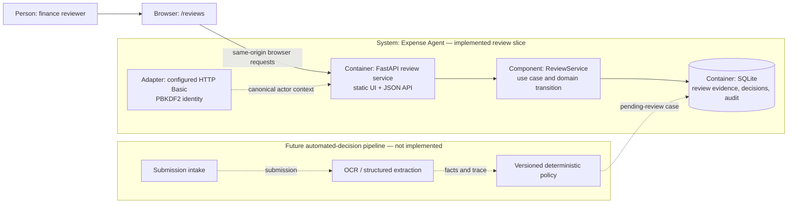
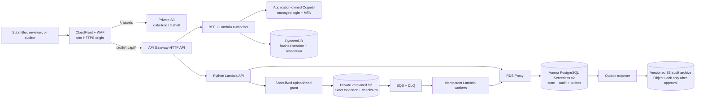
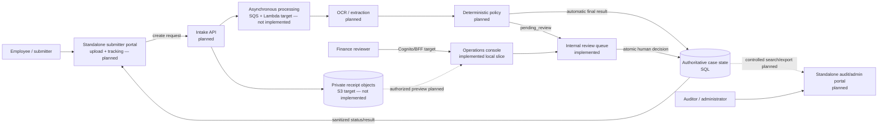
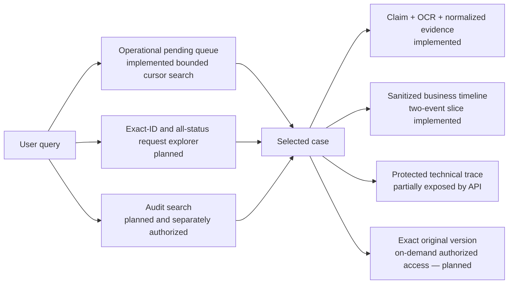
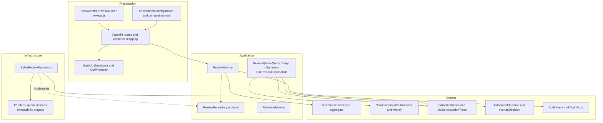
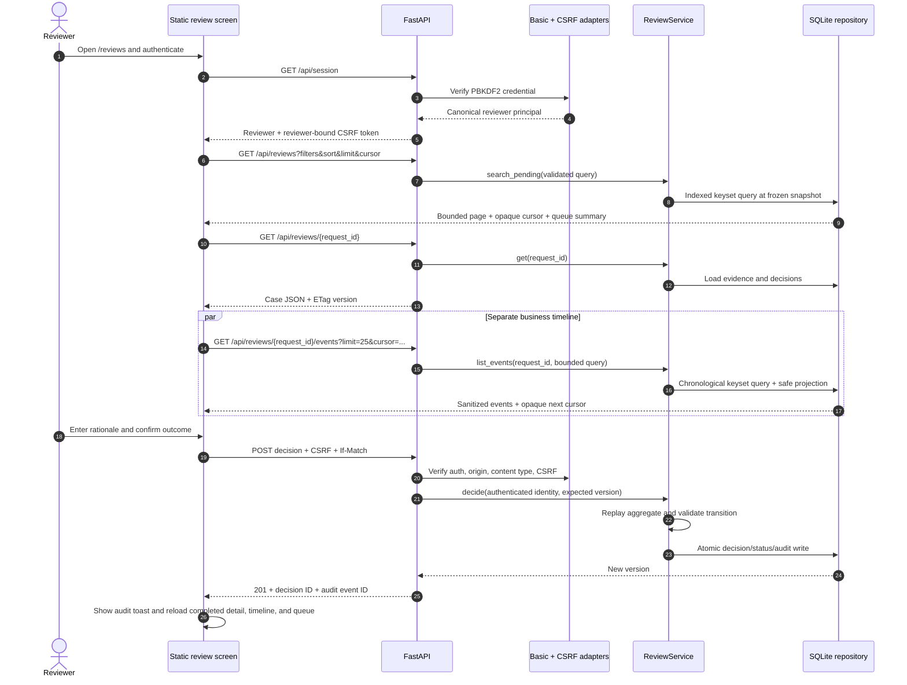
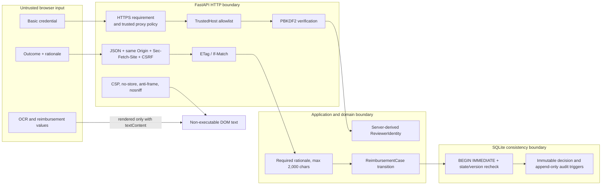
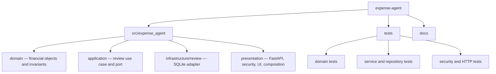

# System architecture

## Architectural position

The repository uses a small ports-and-adapters structure. The domain protects
financial invariants, the application coordinates review use cases,
infrastructure persists them, and presentation exposes one authenticated web
screen plus JSON endpoints. Dependencies point inward: the domain imports
neither FastAPI nor SQLite.

The implemented slice starts with a case already routed to human review. Intake,
document processing, and the baseline automated policy remain explicit future
producers of those cases.

## Current assessment context — C4-like view

For the assessment, configured HTTP Basic credentials establish the reviewer.
Local demonstration permits HTTP explicitly; a deployed assessment instance
would require trusted HTTPS. This diagram contains only executable runtime
components and the unimplemented producers that would create review cases.

## Accepted AWS production context — not implemented

The accepted target replaces HTTP Basic with the application-owned
Cognito/BFF session, SQLite with Aurora through the repository port, and
Uvicorn asset/API delivery with the split CloudFront/S3 and API Gateway/Lambda
runtime. `ReviewService` and the domain remain independent of those adapters.
No component in this production diagram is provisioned by this repository.

## Initial user experiences

The product owns its user experiences instead of assuming an existing
RecargaPay application. Each surface has a distinct authorization and
information boundary over the same authoritative case state.

| Audience | Initial surface | What they see | Boundary |
| --- | --- | --- | --- |
| Employee/submitter | Standalone upload and tracking portal | Request reference, upload progress, processing status, final outcome, approved explanation | Required but not implemented |
| Finance reviewer | Standalone HTML/CSS/JavaScript operations console | Server-paginated queue, filters, claimed data, receipt evidence, OCR, normalized facts, problems, rules, and decision form | Queue/detail/decision, bounded discovery, table/card views, and trilingual presentation are implemented; receipt-byte preview is not |
| Auditor/administrator | Standalone controlled search, export, user, and role surface | Identity, reasons, transitions, versions, correlations, model/policy trace, timestamps, and access governance | Required direction; first-release scope and implementation remain open |

Auto-approved and automatically rejected cases do not need to appear in the
human queue. They persist their result and audit facts and expose a sanitized
status in the submitter portal. Only cases routed to `pending_review` enter the
evidence workspace.

### Discovery and evidence-access target

The pending queue and historical discovery solve different jobs and must not
be disguised as one collection. Every path applies authorization and query
conditions in the service/database before pagination; the browser never
searches only the currently loaded page.

The existing `GET /api/reviews` searches the complete eligible pending result
set at its cursor snapshot, not only the current browser page. It does not find
automatic or completed cases and supports only prefix search over request ID,
submitter, and merchant. The planned request explorer provides an exact-ID fast
path and indexed all-status filters. Numbered `OFFSET` page jumps are not the
primary navigation model for a mutable million-row collection; direct lookup,
filters, saved views, and stable keyset cursors are.

Selecting a case currently shows core evidence and independently loads a
sanitized, cursor-paginated timeline for enqueue and human-decision events.
The protected technical trace, access audit, complete lifecycle coverage, and
original bytes remain unavailable. The target keeps the immutable original in
private object storage, fetches bytes only after an explicit authorized action,
and binds the exact object version and checksum to the processing-run input.
Business events, model/OCR invocation trace, and evidence-access events remain
separate records with different permissions.

## Code layers and dependency direction

The web DTO intentionally accepts only `outcome` and `reason`. The canonical
reviewer ID, email, and display name come from the authenticated principal.

## Implemented browser-to-database flow

These browser calls are ordinary same-origin HTTP requests made with `fetch`.
They are not webhooks. A webhook would be an outbound server-to-server
notification after an authoritative internal event, and no such integration is
implemented.

## Trust boundaries and security controls

Implemented controls include:

- HTTP is rejected when `EXPENSE_AGENT_REQUIRE_HTTPS=true`; HSTS is emitted on
  HTTPS responses. A production ingress must terminate TLS and only its IP/CIDR
  may be trusted for forwarded headers.
- Hostnames must match an explicit `TrustedHostMiddleware` allowlist; a bare
  wildcard is rejected at configuration time.
- The state-changing endpoint requires JSON, a matching `Origin`, a non-cross-
  site fetch context, a one-hour HMAC CSRF token bound to the reviewer, and the
  current ETag.
- CSP defaults to no sources and allows only same-origin scripts, styles,
  fonts, images, and connections. Framing, caching, referrers, and unnecessary
  browser capabilities are restricted.
- Client code uses `textContent`/DOM node creation and stores no review data or
  token in `localStorage` or `sessionStorage`.
- The model's raw response is retained in protected persistence for audit but
  is not returned by the browser-facing case endpoint.

## Data ownership

| Data | Authoritative owner | Implemented persistence |
| --- | --- | --- |
| Submission snapshot and workflow status | Expense Agent | `reimbursements` and `attachments` |
| Structured extraction and current single-invocation trace | Expense Agent | `extractions` and `model_invocation_traces`; production OCR/models/retries require a 1:N trace |
| Automated route, reasons, and rule evaluations | Expense Agent | Decision tables in SQLite |
| Review queue and detected problems | Expense Agent | `review_cases` and `review_problems` |
| Human decision and reviewer identity snapshot | Expense Agent | Immutable `human_decisions` row |
| Review-lifecycle audit facts | Expense Agent | Append-only `audit_events` rows |
| Original file bytes | Expense Agent through an application-owned attachment store | Not implemented; only opaque locations are stored |

## Production replacement boundary

The costed [AWS deployment study](aws-deployment-study.md) defines the accepted
self-contained production target using CloudFront, private S3, API Gateway,
Lambda, SQS, Cognito/BFF sessions, Aurora PostgreSQL, and RDS Proxy. It is
accepted but not implemented or deployed. São Paulo remains a planning
assumption, and sizing, data residency, retention, recovery targets, and SLOs
still require product and governance validation. The target has no dependency
on an existing RecargaPay application service.

D-041 records Amazon EKS as a feasible but unselected compute alternative.
D-042 later closes that option and explicitly reaffirms this table. No
Kubernetes artifact is part of the current project; a later reconsideration
would require a new explicit decision.

| Assessment implementation | Production requirement |
| --- | --- |
| HTTP Basic + configured PBKDF2 hashes | Cognito Authorization Code + PKCE through a BFF; opaque HttpOnly cookie; DynamoDB session revocation; RBAC/ABAC/four-eyes |
| File-backed SQLite | Aurora PostgreSQL Serverless v2 through RDS Proxy, production migrations, backups/PITR, recovery testing, encryption, and operational access controls |
| Uvicorn serving API and assets | CloudFront/WAF single edge, private S3 static origin, API Gateway, and Python Lambda |
| Environment-provided secrets | Approved secret manager and rotation process |
| Attachment locations displayed as text | Immutable object version plus SHA-256, safe derivative preview, explicit original download, object-level authorization, and access audit |
| Sanitized cursor timeline over two review-lifecycle event types | Full lifecycle coverage, separately authorized 1:N technical invocation trace, event search/export, and access audit across authoritative actions |
| Decision/status/audit atomic transaction | Decision/status/audit/outbox atomic transaction plus idempotent SQS/export consumers and immutable S3 audit archive after retention approval |

## Repository map

The latest recorded verification is 60 passing tests, a passing Ruff check,
JavaScript syntax validation, and a prior successful browser run. New automated
coverage exercises the sanitized timeline, signed purpose-bound event cursor,
pagination, frontend states/localization, and decision-to-event integration.
The prior browser QA covered all three locales, a category
filter, table/cards/detail views, a 10 + 6 item cursor traversal without overlap,
and one decision returning HTTP 201; the queue and KPIs refreshed, the returned
audit event ID was displayed, and no console errors were recorded. A real
two-thread test also proves that two writers starting at version 1 yield exactly
one commit and one conflict. `uv build` produced sdist and wheel with the static
UI assets and all three CLI entry points.
