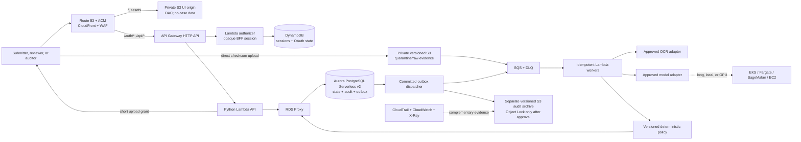
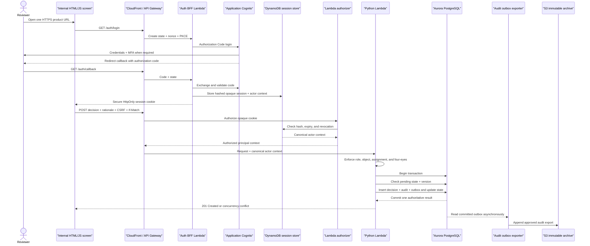
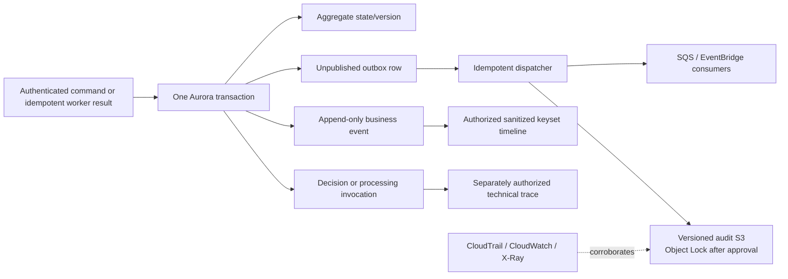
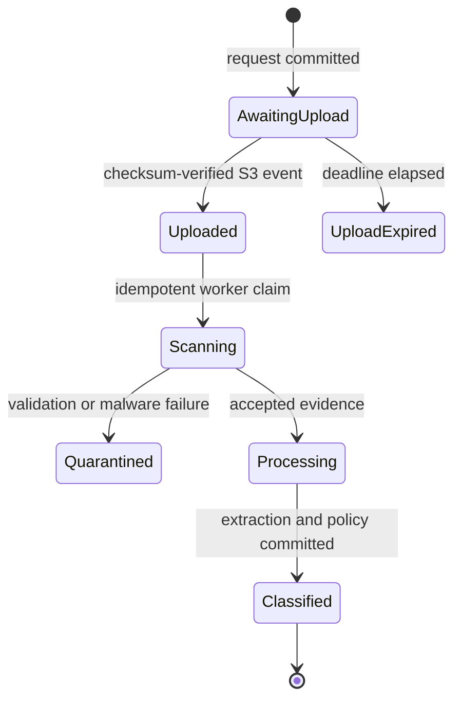
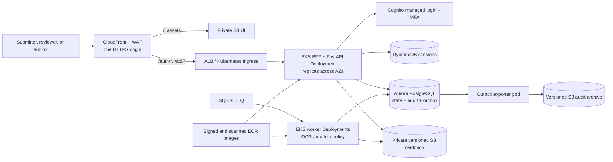

# Accepted AWS serverless target and cost study

The user accepted AWS hybrid serverless as the production deployment target.
This document now defines that target; it is still architecture, not deployed
infrastructure. AWS South America (São Paulo), `sa-east-1`, remains a working
cost/data-residency assumption because the final account topology, region,
networking, legal retention, recovery, and volume/SLO constraints are not yet
approved.

Prices are a 2026-08-10 snapshot in USD before tax, exchange rate, enterprise
discounts, support, or free-tier credits. They are useful for comparing designs,
not as a purchasing quote.

## Accepted target

Use this hybrid serverless design for the first production deployment:

- Route 53, ACM, CloudFront, and WAF as the single HTTPS product edge;
- a private S3 origin with CloudFront Origin Access Control for the data-free
  HTML/CSS/JavaScript application shell;
- API Gateway HTTP API and Python Lambda for short, stateless API operations;
- S3 for original receipts and derived images;
- Aurora PostgreSQL for financial state, relationships, decisions, and audit;
- RDS Proxy to protect PostgreSQL from Lambda connection bursts;
- SQS with a dead-letter queue between upload, extraction, model calls, and
  deterministic policy evaluation;
- an application-owned Cognito User Pool, MFA, a serverless BFF, and a small
  DynamoDB session store for user access;
- a transactional outbox and idempotent exporter for downstream events and an
  approved immutable audit archive;
- Fargate, SageMaker, or EC2 only for workers or local models that are too long,
  heavy, or specialized for Lambda;
- no VPN by default; add one only for a confirmed corporate network boundary or
  an on-premises/private dependency.

Aurora is the standalone AWS reference database. The repository port keeps the
domain portable, but the product does not depend on a pre-existing RecargaPay
database. Likewise, an `AttachmentStore` port keeps S3 replaceable without
changing the domain model.

Do not store receipt files in a Linux host filesystem and do not put image bytes
in PostgreSQL or DynamoDB. The normal design is deliberately polyglot: S3 owns
binary objects, while PostgreSQL owns their identifiers, checksums, lifecycle
metadata, and relationship to the reimbursement case.

## Accepted target runtime



The HTTP request should return `202 Accepted` after durable intake, not wait for
OCR or an LLM. API Gateway HTTP APIs have a 10 MB payload limit and a 30-second
maximum integration timeout, so receipt bytes should go directly to S3 through
a short-lived presigned URL. See the official [HTTP API quotas](https://docs.aws.amazon.com/apigateway/latest/developerguide/http-api-quotas.html)
and [S3 presigned URL guidance](https://docs.aws.amazon.com/AmazonS3/latest/userguide/using-presigned-url.html).

S3 and SQS event delivery can be repeated. Each processing stage therefore
needs an idempotency key such as `(request_id, attachment_version, stage,
processor_version)`. AWS explicitly documents SQS-triggered Lambda delivery as
at least once and recommends idempotent processing and partial batch responses:
[Lambda with SQS](https://docs.aws.amazon.com/lambda/latest/dg/with-sqs.html).

Step Functions Standard is an optional orchestration adapter when the measured
OCR/model graph needs durable parallel branches, provider waits, or explicit
compensation. Its execution history is operational and time-bounded; it never
replaces the Aurora business ledger. The simpler SQS/Lambda pipeline remains
the default until the actual provider graph justifies state-machine transition
cost and complexity.

## Serverless identity and end-to-end traceability

Serverless does not mean stateless business history. Lambda instances are
disposable, while PostgreSQL, the transactional outbox, S3 evidence, and the
audit archive hold durable state. Authentication supplies the human actor;
authorization determines whether that actor may review; the business
transaction records what the actor decided and why.

The reviewer must not type a reviewer ID, employee code, request identity, API
key, or other attribution value. The normal experience is:

1. An application administrator invites the user and assigns an initial role;
   public self-registration is not the default.
2. The user opens the one CloudFront HTTPS domain. S3 returns only the static
   shell, which contains no reimbursement data.
3. `/auth/login` creates one-time state, nonce, and PKCE context and redirects
   the browser to Cognito managed login. Cognito reuses its session or asks for
   credentials and MFA.
4. `/auth/callback` reaches the BFF Lambda. The backend validates the callback,
   exchanges the code, and maps stable `(iss, sub)` claims to the application's
   immutable actor ID. Email and display name are snapshots only.
5. The BFF creates a random opaque session and sets a `__Host-` cookie with
   `Secure`, `HttpOnly`, `SameSite=Lax`, no `Domain`, and `Path=/`. DynamoDB
   stores only its hash plus actor/auth context, explicit idle/absolute expiry,
   and revocation state. Provider tokens never enter browser JavaScript.
6. API Gateway invokes a Lambda authorizer for the cookie. The application then
   enforces role, team, assignment, value, purpose, and object-level policy in
   its service/SQL query before filtering or pagination.
7. `/api/session` returns display data, allowed actions, and a session-bound
   CSRF token held in memory. The reviewer submits only outcome, mandatory
   rationale, idempotency command ID, and expected version; actor identity is
   always derived from the verified session.

HTTP API Lambda authorizers receive cookies and can pass principal context to
the integration: [Lambda authorizers](https://docs.aws.amazon.com/apigateway/latest/developerguide/http-api-lambda-authorizer.html).
The default `execute-api` endpoint is disabled so callers must use the
controlled custom origin. CloudFront overwrites a rotated origin-verification
header and the authorizer rejects requests that lack its valid value, preventing
direct custom-origin calls from bypassing the WAF path: [disable the default endpoint](https://docs.aws.amazon.com/apigateway/latest/developerguide/http-api-disable-default-endpoint.html)
and [CloudFront origin custom headers](https://docs.aws.amazon.com/AmazonCloudFront/latest/DeveloperGuide/add-origin-custom-headers.html).
CloudFront serves private S3 assets through its recommended Origin Access
Control: [S3 origin restriction](https://docs.aws.amazon.com/AmazonCloudFront/latest/DeveloperGuide/private-content-restricting-access-to-s3.html).



### Identity integration options

| Option | When it fits | Direction |
| --- | --- | --- |
| Application-owned Cognito User Pool | The standalone AWS product needs managed login, tokens, MFA, groups, recovery, and lifecycle APIs | Selected production identity target; user lifecycle is explicit product scope |
| Another application-owned managed OIDC provider | Deployment standards select an equivalent portable provider | Valid replacement behind the same verified-claims boundary |
| Self-hosted identity server | A measured regulatory or portability need rules out managed identity | Last resort; adds patching, availability, key rotation, recovery, and incident ownership |

Cognito managed login provides an OAuth/OIDC authorization server plus login,
recovery, and MFA surfaces without making the application store passwords:
[managed login](https://docs.aws.amazon.com/cognito/latest/developerguide/cognito-user-pools-managed-login.html).
For a browser public client, use Authorization Code with PKCE rather than an
implicit token flow; AWS documents PKCE support and recommends the authorization
code grant:
[OAuth grants](https://docs.aws.amazon.com/cognito/latest/developerguide/federation-endpoints-oauth-grants.html).

Two browser-session shapes were evaluated:

- a short-lived access token obtained with Authorization Code and PKCE, sent to
  an API Gateway JWT authorizer; or
- a backend-for-frontend that exchanges the code and gives the browser only a
  short-lived, opaque, `Secure`, `HttpOnly` session cookie, with server-side
  revocation and same-origin CSRF/Origin checks.

The second option is selected. It better isolates tokens from browser
JavaScript and supports application-session revocation, at the cost of a
DynamoDB lookup and Lambda authorizer. Neither option stores access tokens in
`localStorage`. DynamoDB TTL may delete an expired item days later, so the
authorizer checks logical expiry and revocation on every request rather than
treating physical deletion as authorization:
[DynamoDB TTL](https://docs.aws.amazon.com/amazondynamodb/latest/developerguide/TTL.html).

Cognito proves identity; it is not the financial authorization database.
Aurora stores immutable actor IDs, `(issuer, subject)` identity links, role
grants, team memberships, case assignments, approval limits, and the audit of
administrative changes. A grant change increments an authorization version and
revokes or invalidates sessions created under an older version. DynamoDB keeps
the replaceable session projection and never becomes the authority for who may
approve which reimbursement.

### What is recorded

The authoritative human-review transaction should append:

- actor type `human`, identity issuer and subject, and email/display-name
  snapshots;
- role/scope snapshot and, if approved, an authentication/session reference;
- outcome, mandatory rationale, previous and next states, reviewed version, and
  idempotency command ID;
- request, correlation, and distributed-trace IDs;
- application build and policy versions plus a UTC timestamp;
- IP address and user agent only if Privacy and Security approve their purpose
  and retention.

Raw access and ID tokens must not be stored in the audit record. Automated
actions use a service/workload identity and additionally record OCR/model
provider and version, prompt/input/output hashes, parameters, retry attempt,
latency, and cost metadata. A deterministic policy decision records the policy
version, rule evaluations, and structured evidence that produced the route.

Database changes and event publication form a dual-write problem. The
transactional outbox writes the decision, state, audit, and unpublished event
in one database transaction; an idempotent publisher exports the committed
event later. AWS describes this pattern and its duplicate-delivery requirement:
[transactional outbox](https://docs.aws.amazon.com/prescriptive-guidance/latest/cloud-design-patterns/transactional-outbox.html).

CloudTrail remains useful for AWS control-plane and supported data-event
evidence, but it is not the financial business ledger: it does not contain the
reviewer's mandatory rationale or the case invariant. Optional CloudTrail log
file validation uses SHA-256 hashes and RSA signatures to detect modification
or deletion after delivery:
[CloudTrail log integrity validation](https://docs.aws.amazon.com/awscloudtrail/latest/userguide/cloudtrail-log-file-validation-intro.html).

### End-to-end trace model

Lambda contains no authoritative memory between requests. Durable identifiers
connect every persisted fact:

| Identifier | Meaning |
| --- | --- |
| `request_id` | Stable reimbursement/case identity visible to authorized users. |
| `command_id` | Client-generated idempotency key for one intended mutation. |
| `event_id` and per-case `event_sequence` | Immutable event identity and commit order used by the timeline cursor. |
| `correlation_id` / `causation_event_id` | End-to-end operation group and the event that caused the next action. |
| `attachment_id` / S3 `version_id` / SHA-256 | Exact original or derivative bytes consumed by a stage. |
| `processing_run_id` / `invocation_id` | One processing/reprocessing run and one OCR/model attempt, including retries. |
| `decision_id` | One automated or human decision record. |
| operational `trace_id` / AWS request ID | Diagnostic correlation only; not a business primary key. |

Each business event stores schema version, occurrence and recording times,
aggregate version, actor or workload identity, role/team snapshot, correlation
and causation, application/policy versions, and a canonical payload. OCR/model
attempts separately store provider/model/prompt/input/output hashes, permitted
parameters, latency, token/cost metadata, result/error, and a protected raw
output reference. Tokens, passwords, OAuth codes, CSRF secrets, presigned URLs,
and raw model output never enter the normal reviewer timeline.



For a human decision, the same Aurora transaction checks assignment,
four-eyes/value policy, `pending_review`, `If-Match`/aggregate version, and
`command_id`; inserts the immutable reviewer decision; changes status; appends
the business event; and inserts the outbox row. A conflict rolls back all of
them. The UI then reloads the case and `GET /events`; no asynchronous exporter
is required before the reviewer sees the committed event.

For a file read, the API authorizes the actor and exact attachment version,
records an `evidence_access_granted` event, and issues a very short-lived access
grant. The grant event proves authorization, not human comprehension. S3 or
CloudFront delivery logs and CloudTrail data events may later corroborate the
actual object request; a proxy is required only if policy demands synchronous
application-level byte/range accounting.

Protected reads and authentication are not hidden inside the business event
stream. The accepted design keeps three linked, append-only views:

| View | Durable record | Examples |
| --- | --- | --- |
| Business ledger | Aurora aggregate, decision, event, and outbox transaction | automated route, human outcome and rationale, previous/next state, policy version |
| Technical trace | Aurora processing runs/invocations plus protected S3 artifacts | OCR/model attempt, prompt and input/output hashes, latency, retry, error, exact evidence version |
| Identity/access audit | Application auth/access events plus correlated AWS access evidence | login/session lifecycle, authorized or denied search/detail/export, original-file grant, administrator action |

Every protected endpoint receives a correlation ID and records the canonical
actor, action, target or normalized query digest, authorization result, UTC
time, and outcome appropriate to its sensitivity. A sensitive original-file or
bulk-export grant fails closed if its required application access record cannot
be persisted. API Gateway/CloudFront logs and CloudTrail remain corroborating
evidence for transport and AWS-resource operations; they cannot establish a
reviewer's business rationale. Search/list audit payloads record bounded query
metadata and result counts rather than copying returned financial rows into a
second datastore.

Before provisioning, specify the user-invitation and approval workflow,
role/scope mapping, MFA and privileged step-up strength, recovery, logout,
idle/absolute session lifetime, refresh rotation, revocation SLO,
deprovisioning, separation of duties, and bootstrap administration. The BFF
shape is selected, while these security-policy values remain open. The
assessment's HTTP Basic adapter stays isolated until the AWS adapters exist.

## Storage model

### Why S3 plus SQL is the right split

| Concern | Recommended owner | Reason |
| --- | --- | --- |
| Original image/PDF bytes | S3 | Durable object storage without host affinity; lifecycle and version controls. |
| OCR/preview derivative bytes | Separate S3 key or bucket | Derivatives can change without modifying the original evidence. |
| Reimbursement state and amount | PostgreSQL | Relational invariants, exact transactions, concurrency, and reporting. |
| Attachment relationship | PostgreSQL | Foreign key from attachment metadata to the reimbursement. |
| Human decision and business audit | PostgreSQL | One atomic status/decision/audit transaction remains possible. |
| Long-term immutable audit export | S3 Object Lock, if approved | WORM protection complements but does not replace the business audit table. |

The attachment row should retain at least `attachment_id`, `request_id`, bucket,
object key, S3 version ID, SHA-256 checksum, detected MIME type, byte size,
creation time, classification, lifecycle policy ID, and processing state. The
object key is a reference, so using S3 does not weaken the relational link.

A database cannot commit atomically with S3. Use a small state machine instead:



The original object must be private, encrypted, versioned, and checksum-verified.
A reviewer receives only a short-lived authorized read path. HTML, SVG, MIME,
magic bytes, dimensions, and size require validation before any preview.

### SQL versus NoSQL

Aurora PostgreSQL is the default recommendation because the existing model has
relationships and multi-record financial transactions. DynamoDB may later hold
a specialized idempotency or read model when measured access patterns justify
it, but replacing the authoritative model with one large NoSQL document would
lose useful constraints without solving binary storage. DynamoDB items are
limited to 400 KB, and AWS itself recommends S3 for larger objects:
[large-item guidance](https://docs.aws.amazon.com/amazondynamodb/latest/developerguide/bp-use-s3-too.html).

This choice belongs behind the existing repository boundary: SQLite remains the
assessment adapter; the accepted Aurora PostgreSQL implementation becomes the
production adapter. Cloud topology must not leak into the aggregate or policy
objects.

## Compute options

| Option | Best fit | Advantages | Material disadvantages | Direction |
| --- | --- | --- | --- | --- |
| Lambda | Short APIs, orchestration, bursty workers | No host management, automatic scale, pay per execution | Cold starts, 15-minute maximum, ephemeral local disk, concurrency and SQL-connection control | Recommended default |
| ECS Fargate | Always-warm API or workers longer than Lambda | Containers without managing instances; no Lambda time limit | Continuous minimum cost and slower scale-out than Lambda | Recommended fallback |
| Amazon EKS Auto Mode | Kubernetes-required, multi-container, long-running, or GPU workloads | Kubernetes API/portability while AWS manages more node, networking, load-balancing, storage, scaling, and patching work | Per-cluster fee plus EC2 and Auto Mode charges; application, cluster policy, releases, security, and observability remain owned | Feasible alternative; not selected |
| EKS on Fargate | Lightweight Kubernetes pods without owned nodes | Per-pod compute boundary and no EC2 node groups | EKS cluster fee remains; no GPU, Spot, DaemonSets, privileged containers, or EBS; private-subnet networking | Conditional niche, not the model-worker default |
| EC2 Auto Scaling | Stable high utilization or specialized/GPU runtime | Maximum runtime and hardware control; potentially lower unit cost when saturated | Patching, AMIs, capacity, scaling, failover, and operational ownership | Use only with measured justification |
| One VPS | Demonstration only | Lowest apparent bill and simplest host | Single point of failure, local state, manual scaling, maintenance outage | Reject for mission-critical production |

The 15-minute Lambda ceiling and related resource limits are documented in the
official [Lambda quotas](https://docs.aws.amazon.com/lambda/latest/dg/gettingstarted-limits.html).

A million cases per month is only about `0.39` cases/second on average; ten
million is about `3.86` cases/second. Peak RPS, duration, file size, and model
concurrency matter much more than the monthly total. SQS absorbs bursts and
lets the application cap OCR, LLM, and database concurrency independently.

Cold-start latency should not be on the OCR/LLM critical path because processing
is asynchronous. Measure P95/P99 for creation and human-review commands, and
pay for provisioned concurrency only if the service-level objective requires
it.

## Kubernetes/EKS feasibility — evaluated and not selected

Technical feasibility is high, but no Kubernetes requirement has been accepted.
The application boundaries deliberately allow compute adapters to change. A
full EKS deployment would containerize the BFF/API and queue workers while
leaving durable and identity services outside the cluster:

| Accepted serverless component | Full EKS alternative |
| --- | --- |
| CloudFront/WAF plus private S3 UI | Unchanged; static assets do not need a pod. |
| API Gateway, Lambda authorizer, and Python API Lambda | CloudFront/WAF to ALB/Ingress, Kubernetes Service, and replicated BFF/API Deployments. |
| Lambda SQS consumers | Separately scaled worker Deployments/Jobs consuming the same SQS queues and DLQs. |
| Cognito and DynamoDB BFF sessions | Unchanged; session middleware runs in the BFF pods. |
| Aurora through RDS Proxy | Aurora stays authoritative; application pooling and the continued need for RDS Proxy are measured. |
| Versioned S3 evidence and audit archive | Unchanged and never mounted as authoritative pod-local state. |
| Lambda execution roles | Least-privilege EKS Pod Identity per Kubernetes service account. |
| CloudWatch/X-Ray/CloudTrail | Container/OTel telemetry plus EKS control-plane logs; all remain complementary to the application ledger. |



If Kubernetes becomes mandatory, EKS Auto Mode is the default shape to assess.
AWS manages more of the node lifecycle, compute autoscaling, pod/service
networking, load balancing, cluster DNS, block storage, and patching while the
team still owns containers, Kubernetes configuration, availability, security,
monitoring, and releases:
[EKS Auto Mode](https://docs.aws.amazon.com/eks/latest/userguide/automode.html).
Managed node groups are justified only for a documented customization gap.
EKS on Fargate can run lightweight API pods, but AWS documents limitations
including no DaemonSets, privileged containers, GPU, Spot, or EBS and a
private-subnet requirement:
[EKS Fargate considerations](https://docs.aws.amazon.com/eks/latest/userguide/fargate.html).
Fargate pods use IAM Roles for Service Accounts rather than EKS Pod Identity;
the service account still receives only the workload's least-privilege role.

Pod and node scaling are separate controls. API Deployments need resource
requests, probes, a minimum warm replica count, HPA, multi-AZ topology spread,
and PodDisruptionBudgets. Queue workers should scale from SQS depth and oldest
message age rather than CPU alone; event-driven scaling adds KEDA or an
equivalent external-metrics adapter. EKS Auto Mode then creates or consolidates
nodes. Kubernetes documents HPA as periodically changing workload replicas from
resource or custom metrics, while AWS documents EKS node-autoscaling choices:
[Kubernetes HPA](https://kubernetes.io/docs/concepts/workloads/autoscaling/horizontal-pod-autoscale/)
and [EKS autoscaling](https://docs.aws.amazon.com/eks/latest/userguide/autoscaling.html).

Traceability does not move into Kubernetes. Every financial command still
commits actor, state, decision/rationale, business event, and outbox in Aurora.
Every processing attempt still binds exact S3 versions and checksums. Technical
context additionally records the immutable container-image digest, namespace,
workload, and pod UID. EKS Pod Identity grants temporary AWS credentials to a
service account, not business authority to a human:
[EKS Pod Identity](https://docs.aws.amazon.com/eks/latest/userguide/pod-identities.html).
Enable API, audit, authenticator, controller, and scheduler logs, but AWS labels
their CloudWatch delivery best effort; these cluster logs cannot replace the
financial ledger:
[EKS control-plane logging](https://docs.aws.amazon.com/eks/latest/userguide/control-plane-logs.html).

The fixed price starts before a user request is processed. Standard Kubernetes
version support is `$0.10` per cluster-hour, approximately `$73/month`; extended
support is `$0.60` per hour, approximately `$438/month`. Three isolated
development, staging, and production clusters therefore start around
`$219/month` for standard-support control planes alone. EC2 or Fargate, EKS Auto
Mode management, ALB, NAT or endpoints, EBS, ECR, cross-AZ traffic, logs,
metrics, and engineering/on-call time are additional:
[Amazon EKS pricing](https://aws.amazon.com/eks/pricing/).

The user subsequently reaffirmed D-026 and closed Kubernetes as a current
option in D-042. Lambda therefore remains the selected runtime for short and
bursty paths. A future explicit decision may reopen an EKS worker runtime for a
measured local-model, GPU, long-duration, custom-runtime, or sustained-load
need. One or ten million cases per month alone does not provide that evidence;
peak rate and workload duration do.

## VPN decision

A VPN is not required merely because the application handles financial data or
uses small function calls. It provides a network path; it does not replace
identity, authorization, encryption, or audit.

Accepted network default, subject to the product threat model:

- expose the edge through HTTPS;
- authenticate users with application-owned managed OIDC and MFA;
- enforce reviewer roles/scopes in the API;
- keep Aurora and receipt buckets non-public;
- use security groups and VPC endpoints between AWS components;
- use WAF/rate limits from the product's approved threat model and SLOs.

Add AWS Client VPN only if policy requires reviewers to originate from a
corporate private network. Add Site-to-Site VPN or Direct Connect only if the
service must call on-premises systems or a model hosted outside the AWS VPC.
For S3, a gateway VPC endpoint avoids NAT and has no hourly or data-processing
charge. AWS documents the endpoint alternative in its [NAT cost guidance](https://docs.aws.amazon.com/vpc/latest/userguide/nat-gateway-pricing.html).

At current São Paulo public rates, two Client VPN subnet associations cost
about `$219/month` before connections; active clients add `$0.05` per
connection-hour. Ten reviewers connected 160 hours each add `$80/month`, making
that example about `$299/month` before public IPv4 and transfer. This reinforces
that VPN must satisfy a real requirement, not be a reflexive security purchase.

## Retention and compression

No deletion duration is selected in this study. Legal, Privacy, Finance, Data
Governance, Security, and the accountable product owner must approve a retention
matrix before production lifecycle expiration is enabled. It must define data
category, purpose, minimum retention, maximum retention, litigation/legal hold,
deletion evidence, backups, and exceptions.

After approval, S3 Lifecycle can transition objects and expire them by tag or
prefix. [S3 Lifecycle](https://docs.aws.amazon.com/AmazonS3/latest/userguide/object-lifecycle-mgmt.html)
supports both transitions and expiration. [S3 Object Lock](https://docs.aws.amazon.com/AmazonS3/latest/userguide/object-lock.html)
can prevent overwrite/deletion for a retention period or legal hold, but
Compliance mode is intentionally difficult to reverse and must not be enabled
without governance approval.

Compression rules:

- preserve the uploaded original byte-for-byte with its checksum;
- create a separate normalized derivative for OCR and browser display;
- never overwrite the original with a lossy JPEG/WebP/PDF conversion;
- benchmark OCR field accuracy before changing resolution or quality;
- compress OCR JSON/text losslessly;
- record the derivative algorithm, version, parameters, and source checksum.

If total retained data truly falls from 2 MB to 1 MB per case, one million new
cases per month with 90-day retention saves about `$121.50/month` in S3 Standard;
at ten million cases, the tier-aware saving is about `$1,201.80/month`. If the
original must remain, only derivative compression or moving the original to a
cheaper approved class creates that saving.

## Price inputs

Public on-demand rates used in the model:

| Component in `sa-east-1` | Rate used |
| --- | ---: |
| Lambda x86 duration | `$0.0000166667` per GB-second |
| Lambda requests | `$0.20` per million |
| API Gateway HTTP API, first 300M | `$1.59` per million |
| SQS Standard | `$0.40` per million after the recurring first 1M free requests |
| S3 Standard, first 50 TB | `$0.0405` per GB-month |
| S3 PUT/COPY/POST/LIST | `$0.007` per 1,000 |
| S3 GET and other Tier-2 requests | `$0.0056` per 10,000 |
| S3 Standard-IA | `$0.0221` per GB-month, plus transitions/retrieval |
| Aurora PostgreSQL Serverless v2 | `$0.25` per ACU-hour |
| Aurora Standard storage | `$0.19` per GB-month |
| Aurora Standard I/O | `$0.28` per million I/Os |
| RDS Proxy for Aurora Serverless v2 | `$0.032` per ACU-hour |
| EC2 `t4g.medium` Linux on demand | `$0.0536/hour` |
| EC2 `t4g.large` Linux on demand | `$0.1072/hour` |
| EBS gp3 | `$0.152` per GB-month |
| Application Load Balancer | `$0.034/hour` plus `$0.011/LCU-hour` |
| Fargate ARM | `$0.0557/vCPU-hour` plus `$0.00612/GB-hour` |
| EKS standard-support control plane | `$0.10/cluster-hour` |
| EKS extended-support control plane | `$0.60/cluster-hour` |
| NAT Gateway | `$0.093/hour` plus `$0.093/GB` processed |
| Client VPN | `$0.15/endpoint-association-hour` plus `$0.05/connection-hour` |

Official AWS public price-list snapshot sources: [Lambda](https://pricing.us-east-1.amazonaws.com/offers/v1.0/aws/AWSLambda/20260717075216/sa-east-1/index.json),
[API Gateway](https://pricing.us-east-1.amazonaws.com/offers/v1.0/aws/AmazonApiGateway/20260724004602/sa-east-1/index.json),
[S3](https://pricing.us-east-1.amazonaws.com/offers/v1.0/aws/AmazonS3/20260807185915/sa-east-1/index.json),
[SQS](https://pricing.us-east-1.amazonaws.com/offers/v1.0/aws/AWSQueueService/20250828200713/sa-east-1/index.json),
[RDS/Aurora](https://pricing.us-east-1.amazonaws.com/offers/v1.0/aws/AmazonRDS/current/sa-east-1/index.json),
[EC2/EBS](https://pricing.us-east-1.amazonaws.com/offers/v1.0/aws/AmazonEC2/20260810113509/sa-east-1/index.json),
[Elastic Load Balancing](https://pricing.us-east-1.amazonaws.com/offers/v1.0/aws/AWSELB/current/sa-east-1/index.json),
[Fargate](https://pricing.us-east-1.amazonaws.com/offers/v1.0/aws/AmazonECS/current/sa-east-1/index.json),
[Amazon EKS](https://aws.amazon.com/eks/pricing/),
and [VPC/VPN](https://pricing.us-east-1.amazonaws.com/offers/v1.0/aws/AmazonVPC/20260724154225/sa-east-1/index.json).

## Workload assumptions for comparison

The cost model deliberately exposes its guesses:

- 1 million or 10 million reimbursement cases per month;
- three HTTP API calls, three Lambda invocations, and three SQS operations per
  case;
- 2.25 Lambda GB-seconds per case in total;
- total retained object data averages 1 MB per case;
- illustrative 90-day steady-state retention, not a policy recommendation;
- 20 Aurora I/O operations per case;
- 100 GB database storage and 2 average ACUs at 1M cases;
- 1 TB database storage and 8 average ACUs at 10M cases;
- the HA database column models a writer and failover reader at the stated
  average ACU level;
- 20% of receipt objects receive one S3 GET.

The estimate excludes OCR, LLM, CloudWatch ingestion, WAF, KMS operations,
backups, disaster recovery, data transfer, NAT data, secrets, support, taxes,
and engineering labor.

## Monthly comparison

| Cost area | 1M cases/month | 10M cases/month |
| --- | ---: | ---: |
| HTTP API + Lambda + SQS | `$43.67` | `$440.30` |
| S3 storage and modeled PUT/GET | `$128.61` | `$1,286.12` |
| Aurora, one database instance | `$436.32` | `$1,892.88` |
| **Serverless total, one DB instance** | **`$608.60`** | **`$3,619.30`** |
| Aurora, writer + failover reader | `$848.04` | `$3,539.76` |
| **Serverless total, HA DB model** | **`$1,020.32`** | **`$5,266.18`** |

These totals show why Lambda cold starts and request charges are not the main
economic risk. Database capacity, retained bytes, and especially OCR/LLM are
more likely to dominate.

### S3 sensitivity at 90 days

`Retained GB ≈ cases/month × total MB/case × retention_days / 30 / 1,000`.

| Cases/month | Total retained MB/case | Steady-state S3 Standard | Monthly PUTs for one object/case |
| ---: | ---: | ---: | ---: |
| 1M | 0.5 MB | `$60.75` | `$7.00` |
| 1M | 1 MB | `$121.50` | `$7.00` |
| 1M | 2 MB | `$243.00` | `$7.00` |
| 10M | 0.5 MB | `$607.50` | `$70.00` |
| 10M | 1 MB | `$1,215.00` | `$70.00` |
| 10M | 2 MB | `$2,416.80` | `$70.00` |

For one million 1 MB objects/month and 90-day retention, a deterministic policy
of 30 days in Standard followed by 60 days in Standard-IA is approximately
`$94.70/month` at steady state: `$40.50` Standard, `$44.20` Standard-IA, and
`$10` in transition requests, before retrieval. Keeping all three months in
Standard is `$121.50`. This policy must follow access and retention evidence;
it is not automatically correct for actively reviewed cases.

### Compute deployment baselines

These values cover only the API/container layer and do not include S3 or the
database:

| Deployment baseline | Approximate monthly cost | Interpretation |
| --- | ---: | --- |
| One `t4g.large` + 20 GB gp3 | `$81.30` | Cheap but a production single point of failure. |
| Two Fargate ARM tasks, each 0.5 vCPU/1 GB, plus one ALB/LCU | `$82.45` | Managed always-warm baseline; scale-out is extra. |
| Two `t4g.large`, 40 GB gp3 total, plus one ALB/LCU | `$195.44` | Minimum credible EC2 HA baseline before autoscaling and operations. |
| Same EC2 baseline plus two NAT gateways | `$331.22` | Adds `$135.78` fixed NAT cost before `$0.093/GB`. |
| EKS managed-node baseline: standard control plane plus the two-EC2/ALB row | `$268.44` | Before NAT, EKS logs, ECR, autoscaling headroom, and engineering operations. |
| Same EKS managed-node baseline plus two NAT gateways | `$404.22` | Illustrative floor, not a production capacity recommendation. |

Lambda plus HTTP API and SQS is about `$43.67` at the modeled 1M cases, but
about `$440.30` at 10M. Fargate or EC2 may become cheaper for high, stable,
measured utilization; their task/instance count at 10M cannot be inferred from
monthly volume and requires load testing. A single VPS is not a valid comparison
to managed highly available Lambda.

## OCR and LLM warning

The 2026-08-10 AWS public Textract catalog contains no `sa-east-1` products, so
this study does not assume that service can process Brazilian receipts in-region.
Using another region would require explicit data-residency, privacy, latency,
and transfer approval.

For order-of-magnitude context only, the current N. Virginia catalog prices
basic document-text detection at `$0.0015/page` through one million pages and
`$0.0006/page` above that tier. That is `$1,500` for 1M one-page receipts and
`$6,900` for 10M. Analyze Expense is `$0.01/page` then `$0.008/page`, or
`$10,000` and `$82,000` for the same volumes. Source: [AWS Textract public price catalog](https://pricing.us-east-1.amazonaws.com/offers/v1.0/aws/AmazonTextract/current/index.json).

An LLM estimate needs model, region/provider, input tokens, output tokens,
number of model calls, retry rate, and cache hit rate. The formula is:

```text
monthly LLM cost = cases × model calls per case ×
  ((input tokens ÷ 1,000,000 × input price) +
   (output tokens ÷ 1,000,000 × output price))
```

This is why OCR and model usage must be measured separately from the roughly
`$44 per million` modeled API/Lambda/SQS glue cost.

## Information required before production provisioning

1. Confirm AWS account separation, controls, and the required deployment region.
2. Provide cases/month, peak cases/second, burst duration, and growth forecast.
3. Measure pages and bytes per receipt before and after safe normalization.
4. Define P95/P99 SLOs for intake, status queries, and reviewer decisions.
5. Identify the approved OCR/LLM providers and whether receipt data may leave
   Brazil or the private network.
6. Obtain the Legal/Data Governance retention and legal-hold matrix.
7. Specify standalone identity provisioning, MFA, recovery, roles, revocation,
   bootstrap administrators, and whether private-network-only access is
   mandatory.
8. Load-test PostgreSQL transactions and determine average/peak ACUs or choose a
   provisioned Aurora/RDS tier.
9. Decide recovery point, recovery time, backup, and multi-region requirements.
10. Recalculate in AWS Pricing Calculator with enterprise discounts and taxes.

The AWS topology is accepted. Until these inputs exist, the honest claim is an
accepted replaceable target plus a parametric cost model—not a deployed,
capacity-proven, governance-approved production environment.
