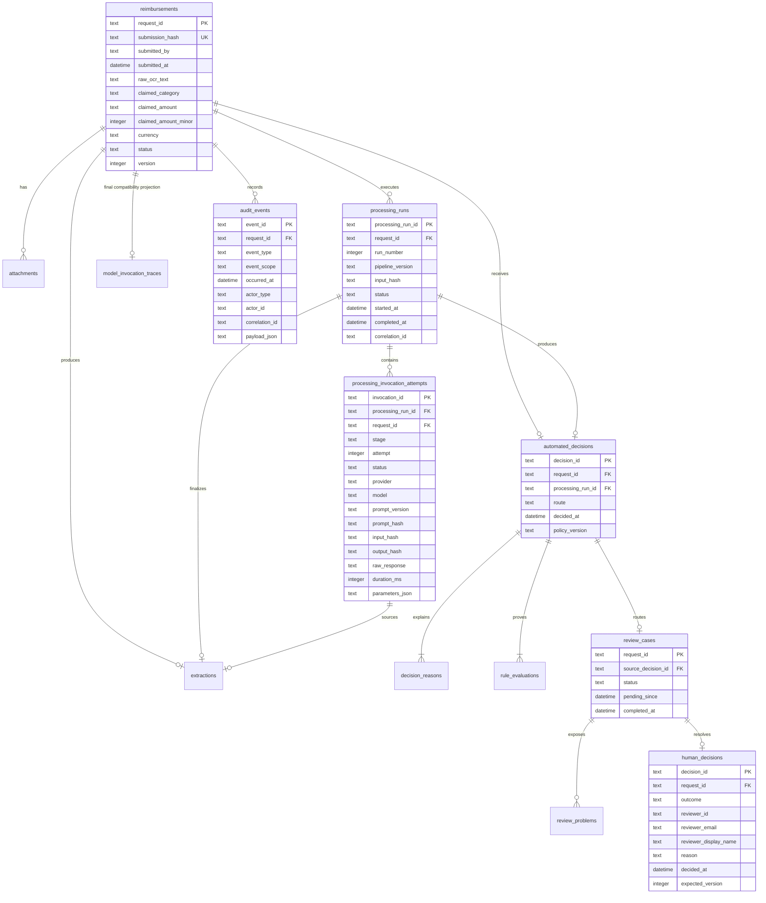
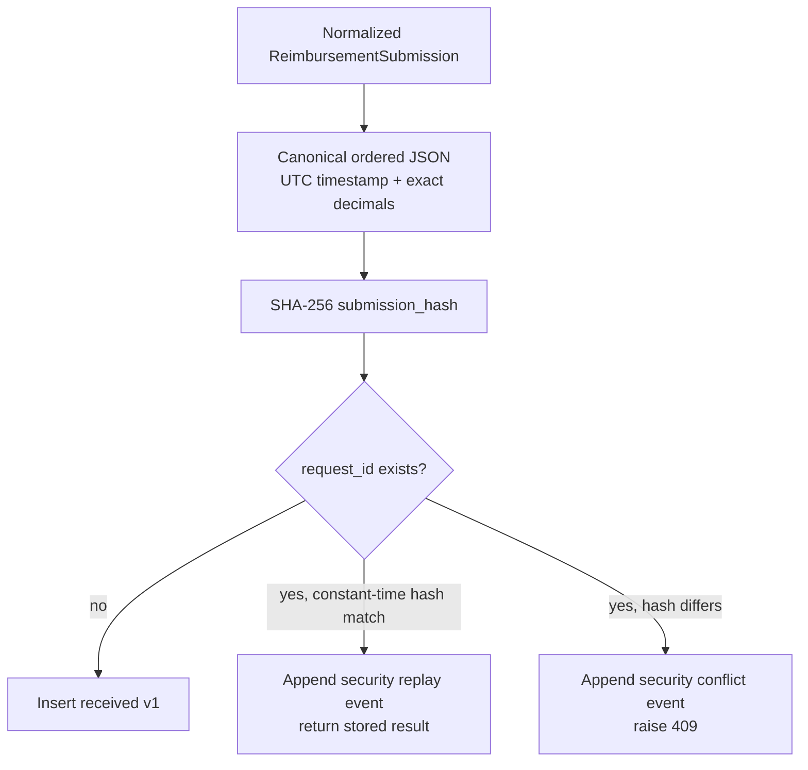

# Database model

## Persistence position

The executable uses one file-backed SQLite database as an assessment adapter.
It persists the full local workflow—input, versions, processing run, invocation
attempts, extraction, automated decision, optional review, human decision, and
audit events—without storing monetary values as binary floating point.

SQLite is not the production scale claim. The accepted production replacement
is Aurora PostgreSQL Serverless v2 through RDS Proxy, plus a transactional
outbox and versioned S3 evidence. That adapter and schema are not implemented.

## Physical schema and cardinalities

The fourteenth table, `application_metadata`, stores repository metadata such
as the persistent HMAC key used to sign queue/timeline cursors.

`model_invocation_traces` is retained as the one-row final extraction projection
used by existing review reads and compatibility migration. The authoritative
attempt history is `processing_invocation_attempts`: one request may have many
runs, stages, and attempts, each with its own immutable identity and input/
output hash. The current `ProcessingService` executes one run and one primary
attempt; the storage shape no longer prevents retries or a secondary verifier.
For compatibility with upgraded databases, `extractions.source_invocation_id`
and decision/run links are validated by the finalization transaction rather
than declared as new SQLite foreign keys; the diagram shows their logical
cardinality.

## Table responsibilities

| Table | Responsibility |
| --- | --- |
| `reimbursements` | Immutable normalized submission, canonical fingerprint, current state, and optimistic version. |
| `attachments` | Ordered caller-supplied reference strings. No bytes, object version, checksum, MIME, scan, or retention metadata. |
| `processing_runs` | Numbered pipeline execution, version, input hash, correlation ID, and running/terminal state. |
| `processing_invocation_attempts` | 1:N durable extractor/model attempt ledger including protected raw output and terminal hash. |
| `model_invocation_traces` | Final 1:1 compatibility projection for the selected extraction. |
| `extractions` | One selected structured result or bounded failure, linked to its run and source attempt. |
| `automated_decisions` | One immutable versioned policy route per request. |
| `decision_reasons` | Ordered business explanations and evidence. |
| `rule_evaluations` | Ordered rule ID/version/outcome/facts for deterministic replay. |
| `review_cases` | Pending/completed human-review lifecycle sourced from an automated decision. |
| `review_problems` | Immutable reviewer-facing reasons for queue placement. |
| `human_decisions` | One immutable approve/reject outcome, canonical reviewer snapshot, rationale, and expected version. |
| `audit_events` | Append-only scoped business, technical, and security facts. |
| `application_metadata` | Repository-owned cursor signing material and future schema metadata. |

## Idempotency and identity

The fingerprint includes request ID, submitter, timestamp normalized to UTC,
raw OCR text, category, exact amount/currency, and ordered attachment references.
Correlation IDs and processing metadata are excluded. A JSON number `0.1` and
the string `"0.10"` normalize to the same exact domain amount and replay safely.

`request_id` is both the public idempotency key and primary aggregate identity.
Processing run, invocation, decision, and event IDs remain independent to avoid
conflating retries or audit facts with the business request.

## Transaction and version model

```mermaid
flowchart LR
    T1["Tx 1\nsubmission + attachments + received event"] --> V1["received v1"]
    V1 --> T2["Tx 2\nrun + processing event"] --> V2["processing v2"]
    V2 --> T3["Tx 3\nrunning attempt + technical event"]
    T3 --> Call["Extractor call\noutside SQL transaction"]
    Call --> T4["Tx 4\nterminal attempt + technical event"]
    T4 --> T5["Tx 5\nextraction + policy + route + business events"] --> V3["automated final v3"]
    V3 -->|"pending only"| T6["Tx 6\nhuman decision + status + event"] --> V4["human final v4"]
```

### Received transaction

`BEGIN IMMEDIATE` inserts the reimbursement at v1, ordered attachment
references, and `reimbursement_received`. Existing IDs take a separate path:
the same hash appends `reimbursement_intake_replayed`; a different hash appends
`reimbursement_intake_conflict_rejected` before returning a conflict. Those two
events use the `security` scope and are excluded from the reviewer timeline.

### Processing-start transaction

The repository verifies `received` at the expected version, inserts a running
`processing_runs` row, updates the reimbursement to `processing` v2, and appends
`reimbursement_processing_started`. A partial start cannot be observed.

### Invocation transactions

Before extractor execution, a transaction inserts a `running` attempt and
`model_invocation_started` technical event. No database transaction spans the
potential network call. A second transaction changes that exact row to
`succeeded` or `failed`, records the raw response, output hash, bounded error,
completion/timing/parameters, and appends `model_invocation_completed`.

Persisting intent first means a crash can leave visible evidence of an
unfinished attempt instead of erasing the fact that processing began. Automatic
recovery/retry is not implemented in the synchronous assessment. A request can
therefore remain at processing v2 with a running run/attempt; production cannot
activate until an idempotent lease/watchdog/resume/replay path is implemented.

### Automated finalization transaction

The repository requires `processing` v2, the expected running run, and a
terminal source invocation whose raw response matches the extraction trace. In
one transaction it inserts:

- selected extraction and compatibility trace;
- automated decision, ordered reasons, and ordered rule evaluations;
- a review case and immutable problems only for `human_review`;
- terminal `completed` processing run;
- reimbursement final status at v3;
- `automated_decision_recorded`, plus `review_case_enqueued` when applicable.

An audit insertion or uniqueness failure rolls this whole outcome back to
processing v2; tests explicitly force a late event collision and verify that no
extraction, automated decision, or review row leaks through.

### Human-decision transaction

The API first requires an ETag/`If-Match` precondition. The repository then
serializes the write with `BEGIN IMMEDIATE`, rechecks pending workflow states
and v3, inserts the immutable decision with server-derived reviewer identity,
marks the review complete, updates reimbursement to approved-after-review or
rejected v4, and appends `human_review_decided`. Competing or repeated writers
cannot produce two decisions.

## Immutability and durability

SQLite is configured with foreign keys, WAL, busy timeout, and
`synchronous=FULL`. Database triggers prevent update/delete of:

- immutable submission fields and attachment references;
- terminal processing runs and terminal invocation attempts;
- final compatibility traces, extractions, automated decisions, reasons, rule
  evaluations, and review problems;
- human decisions and all audit events.

A running attempt/run may transition once to a terminal state, then becomes
immutable. Reimbursement status/version and review status are the intentional
mutable aggregate projections guarded by expected state/version checks.

## Read models and indexes

The exact result read starts from `reimbursements` and treats processing,
extraction, automated decision, review, and human decision as optional. It
therefore returns every retained status rather than using the inner joins of the
pending-review detail projection.

Pending discovery applies authorization (global in this assessment), search,
filters, sort, and limit in SQL before returning a page. Exact BRL filters use
minor units. Stable keyset cursors are HMAC-signed, bound to query shape and a
first-page snapshot, and use a unique request-ID tie-breaker. Indexes cover
pending time, amount, submitted time, category+amount, submitter, merchant, and
problem code.

Business timelines query `(request_id, event_scope, occurred_at, event_id)` and
return only whitelisted `business` events through a purpose-bound cursor.
Technical/security events and raw attempt data remain protected DB records.

## Compatibility migration

Repository initialization adds missing workflow/minor-unit/scope columns,
creates new tables and indexes, backfills older review fixtures into compatible
workflow records inside one explicit transaction, and installs immutability
triggers. The derived `claimed_amount_minor` is immutable with its source amount
so indexed comparisons cannot drift; a dedicated versioned trigger also closes
that protection on databases carrying the older trigger definition. Migration
tests cover the legacy
assessment schema and rollback. This is intentionally small SQLite compatibility
logic, not a substitute for a versioned production migration system.

## Production data gaps

The current database cannot by itself satisfy the complete production evidence
contract:

- attachment bytes, immutable object version/checksum, MIME/size, malware scan,
  legal hold, and access audit are absent;
- no actor/role/team/assignment/tenant tables or separation-of-duties policy;
- no comprehensive authentication, read, search, validation-error,
  orchestration-error, or evidence-access audit;
- no transactional outbox, immutable archive export, backup/restore exercise,
  PITR, replica, or RPO/RTO evidence;
- no PostgreSQL adapter, million-row query plan/load test, partitioning, or
  connection-pool measurement;
- no automated recovery for abandoned running attempts; a crash can strand v2
  and is a production blocker, not merely an operational enhancement;
- no approved retention/deletion matrix.

In AWS, authoritative business state remains relational in Aurora. Receipt
bytes belong in versioned private S3, not local disk, SQLite blobs, DynamoDB, or
one undifferentiated NoSQL document. S3 and SQL require explicit intake states,
checksum/version binding, idempotent events, and cleanup because they do not
share a transaction.
