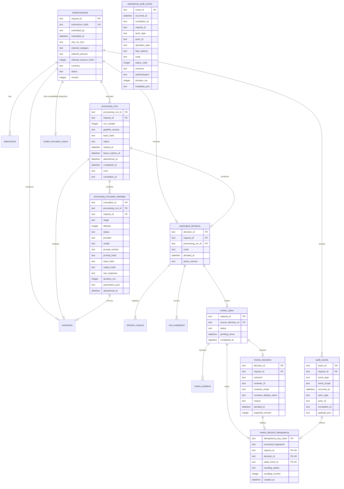
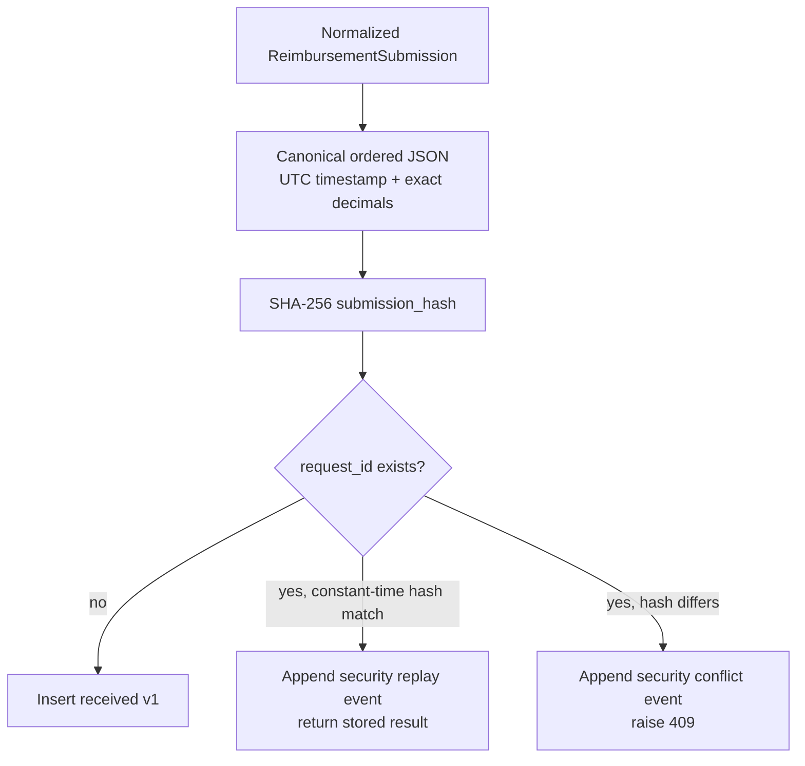
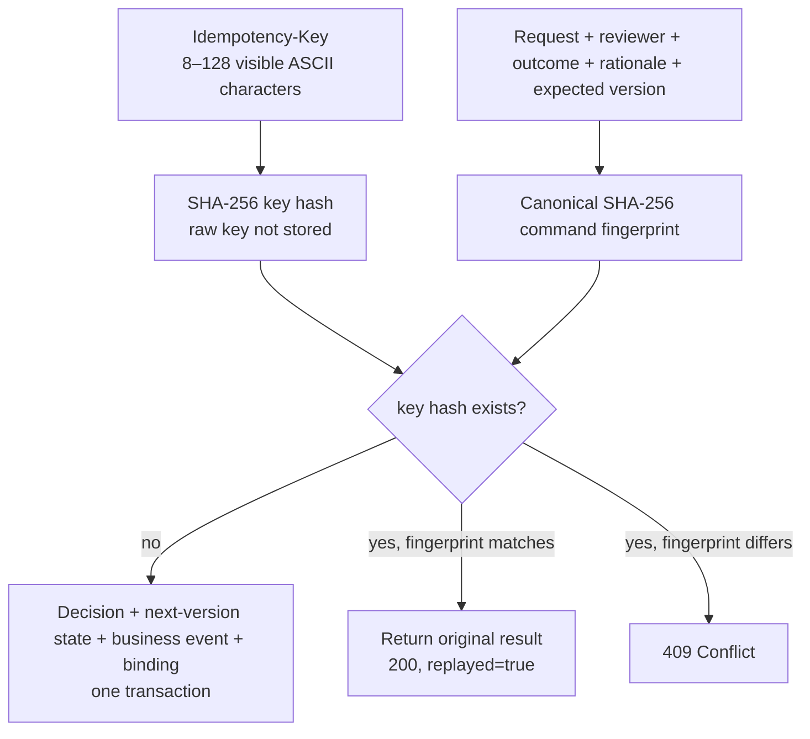

# Database model

## Persistence position

The executable uses one file-backed SQLite database as an assessment adapter.
It persists the full local workflow—input, versions, leased processing runs,
invocation attempts, extraction, automated decision, optional review, idempotent
human decision, business/technical/security events, and sanitized HTTP operation
events—without storing monetary values as binary floating point. Audit payloads
and pipeline identities bind important operations to `build_id` and the SHA-256
`configuration_hash` of the effective runtime settings. Exact managed attachment
bytes and their envelope metadata live in a separate private filesystem tree;
SQLite stores the request relationship as an ordered reference.
The filesystem adapter independently validates private directory ownership
against a trusted POSIX UID; this control is configuration, not a database row.

SQLite is not the production scale claim. The accepted production replacement
is Aurora PostgreSQL Serverless v2 through RDS Proxy, plus a transactional
outbox and versioned S3 evidence. That adapter and schema are not implemented.

## Physical schema and cardinalities

The complete SQLite schema contains sixteen tables. `application_metadata`,
omitted from the diagram for readability, stores repository metadata such as
the persistent HMAC key used to sign queue/timeline cursors.

`model_invocation_traces` is retained as the one-row final extraction projection
used by existing review reads and compatibility migration. The authoritative
attempt history is `processing_invocation_attempts`: one request may have many
runs, stages, and attempts, each with its own immutable identity and input/
output hash. The current `ProcessingService` executes one primary attempt per
run. An expired lease can create a later recovery run without overwriting the
abandoned run or attempt; multi-stage retries and a secondary verifier remain
outside the executable workflow.
For compatibility with upgraded databases, `extractions.source_invocation_id`
and decision/run links are validated by the finalization transaction rather
than declared as new SQLite foreign keys; the diagram shows their logical
cardinality.

## Table responsibilities

| Table | Responsibility |
| --- | --- |
| `reimbursements` | Immutable normalized submission, canonical fingerprint, current state, and optimistic version. |
| `attachments` | Ordered request relationships. A managed value is an opaque `evidence:att_*` reference. Legacy strings remain readable only for seeded/upgraded persisted rows; new HTTP intake rejects them. Exact bytes/checksum/media/filename are held in the filesystem envelope, not this row. Identical content is not deduplicated. |
| `processing_runs` | Numbered pipeline execution, version, input hash, correlation ID, lease expiry, abandonment, and running/terminal state. `pipeline_version` binds policy, build, and configuration digest. |
| `processing_invocation_attempts` | 1:N durable extractor/model attempt ledger including protected raw output, terminal hash, and abandonment evidence. |
| `model_invocation_traces` | Final 1:1 compatibility projection for the selected extraction. |
| `extractions` | One selected structured result or bounded failure, linked to its run and source attempt. |
| `automated_decisions` | One immutable versioned policy route per request. |
| `decision_reasons` | Ordered business explanations and evidence. |
| `rule_evaluations` | Ordered rule ID/version/outcome/facts for deterministic replay. |
| `review_cases` | Pending/completed human-review lifecycle sourced from an automated decision. |
| `review_problems` | Immutable reviewer-facing reasons for queue placement. |
| `human_decisions` | One immutable approve/reject outcome, canonical reviewer snapshot, rationale, and expected version. |
| `review_decision_idempotency` | Irreversible key hash and full command fingerprint bound atomically to the original decision, audit event, resulting state, and version. |
| `audit_events` | Append-only scoped business, technical, and security facts. Intake and human-decision payloads include execution identity; processing-start records it both directly and through the bound pipeline version. |
| `operational_audit_events` | One append-only, privacy-bounded record for every HTTP attempt. Its metadata contains `build_id` and `configuration_hash`; it deliberately has no mandatory reimbursement foreign key because authentication failures and unmatched routes can precede a valid aggregate. |
| `application_metadata` | Repository-owned cursor signing material and future schema metadata. |

The executable policy currently persists `baseline-v3` on each automated
decision and rule version `1.2.0` on every ordered rule evaluation. These values
are evidence, not mutable configuration aliases: a later policy must use a new
version instead of rewriting historical rows.

`build_id` is a validated deployment identifier. `configuration_hash` is a
lowercase SHA-256 digest of canonical effective settings; cleartext settings are
not copied into these audit payloads. The stored processing value is
`baseline-v3;build=<build_id>;config=<configuration_hash>`. These identities are
not dedicated relational columns in `audit_events`: they are whitelisted fields
inside immutable `payload_json`, while operational events retain them in bounded
`metadata_json`.
The effective configuration digest includes the attachment-owner setting. Local
execution defaults the filesystem trust boundary to the process effective UID;
the SAM sandbox explicitly uses UID 1000 to match its EFS access point.

## Request and decision-command idempotency

### Request intake

The fingerprint includes request ID, submitter, timestamp normalized to UTC,
raw OCR text, category, exact amount/currency, and ordered attachment references.
Correlation IDs and processing metadata are excluded. A JSON number `0.1` and
the string `"0.10"` normalize to the same exact domain amount and replay safely.

`request_id` is both the public idempotency key and primary aggregate identity.
Processing run, invocation, decision, and event IDs remain independent to avoid
conflating retries or audit facts with the business request.

### Human decision command

The fingerprint binds request ID, outcome, trimmed rationale, canonical reviewer
ID, and expected version. The idempotency row stores the original decision and
audit-event identities plus resulting state/version, so a retry after response
loss does not depend on the case still being pending. The unique request,
decision, and event links ensure that a reimbursement has only one authoritative
decision-command binding. A new key cannot bypass the aggregate state/version
checks after the case is complete.

## Transaction and version model

```mermaid
flowchart LR
    T1["Tx 1\nsubmission + attachments + received event"] --> V1["received v1"]
    V1 --> T2["Tx 2\nleased run + processing event"] --> V2["processing v2"]
    V2 -->|"lease expired + identical retry"| TR["Recovery Tx\nabandon old run/attempt + claim next run + events"]
    TR --> VN["processing vN+1"]
    VN -->|"another expiry"| TR
    V2 --> T3["Tx 3\nrunning attempt + technical event"]
    VN --> T3
    T3 --> Call["Extractor call\noutside SQL transaction"]
    Call --> T4["Tx 4\nterminal attempt + technical event"]
    T4 --> T5["Tx 5\nextraction + policy + route + business events"] --> VF["automated final vN+1\nv3 without recovery"]
    VF -->|"pending only"| Guard["Decision guard\nimmutable intake actor + original evidence reread"]
    Guard --> T6["Tx 6\nhuman decision + idempotency binding + status + event"] --> VH["human final vN+1\nv4 without recovery"]
    Identity["ExecutionIdentity\nbuild_id + configuration_hash"] --> T1
    Identity --> T2
    Identity --> TR
    Identity --> T6
```

### Received transaction

`BEGIN IMMEDIATE` inserts the reimbursement at v1, ordered attachment
references, and `reimbursement_received`. Existing IDs take a separate path:
the same hash appends `reimbursement_intake_replayed`; a different hash appends
`reimbursement_intake_conflict_rejected` before returning a conflict. Those two
events use the `security` scope and are excluded from the reviewer timeline.
For executable HTTP intake, the business event actor type is literally
`submitter`, and its actor ID is the authenticated principal ID. The claimed
submitter email is not used as that audit identity. The received payload includes
the execution identity.

### Processing-lease claim and recovery transaction

The repository verifies `received` at the expected version, inserts a running
`processing_runs` row with a five-minute expiry, updates the reimbursement to
`processing` v2, and appends `reimbursement_processing_started`. A partial start
cannot be observed. The run's `pipeline_version` binds policy, build, and
configuration hash; the start event also exposes the build and configuration
fields separately for the reviewer-safe timeline.

An identical retry while the lease is active returns the current processing
result and does not call the extractor. After expiry, `BEGIN IMMEDIATE` gives
exactly one caller recovery ownership. That transaction increments the aggregate
version, marks the old running run failed and abandoned, marks any unfinished
invocation failed and abandoned, preserves an already-terminal invocation,
appends technical abandonment facts, creates the next numbered leased run, and
appends the reviewer-safe
`reimbursement_processing_resumed` event. A concurrent caller observes the new
active lease. Finalization verifies the current run identity, so a stale worker
cannot commit after takeover. Recovery is request-triggered; there is no
background watchdog, heartbeat, retry budget, operator replay, or DLQ.

### Invocation transactions

Before extractor execution, a transaction inserts a `running` attempt and
`model_invocation_started` technical event. No database transaction spans the
potential network call. A second transaction changes that exact row to
`succeeded` or `failed`, records the raw response, output hash, bounded error,
completion/timing/parameters, and appends `model_invocation_completed`.

Persisting intent first means a crash leaves visible evidence instead of erasing
the fact that processing began. Retry-triggered lease recovery can resume that
request after expiry and retains the abandoned history. It is not a scheduled
production recovery system: without a later identical request, the processing
state remains waiting, and there is no queue retry/DLQ policy or health-based
lease extension.

### Automated finalization transaction

The repository requires `processing` at the caller's expected version, the
expected running run, and a terminal source invocation whose raw response
matches the extraction trace. In one transaction it inserts:

- selected extraction and compatibility trace;
- automated decision, ordered reasons, and ordered rule evaluations;
- a review case and immutable problems only for `human_review`;
- terminal `completed` processing run;
- reimbursement final status at the next version (v3 when no recovery occurred);
- `automated_decision_recorded`, plus `review_case_enqueued` when applicable.

An audit insertion or uniqueness failure rolls this whole outcome back to its
current processing version; tests explicitly force a late event collision and
verify that no extraction, automated decision, or review row leaks through.

### Human-decision transaction

The API first requires an ETag/`If-Match` precondition and an `Idempotency-Key`.
For a new command, the review read model derives `submission_actor_id` from the
earliest immutable `reimbursement_received` event whose actor type is
`submitter`. The HTTP adapter rejects a missing/matching actor and rereads every
managed original. Approval continues only with `evidence_integrity=verified`.
Rejection may continue with `missing`, `failed` (corrupt), `unverifiable`, or
`invalid_reference`, allowing an unavailable-evidence case to close without
pretending the original was verified.

`ReviewService` repeats the four-eyes comparison and independently forbids
approval for any evidence state other than `verified`, so another adapter cannot
bypass either control. The repository hashes the idempotency key, fingerprints
the normalized financial command, and serializes the write with
`BEGIN IMMEDIATE`. It rechecks any existing binding, pending workflow states,
and the expected current version; inserts the immutable decision with
server-derived reviewer identity; marks the review complete; updates the
reimbursement to the next version; appends `human_review_decided` with the
observed evidence state, `build_id`, and `configuration_hash`; and inserts the
immutable idempotency binding. All rows commit or roll back together.

An exact repeated command returns the original decision/event with
`replayed=true`; this is a read of a completed act, not a second evidence check.
Key reuse for different content or a genuinely competing command returns a
conflict.

## Immutability and durability

SQLite is configured with foreign keys, a validated journal mode, busy timeout,
and `synchronous=FULL`. Local execution defaults to WAL. The AWS assessment
sandbox explicitly selects rollback journal `DELETE` because SQLite WAL does
not support a network filesystem. That selection does **not** make SQLite/EFS a
production-safe remote database; SQLite still warns that network locking and
sync behavior are filesystem-dependent. Database triggers prevent update/delete of:

- immutable submission fields and attachment references;
- terminal processing runs and terminal invocation attempts;
- final compatibility traces, extractions, automated decisions, reasons, rule
  evaluations, and review problems;
- human decisions, decision-idempotency bindings, and all business/technical/
  security and operational audit events.

A running attempt/run may transition once to a terminal state, then becomes
immutable. Reimbursement status/version and review status are the intentional
mutable aggregate projections guarded by expected state/version checks.

## Read models and indexes

The exact result read starts from `reimbursements` and treats processing,
extraction, automated decision, review, and human decision as optional. It
therefore returns every retained status rather than using the inner joins of the
pending-review detail projection.

Pending discovery is restricted to principals with review or audit-read
capability, then applies search, filters, sort, and limit in SQL before returning
a page. Reviewer/auditor/admin access is still global within that queue; future
team/tenant/assignment predicates must move into the query itself. Exact BRL
filters use minor units. Stable keyset cursors are HMAC-signed, bound to query
shape and a first-page snapshot, and use a unique request-ID tie-breaker. Indexes
cover pending time, amount, submitted time, category+amount, submitter, merchant,
and problem code. Exact result lookup is owner-restricted by authenticated email
unless the principal has reviewer, auditor, or administrator capability.

Business timelines query `(request_id, event_scope, occurred_at, event_id)` and
return only whitelisted `business` events through a purpose-bound cursor.
Technical/security events and raw attempt data remain protected DB records.
Review detail also projects `submission_actor_id` from the immutable intake
event, which lets both presentation and application layers enforce four-eyes
separation. Synthetic preprocessed compatibility rows use a bounded repository
sentinel; a migrated row with neither source fails closed at decision time.

Business and operational actor namespaces are distinct by design. HTTP intake
stores `actor_type=submitter` in `audit_events`; HTTP-attempt middleware stores
`actor_type=authenticated_principal` in `operational_audit_events`. Reviewer and
system business actions keep their own bounded actor types.

`operational_audit_events` is deliberately separate from the case timeline. It
indexes time, correlation, and optional path-derived request ID. Each row records
the route template or bounded classification, HTTP method/status/outcome,
authentication result, duration, actor when established, and strictly bounded
scalar metadata, including execution identity. Request/response bodies, OCR,
query strings, credentials, cookies, tokens, and secrets are forbidden. No
normal API currently searches or exports this collection.

## Compatibility migration

Repository initialization adds missing workflow/minor-unit/scope/lease columns,
creates new tables and indexes, backfills older review fixtures into compatible
workflow records inside one explicit transaction, and installs immutability
triggers. The derived `claimed_amount_minor` is immutable with its source amount
so indexed comparisons cannot drift; a dedicated versioned trigger also closes
that protection on databases carrying the older trigger definition. Migration
tests cover the legacy
assessment schema and rollback. This is intentionally small SQLite compatibility
logic, not a substitute for a versioned production migration system.

## Production data gaps

The current database cannot by itself satisfy the complete production evidence
contract:

- managed bytes, checksum, size, detected media, and safe filename exist only in
  local filesystem envelopes; relational object version, malware scan,
  quarantine, legal hold, uploader binding, OCR-input binding, and lifecycle
  metadata remain absent. A trusted local/EFS POSIX owner check is implemented,
  but it is not a replacement for production S3 IAM and object-version controls;
- assessment roles come from startup credentials, while four-eyes checks use the
  immutable intake actor plus a defensive email comparison; no actor/role/team/
  assignment/tenant/value/purpose tables or production-grade authorization
  history exists;
- every HTTP attempt is locally audited, but the operational event is a separate
  transaction without exact query replay, normal search/export, immutable
  off-host archive, or all non-HTTP administrative/worker-operation coverage;
- no transactional outbox, immutable archive export, backup/restore exercise,
  PITR, replica, or RPO/RTO evidence;
- no PostgreSQL adapter, million-row query plan/load test, partitioning, or
  connection-pool measurement;
- no cross-case duplicate-candidate index or service exists for object SHA and
  normalized merchant/date/amount signals. That is an open production control
  target, not a current capability or automatic rejection rule;
- expired work can recover only when an identical request arrives; there is no
  background watchdog, heartbeat, retry budget, queue/DLQ replay, or recovery
  operations surface;
- no approved retention/deletion matrix.

In AWS, authoritative business state remains relational in Aurora. Receipt
bytes belong in versioned private S3, not local disk, SQLite blobs, DynamoDB, or
one undifferentiated NoSQL document. S3 and SQL require explicit intake states,
checksum/version binding, idempotent events, and cleanup because they do not
share a transaction.
