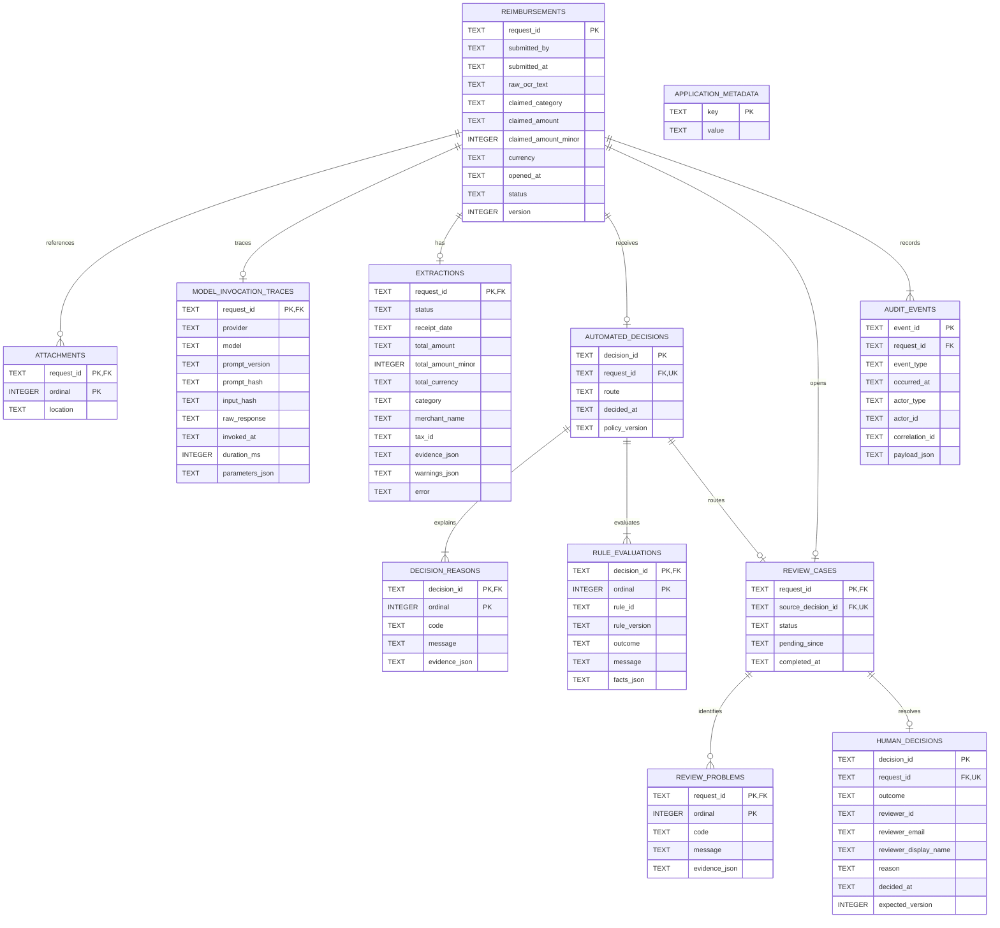
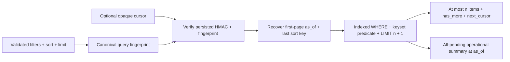
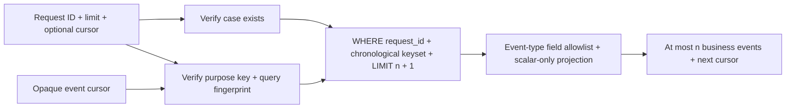
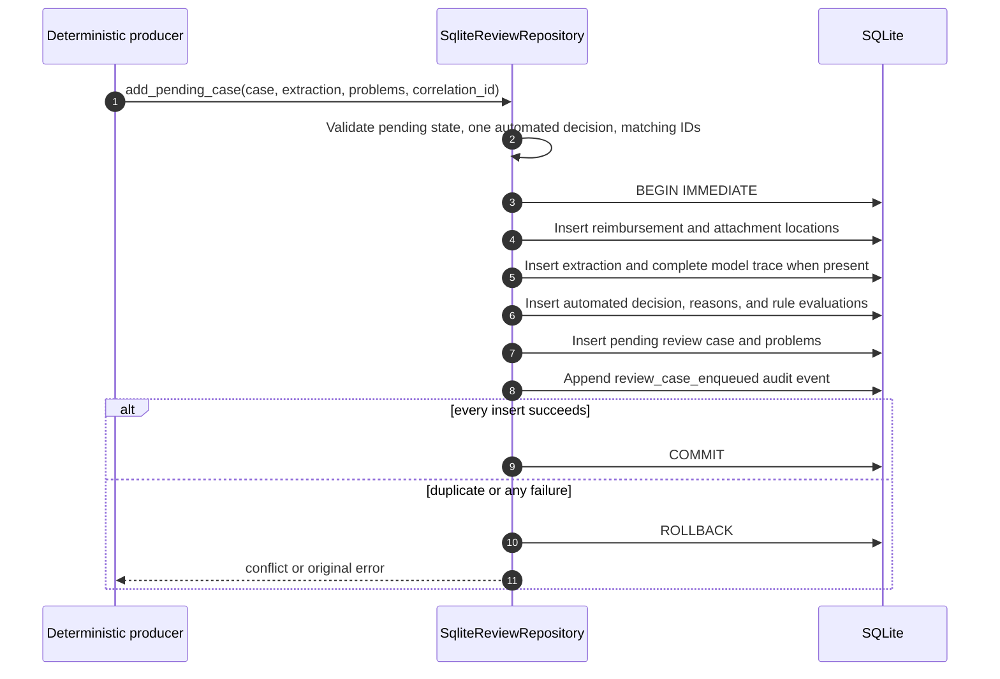
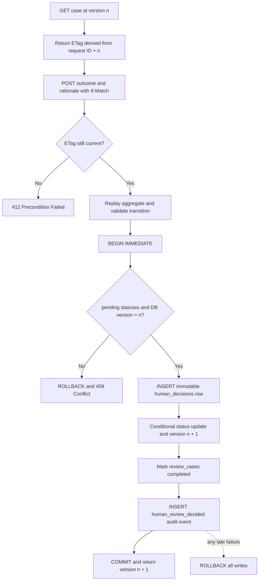
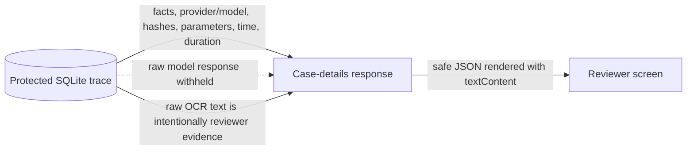
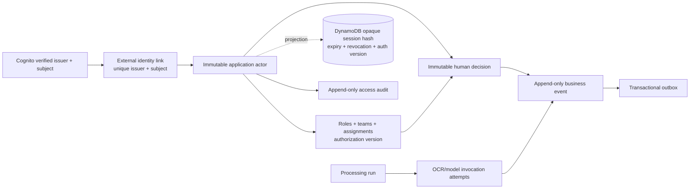
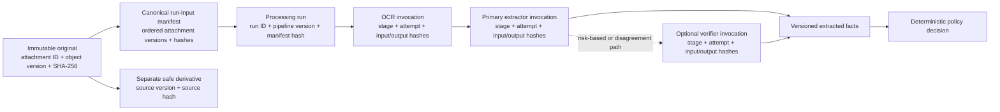

# Database model

## Implemented persistence scope

The assessment uses one file-backed SQLite database as the authoritative store
for the implemented human-review slice. It persists the submission snapshot,
opaque attachment locations, structured extraction, complete model invocation
trace, automated decision evidence, review problems, human decision, and audit
events.

It does **not** contain user, role, reviewer, password, or session tables.
Assessment reviewer credentials are configuration supplied at startup. It also
does not contain attachment bytes or provide file preview/download; the
`attachments` table stores `AttachmentReference.location` strings only.

## Physical schema



SQLite enforces foreign keys and value checks for currency, workflow states,
routes, extraction statuses, rule outcomes, review outcomes, ordinals, versions,
invocation duration, non-blank reviewer/audit identity fields, and a trimmed
human rationale between 1 and 2,000 characters. The schema contains 12 tables,
including the standalone `application_metadata` table used for adapter-owned
values that do not belong to a reimbursement aggregate.

Money remains serialized in canonical decimal text for domain reconstruction.
The parallel `claimed_amount_minor` and `total_amount_minor` integer columns are
exact query projections (`Decimal * 100` for BRL); no binary floating-point
conversion is used. `claimed_amount_minor` is mandatory and non-negative.
Extracted minor units are nullable exactly when no extracted total exists.

## Table responsibilities

| Table | Cardinality per request | Responsibility |
| --- | ---: | --- |
| `reimbursements` | 1 | Original input snapshot, current domain status, and optimistic version. |
| `attachments` | 0..n | Ordered opaque storage locations; no file bytes or access grants. |
| `model_invocation_traces` | 0..1 | Provider/model/prompt/input hashes, raw response, parameters, time, and duration. |
| `extractions` | 0..1 | Success/failure and normalized receipt facts or error. |
| `automated_decisions` | 1 for a review case | Route, policy version, and decision time. |
| `decision_reasons` | 1..n | Machine-readable code plus human explanation/evidence. |
| `rule_evaluations` | 1..n | Versioned deterministic rule result and input facts. |
| `review_cases` | 1 | Pending/completed review lifecycle and source decision. |
| `review_problems` | 0..n | Concrete issues displayed to the reviewer. |
| `human_decisions` | 0..1 | Immutable outcome, authenticated reviewer snapshot, rationale, and expected version. |
| `audit_events` | 1..n | Append-only lifecycle facts with actor, correlation, time, and canonical payload. |
| `application_metadata` | Database-global | Persistent SQLite-adapter metadata. It currently contains the random root HMAC secret used to validate queue cursors and derive a purpose-separated business-timeline cursor key. |

The assessment currently writes two audit-event types:

- `review_case_enqueued`, written in the same transaction as the pending case.
  Its actor is `system/deterministic-policy-engine`; its payload includes the
  automated decision ID, policy version, route, extraction status, attachment
  count, and resulting status. The repository propagates the producer's
  correlation ID; only the demo/helper path derives `ingest:{request_id}` when
  its caller omits one.
- `human_review_decided`, written in the same transaction as the authoritative
  reviewer decision and state transition. Its payload includes decision ID,
  previous and resulting states, outcome, rationale, and request version.

JSON fields are serialized canonically with sorted keys and compact separators.
Money is serialized as an exact decimal string and timestamps are normalized to
timezone-aware UTC ISO 8601 with microseconds.

The normal reviewer timeline never serializes `payload_json` wholesale. For
each known event type, the adapter selects an explicit business-field whitelist
and retains only scalar string, integer, or boolean values. Nulls, nested
objects, arrays, unknown-event payloads, raw provider data, tokens, and internal
attachment locations are omitted before the application result reaches HTTP.

## Scalable pending-queue read path

The operational browser endpoint does not call the legacy unbounded
`list_pending()` compatibility method. It calls `search_pending()` with a page
size between 10 and 100, and SQLite executes a parameterized keyset query with
`request_id ASC` as the unique final tie-breaker.



Implemented filters and their SQL semantics are:

| Input | Semantics |
| --- | --- |
| `search` | SQLite `NOCASE` literal prefix over request ID, submitter, or extracted merchant. `%`, `_`, and the escape character are treated literally. Built-in case folding is ASCII-only. |
| `category` | Case-insensitive exact claimed-category code. |
| `problem_code` | Case-insensitive exact code matched through `EXISTS`; stored source messages are not translated or rewritten. |
| `min_amount` / `max_amount` | Inclusive comparison over exact `claimed_amount_minor`. |
| `submitted_from` / `submitted_to` | Inclusive UTC-normalized timestamp range. |
| `pending_before` | Exclusive timestamp boundary. It cannot be combined with `age_bucket`. |
| `age_bucket` | `under_4h`, `4h_to_24h`, or `over_24h`, evaluated against the fixed first-page `as_of`. |

Stable sort codes are `pending_oldest`, `pending_newest`, `amount_asc`,
`amount_desc`, and `submitted_newest`. Ascending and descending keyset
predicates account for their direction; equal primary values always continue
by ascending request ID. Offset pagination is not used.

The first page fixes `as_of`, and every page adds
`review_cases.pending_since <= as_of`. The signed cursor carries that snapshot
time and the last `(sort value, request_id)` key. This prevents normal new
arrivals from moving into an in-progress traversal. It is not a cross-request
MVCC snapshot: a case completed while the reviewer paginates disappears, so a
later page can legitimately contain fewer rows.

The cursor payload is base64url-encoded but not trusted by encoding alone. It
is authenticated with HMAC-SHA256, bound to the complete filter/sort/page-size
fingerprint, and validated before any boundary reaches SQL. Its random secret
is generated once in `application_metadata` under
`review_queue_cursor_secret`, so cursors remain valid across process restarts
of the same database. Tampered, malformed, or query-mismatched cursors become a
validation error and the HTTP adapter returns `422`.

The cursor is an opaque API contract, not encrypted confidential storage. A
client must never parse or modify it. A production multi-instance adapter needs
a shared, versioned signing key and an explicit rotation policy rather than the
SQLite-local metadata mechanism.

Queue rows include the claimed value plus extracted merchant and total, the
first problem code/message, and all problem codes. Heavier OCR and rule evidence
remain in the case-detail read. A separate exact summary reports, for the
complete pending queue at the same `as_of`:

- total pending cases;
- cases pending for at least 24 hours;
- high-value cases with claimed amount strictly greater than BRL 2,000.00;
- cases with `AMOUNT_MISMATCH` or `TOTAL_MISMATCH`.

The SQLite assessment computes these counts directly. At production volume the
authoritative PostgreSQL design needs a maintained/materialized aggregate or a
measured cached projection; repeatedly scanning millions of pending rows for
every page is explicitly not the production scale claim.

## Bounded business-timeline read path

`list_business_events()` checks that the request exists and uses the existing
`idx_audit_request_time` index for a stable chronological keyset page. This path
is separate from the pending queue and from any future privileged technical
trace or cross-request audit search.



Ordering is `occurred_at ASC, event_id ASC`; the unique event ID resolves equal
timestamps. The HMAC cursor is bound to request ID, page size, sort, version,
and the business-timeline purpose, so it cannot be reused as a pending-queue
cursor or for another case. The root secret persists in `application_metadata`,
allowing a cursor to survive an adapter restart. This is an assessment read
contract, not a substitute for per-object authorization or production key
rotation.

## Query indexes and compatibility migration

Eight explicit indexes support current audit and reviewer reads:

| Index | Primary use |
| --- | --- |
| `idx_review_queue(status, pending_since, request_id)` | Pending-age filtering and oldest/newest traversal. |
| `idx_audit_request_time(request_id, occurred_at, event_id)` | Ordered audit history for one request. |
| `idx_reimbursements_queue_amount(status, claimed_amount_minor, request_id)` | Exact amount range and amount sort. |
| `idx_reimbursements_queue_submitted(status, submitted_at DESC, request_id)` | Submission-time filter/sort. |
| `idx_reimbursements_queue_category_amount(status, claimed_category, claimed_amount_minor, request_id)` | Selective category plus amount access. |
| `idx_reimbursements_submitter_search(submitted_by, request_id)` | Submitter prefix lookup. |
| `idx_extractions_merchant_search(merchant_name, request_id)` | Merchant prefix lookup. |
| `idx_review_problems_code_request(code, request_id)` | Problem-code filtering and mismatch lookup. |

The three textual search indexes use SQLite `NOCASE`, whose built-in case
folding is ASCII-only. Production PostgreSQL needs a chosen Unicode-aware
collation/normalization strategy; it may use suitable b-tree prefix indexes
initially and measured trigram/search projection support when non-prefix
discovery or latency targets require it.

Startup contains a narrow compatibility migration for SQLite files created
before minor-unit query columns existed. It:

1. inspects `PRAGMA table_info`;
2. adds a missing `claimed_amount_minor` or `total_amount_minor` column;
3. parses every legacy decimal string with `Decimal` and backfills exact cents;
4. creates the queue indexes;
5. installs insert/update triggers that reject a missing or negative claimed
   minor-unit value on legacy table definitions.

This is implemented compatibility care for the assessment adapter. It does not
replace a versioned, reviewed, reversible production migration system.

## Pending-case ingestion transaction



The demo seeder is the current producer. The intake, extraction adapter, and
policy engine that would call this boundary in production are not implemented.

## Human-decision transaction

The HTTP precondition and database transaction serve different purposes. The
ETag gives the reviewer a clear stale-screen response; the transaction remains
the final consistency authority even if two requests pass the HTTP precheck at
nearly the same time.



`human_decisions.request_id` is unique, so only one human decision may exist per
review case. The conditional update checks both `pending_review` and version.
Repository tests demonstrate that an audit insertion failure late in the
transaction restores the case, review status, version, and decision state.
A real two-thread test also starts both writers from version 1 and verifies that
exactly one commits, the other raises a conflict, one human-decision row exists,
and the reimbursement ends at version 2.

## Immutability and durability controls

Four database triggers reject direct updates and deletes of financial history:

```text
human_decisions_no_update
human_decisions_no_delete
audit_events_no_update
audit_events_no_delete
```

Two additional compatibility triggers require a valid non-negative
`claimed_amount_minor` value on reimbursement inserts and updates, including in
legacy SQLite files whose altered column could not acquire the new-table
`NOT NULL` constraint in place.

Every connection enables foreign keys, a 5-second busy timeout, WAL journal
mode, and `synchronous=FULL`. WAL permits readers while a writer is active;
`BEGIN IMMEDIATE` serializes competing writers before the critical state check.
`FULL` strengthens SQLite's fsync behavior, but it does not replace protected
storage, backups, recovery drills, or a highly available production database.

## Browser exposure versus protected persistence



The browser sees raw OCR text because it is required evidence for judgment. It
does not receive `ModelInvocationTrace.raw_response`. Access logging, read-audit
requirements, field-level redaction, and data-retention rules still need a
production policy.

## Accepted production evidence and trace model — not implemented

This section is part of the accepted AWS production target. None of the
entities, object-byte access paths, cryptographic links, or trace APIs described
below exist in the assessment runtime. The implemented SQLite truth remains the
schema documented above: `attachments` contains only an ordered `location`, and
`model_invocation_traces` permits at most one row per request.

### Identity, authorization, and audit authority

Cognito proves the external identity, but Aurora remains authoritative for the
application actor and financial authorization. The production logical model
needs at least these records; final physical names and partitioning remain a
migration-design concern:

| Record | Required invariant |
| --- | --- |
| actor and external identity link | Immutable `actor_id`; unique `(issuer, subject)`; email/display name are mutable snapshots, never the identity key. |
| role grant, team membership, and case assignment | Effective interval, grantor/reason, limits/scope, and an authorization version that changes whenever authority changes. |
| session projection in DynamoDB | Only a hash of the opaque cookie ID, actor/auth context, authorization version, explicit expiry, and revocation; TTL is cleanup, not authorization. |
| human or automated decision | Immutable outcome, rationale/reasons, actor or workload identity, policy/build versions, and aggregate version. |
| business event and transactional outbox | Same Aurora transaction as the state change; monotonic per-case sequence, correlation/causation, canonical payload, and idempotent export identity. |
| processing run and invocation attempt | One row per run/stage/attempt with exact attachment/input/output hashes and provider/model/prompt metadata. |
| access audit event | Actor, action, target or normalized query digest, purpose, authorization outcome, result, time, and correlation ID without credentials or signed URLs. |



A role, team, assignment, or value-limit change appends its own administrative
event, increments the actor's authorization version, and invalidates older
sessions. Sensitive commands recheck current authority in the application/SQL
boundary; a cached Cognito group or stale browser session cannot grant a
financial action.

Production evidence must identify the exact immutable object that entered a
processing run, not merely a mutable storage path. The accepted attachment
record therefore needs at least:

| Field | Purpose |
| --- | --- |
| `attachment_id` | Stable application identifier used by APIs and audit events. |
| `request_id` | Authoritative relationship to the reimbursement. |
| private object key and `object_version` | Locate one exact version without exposing the storage key to the browser. |
| `sha256` | Verify the bytes and bind later processing to this exact object version. |
| original filename, detected MIME type, and `size_bytes` | Support safe presentation and content validation. |
| scan status and scan timestamp | Prevent access or processing before malware controls complete. |
| retention class and optional retain-until value | Apply an approved retention matrix without inventing a duration in code. |
| legal-hold status | Suspend lifecycle deletion when an authorized hold applies. |

The uploaded original remains byte-for-byte immutable. OCR-normalized images,
thumbnails, redacted previews, and other browser-safe representations are new
objects with their own identifiers, versions, hashes, MIME types, and sizes.
Each derivative points to the exact source attachment version and checksum; it
never overwrites or becomes the evidentiary original.



A canonical processing-run input manifest records every input as an ordered
tuple containing `attachment_id`, object version, and SHA-256. Its own SHA-256
is stored on the processing run. Every invocation records that manifest or the
previous stage's output hash as its input hash, and records an output hash. This
creates a verifiable chain from the exact uploaded bytes through OCR and model
stages to normalized facts and the deterministic policy decision. A path or
request ID alone does not provide this guarantee.

The current one-row-per-request trace must become a one-to-many production
relationship. The accepted `model_invocation_traces` design uses
`invocation_id` as its primary key and retains `request_id` plus
`processing_run_id` as indexed foreign keys. Each row includes `stage` (`ocr`,
`primary_extractor`, or `verifier`),
`attempt`, status, provider, exact model, prompt version and hash, input hash,
output hash, parameters, start/end timestamps, duration, and a protected raw
response or error reference. This supports OCR, a primary model, an optional
secondary verifier, retries, and later reprocessing without overwriting earlier
invocations. It does not imply that two LLMs will run for every request; that
cost and quality decision remains open.

Three records serve different purposes and must not be collapsed into one log:

| Record | Answers | Examples |
| --- | --- | --- |
| Business audit | Who or which deterministic rule changed business state, when, and why? | submission accepted, policy decision recorded, review queued, human decision committed, before/after status and version |
| Technical trace | Which exact artifacts, software/model configurations, attempts, and outputs produced the evidence? | processing run, attachment/input hashes, OCR and model invocations, prompt and pipeline versions |
| Access audit | Who attempted to view, preview, download, or export protected data, and what was the result? | actor and authorization snapshot, attachment/version, action, outcome, timestamp, request/correlation ID |

Model agreement is technical evidence, not a financial decision and not a
substitute for the business audit. Likewise, infrastructure object-access logs
may corroborate file retrieval, but they do not replace the application's
authoritative access or business records.

Trace and audit collections are operational collections: production read APIs
must require the appropriate reviewer or auditor authorization, validate all
filters, use stable ordering, cap page size, and return opaque cursor pages.
The case-detail response may include a small first page or summary, but it must
not load an unbounded event or invocation history.

Attachment metadata may be returned with case detail, but bytes are fetched
only on demand through an object-authorized operation. The service verifies the
case-to-attachment relationship, actor permission, exact object version, scan
state, and legal/retention restrictions before streaming content or granting a
short-lived single-purpose access URL. Safe derivatives are the default inline
preview; downloading the immutable original is a distinct authorized action.
The access attempt and result are appended to the access audit, while private
object keys and permanent storage URLs remain outside browser payloads.

## Production replacement and gaps

SQLite is suitable for the self-contained assessment and a single service
instance. Production evaluation must cover:

- a standalone highly available PostgreSQL datastore behind the
  `ReviewRepository` port;
- versioned schema migrations rather than startup-only `CREATE TABLE IF NOT
  EXISTS` statements;
- encryption, secrets, backup, restore, point-in-time recovery, retention,
  erasure/legal-hold rules, and privileged-access auditing;
- stronger throughput/concurrency testing and database-level operational
  metrics;
- authorized attachment content retrieval with object-level access checks;
- broader append-only event coverage for intake, extraction, policy, provider
  calls, retries, administrative changes, and any reads that policy requires;
- application-owned managed identity, role, and session persistence or service
  integration; the current assessment schema intentionally has none.
