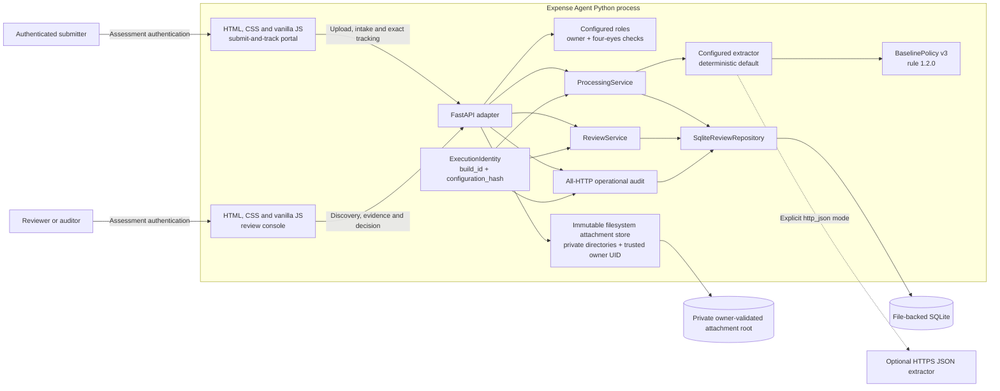
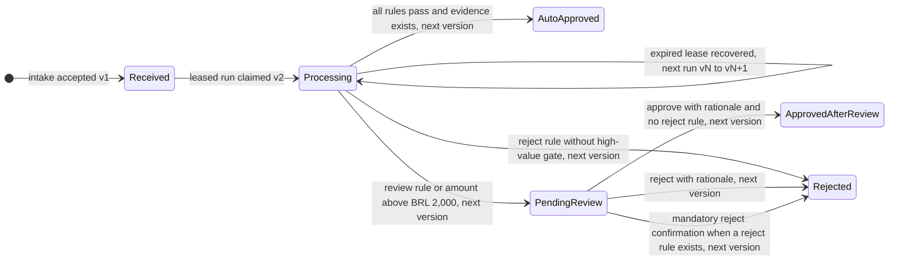
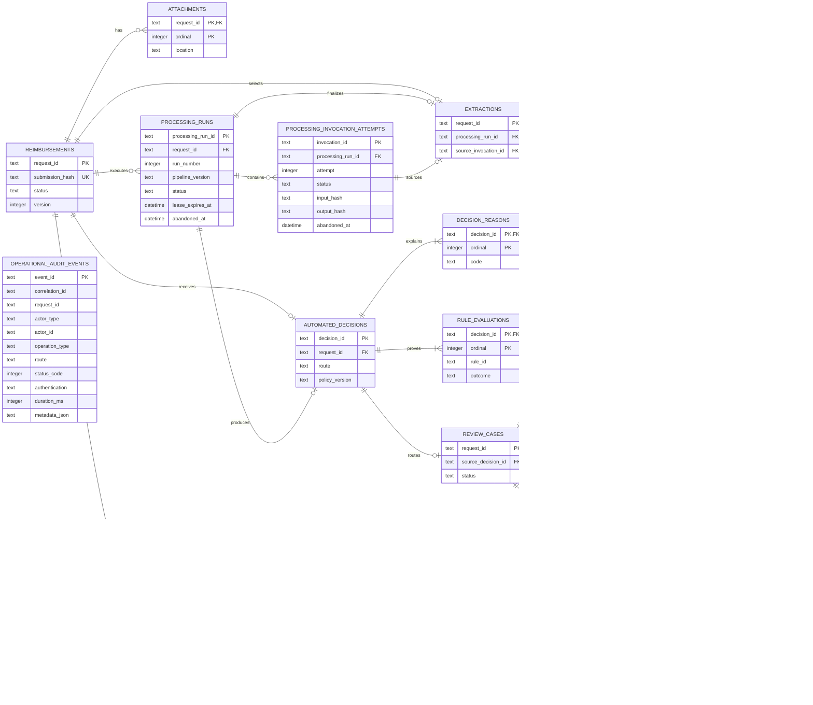
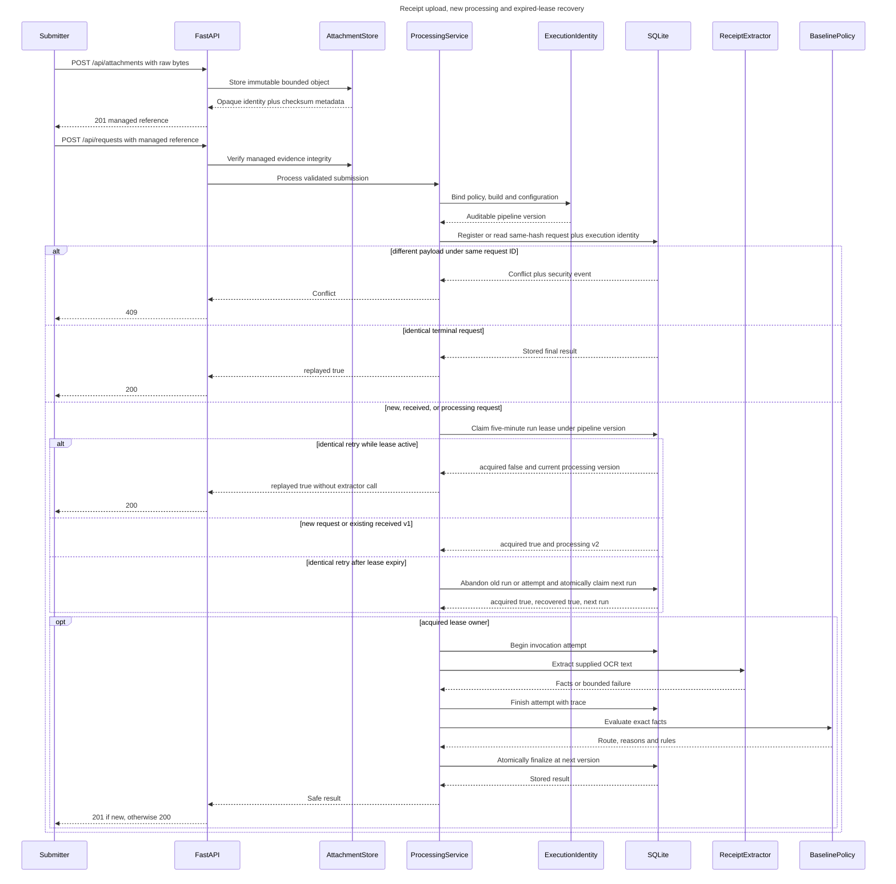
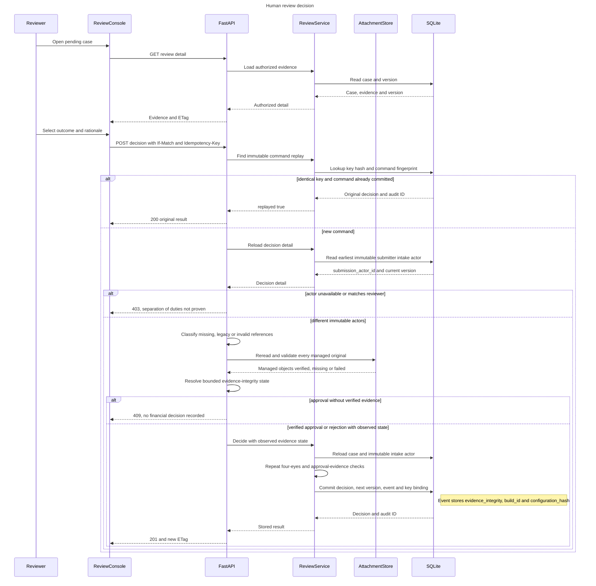
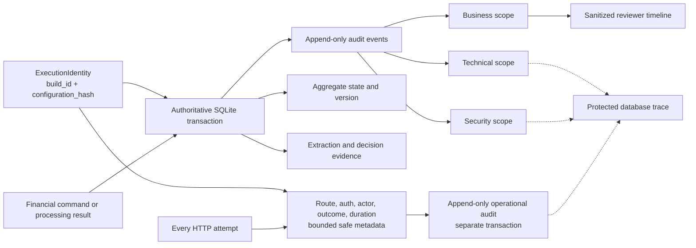
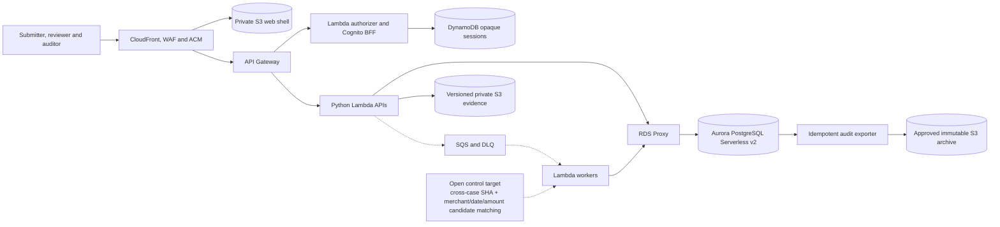
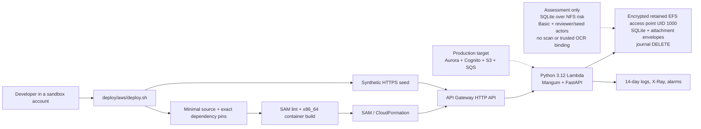

# Diagram gallery

This page is the central visual index for Expense Agent. It consolidates the
main views already accepted in the detailed documentation without changing the
underlying decisions. The diagrams distinguish executable assessment behavior
from production targets and future delivery work.

## Status legend

| Label | Meaning |
| --- | --- |
| **Implemented assessment** | Exists in this repository and is exercised by automated tests. |
| **Partial / release gate** | A useful assessment slice exists, but a control or production capability is incomplete. |
| **Accepted target — not implemented** | The production direction is accepted, but this repository contains no corresponding production adapters/resources or production IaC. |
| **Packaged and validated — not provisioned** | Deployment artifacts pass local checks, but no cloud account or live resource was changed. |

The source-of-truth details remain in [system architecture](architecture.md),
[database model](database.md), [domain model](domain-model.md), [feature
catalog](features.md), and the [decision log](decision-log.md).

## 1. Assessment context and request flow

**Status: Implemented assessment.** The deterministic extractor is the default;
the HTTPS+JSON adapter is selectable only through explicit strict environment
configuration. The SAM sandbox remains deterministic because it has no NAT.

The executable uploads bounded JPEG/PNG/PDF bytes, returns an opaque managed
reference, and accepts supplied OCR text in the subsequent claim. It does not
derive OCR from those exact bytes, scan for malware, use a secondary verifier,
or depend on ClickUp, email, n8n, or an existing RecargaPay system. Store
directories must be private, non-symlink paths owned by the configured trusted
POSIX UID; local execution defaults to the process effective UID. New HTTP
intake rejects arbitrary legacy attachment strings with `422`; only seeded or
upgraded persisted rows remain readable, and those strings do not prove file
existence.

The current execution identity is not a UI label. Processing runs bind policy,
build, and effective configuration digest in `pipeline_version`; intake,
processing-start, human-decision, and operational HTTP evidence retain the
relevant `build_id` and `configuration_hash` without copying cleartext settings.

## 2. Reimbursement lifecycle and aggregate versions

**Status: Implemented assessment.** Both automated and human rejection use the
domain status `rejected`; the transition records whether automation or a human
produced it. Versions increase on every aggregate mutation.

Without recovery the states are received v1, processing v2, automated final v3,
and human final v4. Each recovered lease consumes another version before
finalization, so API clients use the returned version and ETag rather than a
status-derived constant.

`baseline-v3`/rule `1.2.0` makes the above-BRL-2,000 review gate non-bypassable.
An old high-value receipt therefore reaches a human, while the aggregate forbids
approval and requires rejection with rationale. Missing receipt evidence also
blocks automatic approval. Exactly 90 days remains valid. Collision semantics,
the literal BRL 2,000 boundary, and the caller-supplied age anchor still require
policy-owner validation before production.

## 3. Summarized persistence model

**Status: Implemented assessment** in normalized SQLite plus a private immutable
filesystem attachment tree. The diagram omits the compatibility projection and
repository metadata table to keep the operational ledger readable;
[database.md](database.md) documents the complete sixteen-table schema.

`request_id` is the aggregate identity and public idempotency key. Processing
run, invocation, automated decision, human decision, and event identifiers stay
independent so retries and evidence cannot be mistaken for the business request.
Human decisions additionally use an irreversible idempotency-key hash and a
full command fingerprint. `OPERATIONAL_AUDIT_EVENTS` deliberately has no required
case foreign key because login failures, static reads, and unmatched routes may
occur before a valid request exists. The `ATTACHMENTS.location` relationship may
hold an opaque managed reference; exact bytes and checksum/media/filename
metadata remain in the filesystem envelope rather than a SQLite blob.
`PROCESSING_RUNS.pipeline_version` binds policy/build/configuration. Whitelisted
business payloads store the execution identity and decision evidence state;
operational metadata stores the execution identity for every HTTP attempt.

## 4. Processing sequence and durable boundaries

**Status: Implemented assessment.** The extractor call runs outside a database
transaction; durable invocation intent and completion surround it.

Before a new run starts, the repository compares `request_id` and the canonical
submission hash. A matching terminal/active replay returns stored state and
records a security event; a different payload records a conflict event and
returns HTTP 409. After the five-minute lease expires, one identical retry
atomically preserves abandonment evidence and owns a new numbered run; stale
workers cannot finalize. No background watchdog, heartbeat, retry budget,
queue/DLQ, or operator replay surface exists, so this remains an assessment
recovery mechanism rather than production orchestration.

## 5. Human review and audit projection

### Human decision

**Status: Implemented assessment.** Reviewer identity and role are derived from
verified credentials. The HTTP adapter and `ReviewService` both enforce
four-eyes separation from the immutable intake actor. Every new decision
revalidates original evidence; approval requires `verified`, while rejection may
preserve an unavailable/corrupt/unverifiable state. Rationale is mandatory, and
the decision is an atomic next-version write guarded by `ETag`/`If-Match` plus a
command `Idempotency-Key`.

The stored key is an irreversible SHA-256 digest. Its command fingerprint binds
request, reviewer, outcome, normalized rationale, and expected version. Reusing
the same key for different content returns `409`; an exact retry returns the
original result and creates no second decision or business event.

The intake business actor type is literally `submitter`; the repository derives
`submission_actor_id` from that append-only event. The corresponding HTTP
operation uses `actor_type=authenticated_principal`. A failed approval evidence
check is retained in operational audit metadata; a rejection
that proceeds stores the observed state in the authoritative decision event.

### Audit projection

**Status: Implemented local HTTP-attempt coverage with production release
gates.** Processing and decision history is authoritative; a separate bounded
event records every HTTP request attempt.

Authentication outcomes, authorization decisions, ordinary reads/searches,
validation failures, unmatched routes, evidence upload/access, and server errors
now produce operational events. Request/response bodies, raw OCR, query strings,
credentials, cookies, tokens, and secrets are deliberately excluded. The
reviewer timeline also excludes raw provider output and technical/security event
payloads. Because operational writes are separate from business transactions and
there is no exact query replay, privileged search/export UI, transactional
outbox, off-host immutable archive, or WORM control, this is not yet complete
production traceability.

## 6. Accepted AWS production target

**Status: Accepted target — not implemented.** This is the production direction
recorded by D-026, D-039, D-040, and reaffirmed by D-042. It is not the current
runtime and does not claim a deployment.

The target replaces assessment-only HTTP Basic/configured roles, synchronous
execution with retry-triggered local leases, SQLite, filesystem evidence, and
SQLite-only audit with application-owned managed identity and authorization,
queued idempotent processing, an authoritative SQL ledger/outbox, versioned and
scanned object evidence, and approved immutable export. There is no
production Cognito pool/BFF, queue, Aurora cluster/repository, receipt bucket,
CloudFront/WAF edge, outbox/exporter, DNS record, AWS account selection, or live
cloud deployment in this repository. The SAM sandbox below is deliberately not
the production topology.

Cross-case duplicate-candidate detection using exact receipt SHA and normalized
merchant/date/amount signals remains an open production control target. The
assessment performs neither content deduplication nor cross-case matching, and
no such signal is currently an automatic approval/rejection rule.

## 7. AWS assessment sandbox delivery

**Status: Implemented and locally validated artifact; not provisioned.** This
packages the executable assessment for synthetic review, not real finance.

The SAM template defines a new VPC, two private subnets, Lambda/EFS security
groups, an encrypted backed-up EFS access point, a direct HTTPS API, bounded
Lambda concurrency, least-privilege EFS access, log retention, and alarms. The
EFS access-point POSIX user/root are UID/GID 1000, and Lambda sets
`EXPENSE_AGENT_ATTACHMENT_OWNER_UID=1000` so the filesystem adapter verifies the
same owner boundary. The script prompts before billable changes, derives only a
PBKDF2 hash from the
hidden password, assigns the reviewer the `admin` role, creates a separate
reserved seed `admin` actor with a random credential, derives a commit-and-lock
`build_id` by default, generates a CSRF secret, seeds the provided synthetic
fixtures, and prints the review URL. The seed secret is discarded, allowing the
reviewer actor to decide those cases while four-eyes still prevents either actor
from deciding its own submissions.
The application stores managed receipt envelopes under the same retained EFS
mount as a separate tree, and the HTTPS seeder uploads a synthetic managed PDF
for each sample. Any older upgraded legacy references remain metadata-only. The
sandbox also has no cross-case duplicate-candidate control.

Local evidence proves the template and build path, not AWS operation: no account
was mutated and there is no live endpoint, EFS recovery test, concurrency/load
result, or security approval. SQLite's rollback journal avoids the direct WAL
incompatibility but does not make network-filesystem persistence safe enough for
real financial state. The accepted production target remains unchanged.
