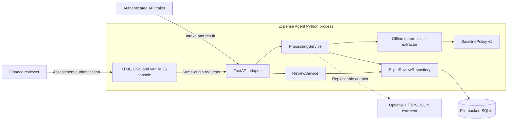
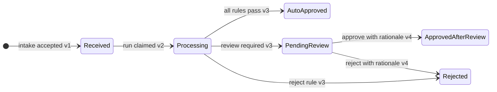
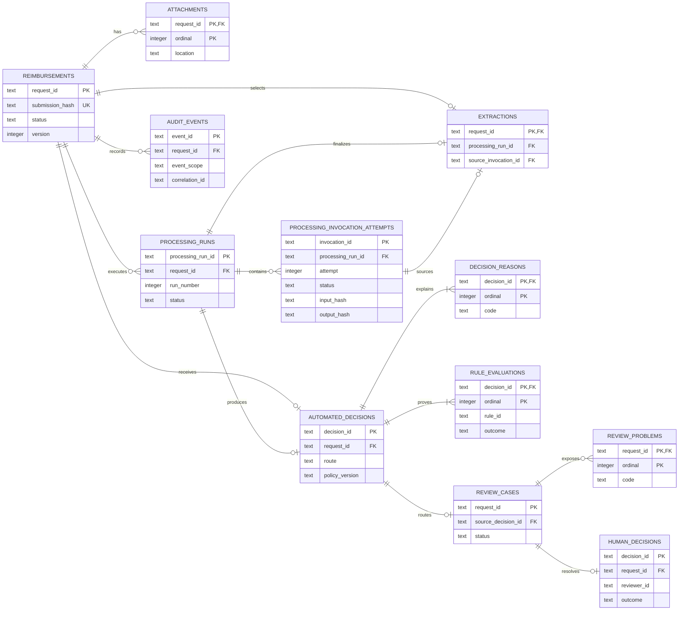
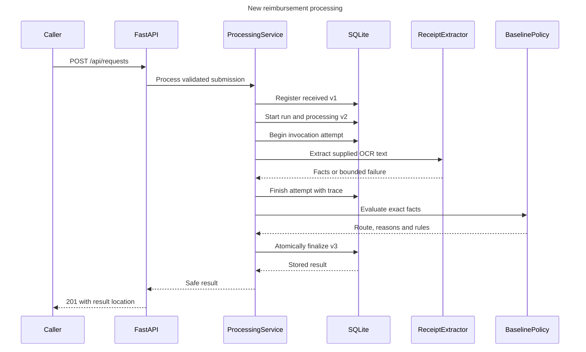
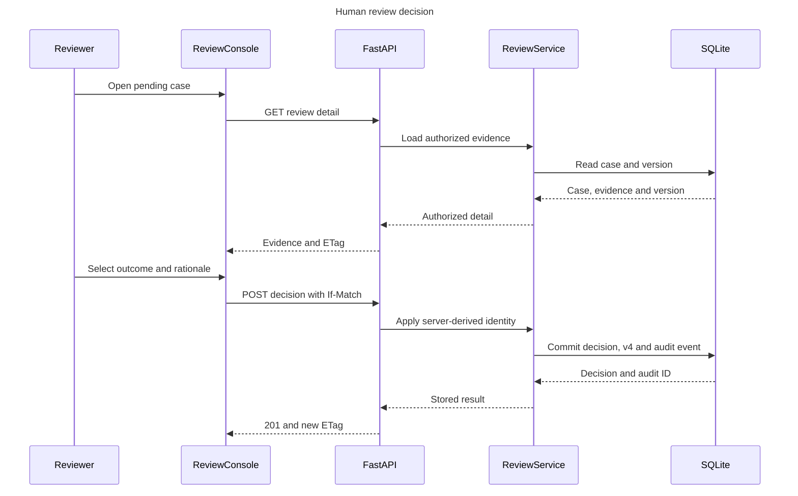
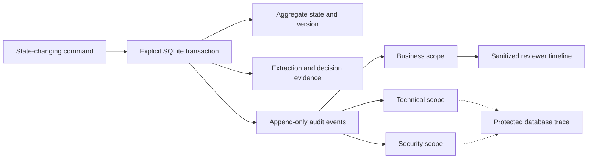
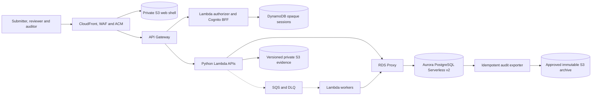
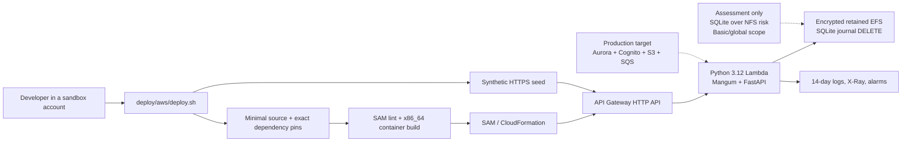

# Diagram gallery

This page is the central visual index for Expense Agent. It consolidates the
main views already accepted in the detailed documentation without changing the
underlying decisions. The diagrams distinguish executable assessment behavior
from production targets and future delivery work.

## Status legend

| Label | Meaning |
| --- | --- |
| **Implemented assessment** | Exists in this repository and is exercised by automated tests. |
| **Partial / release gate** | A useful assessment slice exists, but a control or production capability is incomplete. |
| **Accepted target — not implemented** | The production direction is accepted, but this repository contains no corresponding production adapters/resources or production IaC. |
| **Packaged and validated — not provisioned** | Deployment artifacts pass local checks, but no cloud account or live resource was changed. |

The source-of-truth details remain in [system architecture](architecture.md),
[database model](database.md), [domain model](domain-model.md), [feature
catalog](features.md), and the [decision log](decision-log.md).

## 1. Assessment context and request flow

**Status: Implemented assessment**, with the optional HTTPS extractor available
as an adapter but not composed by default.

The executable accepts supplied OCR text and attachment reference strings. It
does not upload receipt bytes, run a binary OCR engine, use a secondary verifier,
or depend on ClickUp, email, n8n, or an existing RecargaPay system.

## 2. Reimbursement lifecycle and aggregate versions

**Status: Implemented assessment.** Both automated and human rejection use the
domain status `rejected`; the transition label records whether the aggregate
reached it at v3 or v4.

The implemented old-receipt rule takes precedence over review routing, and
exactly 90 days remains valid. That precedence and the literal BRL 2,000 boundary
are tested assessment interpretations pending policy-owner validation.

## 3. Summarized persistence model

**Status: Implemented assessment** in normalized SQLite. The diagram omits the
compatibility projection and repository metadata table to keep the operational
ledger readable; [database.md](database.md) documents the complete schema.

`request_id` is the aggregate identity and public idempotency key. Processing
run, invocation, automated decision, human decision, and event identifiers stay
independent so retries and evidence cannot be mistaken for the business request.

## 4. Processing sequence and durable boundaries

**Status: Implemented assessment.** The extractor call runs outside a database
transaction; durable invocation intent and completion surround it.

Before a new run starts, the repository compares `request_id` and the canonical
submission hash. A matching replay returns the stored result and records a
security event; a different payload for the same ID records a conflict event and
returns HTTP 409. A process crash can still strand v2/running state because
lease, watchdog, retry, DLQ, and recovery orchestration are release gates.

## 5. Human review and audit projection

### Human decision

**Status: Implemented assessment.** Reviewer identity is derived from verified
credentials, rationale is mandatory, and the decision is an atomic v3 to v4
write guarded by `ETag` and `If-Match`.

### Audit projection

**Status: Partial / release gate.** Processing and decision history is durable;
audit coverage of every service operation is not yet complete.

Authentication outcomes, ordinary reads, searches, validation and orchestration
errors, authorization decisions, evidence access, and administrative actions are
not comprehensively audited. The reviewer timeline deliberately excludes raw
provider output and technical/security event payloads.

## 6. Accepted AWS production target

**Status: Accepted target — not implemented.** This is the production direction
recorded by D-026, D-039, D-040, and reaffirmed by D-042. It is not the current
runtime and does not claim a deployment.

The target replaces assessment-only HTTP Basic, synchronous execution, SQLite,
attachment references, and database-only audit with application-owned managed
identity and authorization, queued idempotent processing, an authoritative SQL
ledger/outbox, versioned evidence, and approved immutable export. There is no
production Cognito pool/BFF, queue, Aurora cluster/repository, receipt bucket,
CloudFront/WAF edge, outbox/exporter, DNS record, AWS account selection, or live
cloud deployment in this repository. The SAM sandbox below is deliberately not
the production topology.

## 7. AWS assessment sandbox delivery

**Status: Implemented and locally validated artifact; not provisioned.** This
packages the executable assessment for synthetic review, not real finance.

The SAM template defines a new VPC, two private subnets, Lambda/EFS security
groups, an encrypted backed-up EFS access point, a direct HTTPS API, bounded
Lambda concurrency, least-privilege EFS access, log retention, and alarms. The
script prompts before billable changes, derives only a PBKDF2 hash from the
hidden password, generates a CSRF secret, seeds public fixtures, and prints the
review URL.

Local evidence proves the template and build path, not AWS operation: no account
was mutated and there is no live endpoint, EFS recovery test, concurrency/load
result, or security approval. SQLite's rollback journal avoids the direct WAL
incompatibility but does not make network-filesystem persistence safe enough for
real financial state. The accepted production target remains unchanged.
