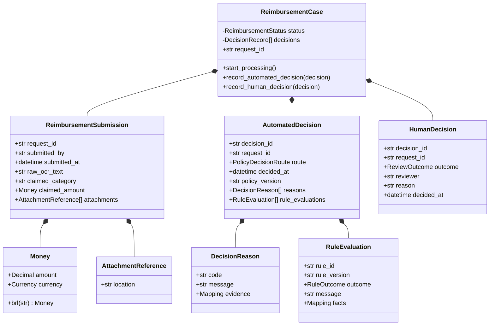
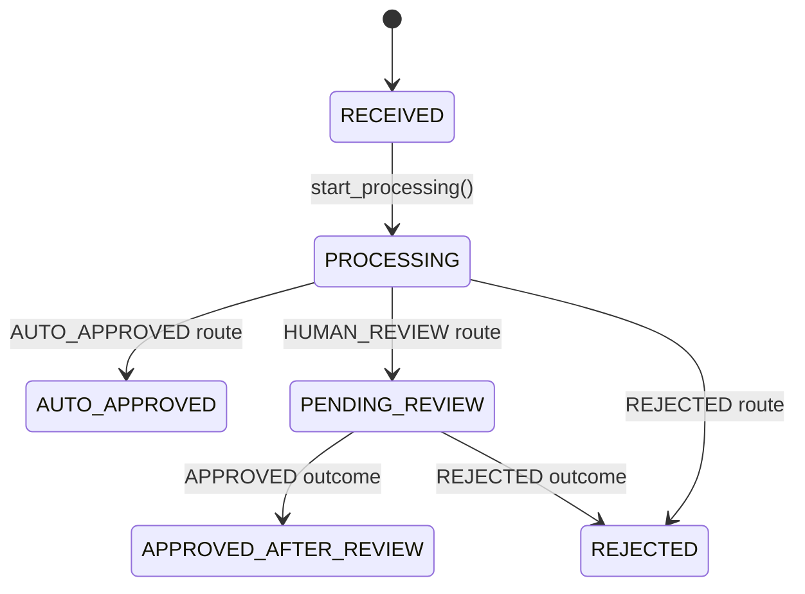
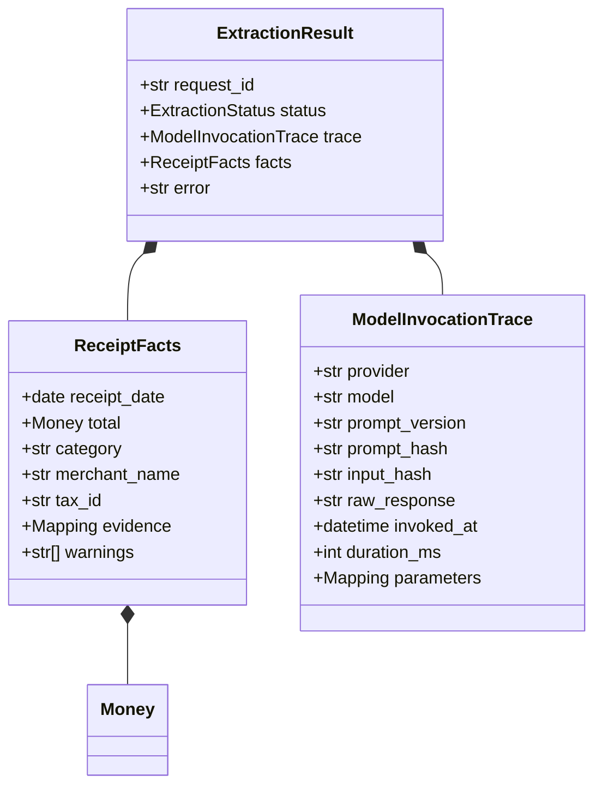
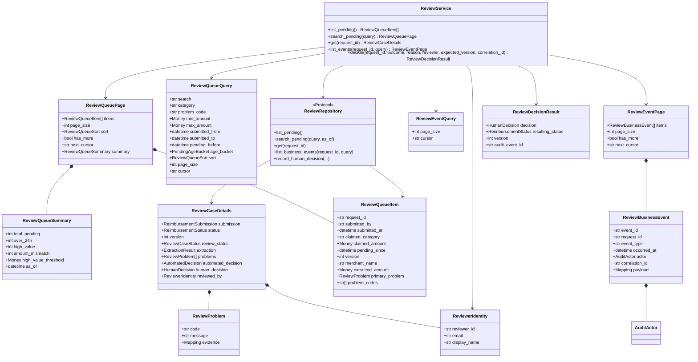
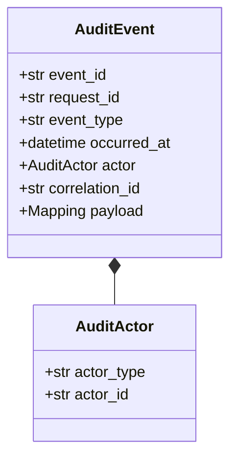
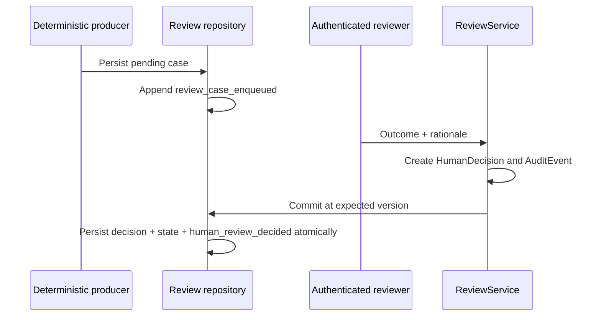
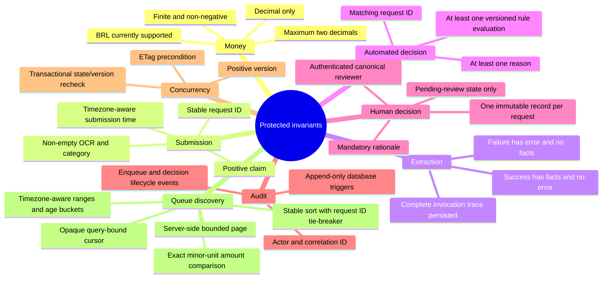
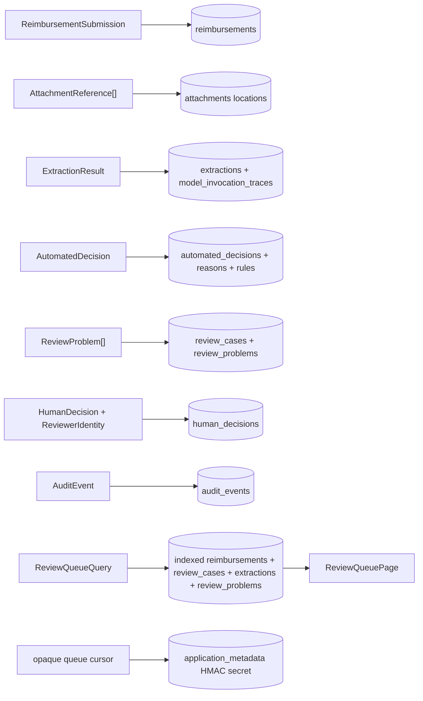

# Domain and application object model

## Modeling approach

Financial objects are separate from HTTP DTOs, database rows, and provider SDK
types. Immutable dataclasses validate values at construction time, while the
`ReimbursementCase` aggregate is the only object allowed to perform workflow
transitions. The application layer then coordinates that aggregate with an
abstract repository.

## Core reimbursement objects

`Money` only accepts finite, non-negative `Decimal` values with at most two
decimal places; BRL is the currently supported currency. Time-bearing objects
require timezone-aware datetimes. IDs and explanations must be non-blank.

## Aggregate state machine

The aggregate rejects a human decision before `PENDING_REVIEW`, a second
automated decision after leaving `PROCESSING`, a decision for another
`request_id`, or any direct assignment of a final state. `ReviewService`
rehydrates the relevant submission and automated decision, replays the domain
transition, and gives the resulting state to the repository transaction.

## Extraction and reproducibility objects

A successful extraction can contain partial facts. Missing values are not
guessed: deterministic policy should route material uncertainty to review. A
failed extraction has an error and cannot contain facts. The full invocation
trace is persisted for audit; the browser response intentionally omits its raw
model response.

The repository contains the extraction contract and demo data, but no live OCR
or language-model adapter. The model count and secondary-verifier strategy
remain open decisions pending measured quality, cost, latency, and privacy data.

## Human-review application objects

`ReviewerIdentity` is an application value supplied by a trusted authentication
adapter. The HTTP command does not contain it. `HumanDecision.reviewer` stores
the canonical ID, while persistence snapshots the ID, email, and display name
that were authenticated at decision time.

`ReviewCaseDetails` is a reviewer read model, not a mutable aggregate or an ORM
entity. It combines the evidence needed for judgment without exposing database
implementation details.

`ReviewQueueQuery` validates the operational discovery contract before it
reaches persistence: optional text values are trimmed and bounded, money uses
`Money`, all timestamps require timezones, the amount and submission ranges
must be ordered, `pending_before` and `age_bucket` are mutually exclusive, and
page size is restricted to 10 through 100. Its language-neutral enums are:

- `ReviewQueueSort`: `pending_oldest`, `pending_newest`, `amount_asc`,
  `amount_desc`, and `submitted_newest`;
- `PendingAgeBucket`: `under_4h`, `4h_to_24h`, and `over_24h`.

`ReviewQueuePage` is the bounded application result. It couples a tuple of
compact queue rows with `has_more`, an opaque forward cursor, and operational
summary counts evaluated at one `as_of`. `ReviewQueueItem` now carries merchant,
extracted total, primary problem, and problem codes so a reviewer can triage
without loading every full case. The original problem message remains evidence;
the browser translates known codes and interface labels rather than mutating
stored text.

Cursor signing and keyset SQL are infrastructure responsibilities. The
application model treats the cursor as an opaque string and does not expose its
sort key or HMAC payload. The old `list_pending()` method remains only for
internal compatibility; the HTTP collection uses `search_pending()` and never
loads the complete queue into the browser.

`ReviewEventQuery` independently bounds one case's business-history read to
1–100 events. `ReviewBusinessEvent` is not the stored `AuditEvent`: it is a
reviewer-safe projection with an event-specific scalar payload whitelist.
`ReviewEventPage` returns stable chronological keyset metadata without exposing
the cursor boundary or HMAC. This distinction prevents the normal review screen
from becoming an accidental privileged technical-trace surface.

## Audit objects and lifecycle facts

Both records are immutable domain values. The implemented repository appends a
`review_case_enqueued` event when it persists a routed case and a
`human_review_decided` event when it records the reviewer action. Database
triggers prevent updates and deletes of every audit row.

## Object catalog

| Object | Layer/classification | Mutable? | Primary responsibility |
| --- | --- | --- | --- |
| `Money` | Domain value object | No | Exact amount and currency. |
| `AttachmentReference` | Domain value object | No | Opaque location of externally stored content. |
| `ReimbursementSubmission` | Domain entity snapshot | No | Original employee input. |
| `ReimbursementCase` | Domain aggregate root | Controlled | Workflow state and append-only in-memory decision history. |
| `ReceiptFacts` | Domain value object | No | Structured evidence extracted from a receipt. |
| `ModelInvocationTrace` | Domain value object | No | Complete model invocation metadata for audit. |
| `ExtractionResult` | Domain result | No | Valid success or failure from extraction. |
| `DecisionReason` | Domain value object | No | Explainable decision code, message, and evidence. |
| `RuleEvaluation` | Domain value object | No | Versioned deterministic rule trace. |
| `AutomatedDecision` | Domain record | No | Automated route plus policy evidence. |
| `HumanDecision` | Domain record | No | Authenticated reviewer outcome and rationale. |
| `AuditEvent` / `AuditActor` | Domain records | No | Correlated, append-only lifecycle fact. |
| `ReviewerIdentity` | Application value | No | Canonical identity obtained from authentication. |
| `ReviewProblem` | Application value | No | Concrete issue presented for judgment. |
| `ReviewQueueQuery` | Application query | No | Validated search, filters, stable sort, page bound, and opaque cursor. |
| `ReviewQueueSort` / `PendingAgeBucket` | Application enums | No | Stable language-neutral discovery codes. |
| `ReviewQueueItem` | Application read model | No | Compact triage representation including merchant, extracted total, and problem summary. |
| `ReviewQueueSummary` | Application read model | No | Global pending, overdue, high-value, and amount-mismatch counts at one snapshot time. |
| `ReviewQueuePage` | Application read model | No | Bounded rows, forward cursor metadata, and summary. |
| `ReviewEventQuery` | Application query | No | Bounded page size and opaque cursor for one case timeline. |
| `ReviewBusinessEvent` | Application read model | No | Sanitized reviewer-visible business audit fact. |
| `ReviewEventPage` | Application read model | No | Chronological business events and forward cursor metadata. |
| `ReviewCaseDetails` | Application read model | No | Complete evidence snapshot for one case. |
| `ReviewDecisionResult` | Application result | No | Decision, final status, version, and audit ID. |
| `ReviewRepository` | Application port | N/A | Persistence operations required by review. |
| `ReviewService` | Application service | Controlled | Reads cases and coordinates authoritative decisions. |
| `ReviewerPrincipal` | Presentation security value | No | Identity established by the assessment auth adapter. |
| `ReviewQueueRequest` | Presentation DTO | No | Strict HTTP query model mapped to `ReviewQueueQuery`. |
| `ReviewEventRequest` | Presentation DTO | No | Strict timeline limit/cursor mapped to `ReviewEventQuery`. |
| `DecisionRequest` | Presentation DTO | No | Strictly `outcome` plus mandatory `reason`. |

## Invariants by boundary

## Object-to-storage mapping

No reviewer account/session object or attachment-content object is persisted in
the current schema. Standalone managed identity and authorized file access
are production responsibilities, not implied implemented features.
