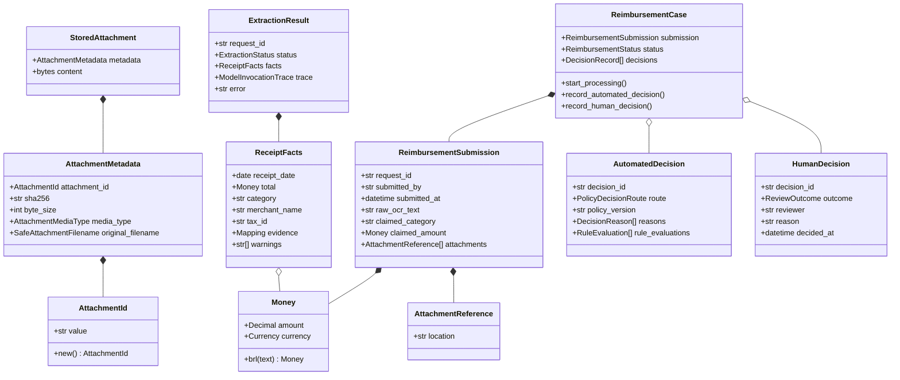
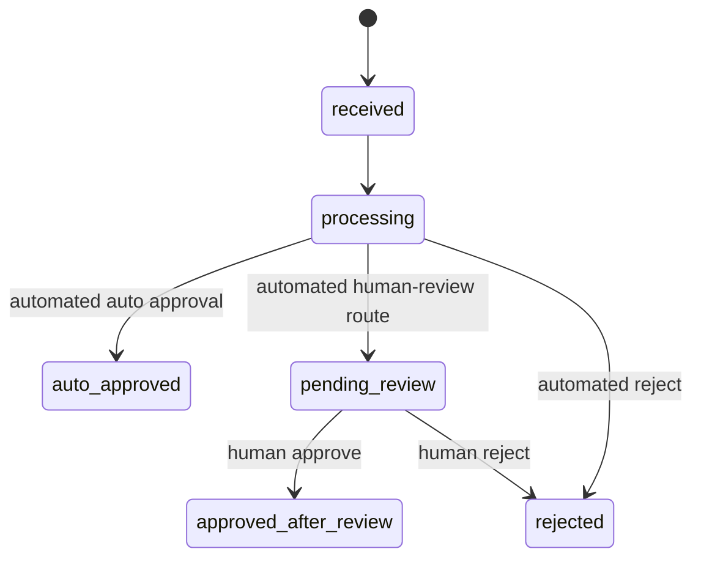
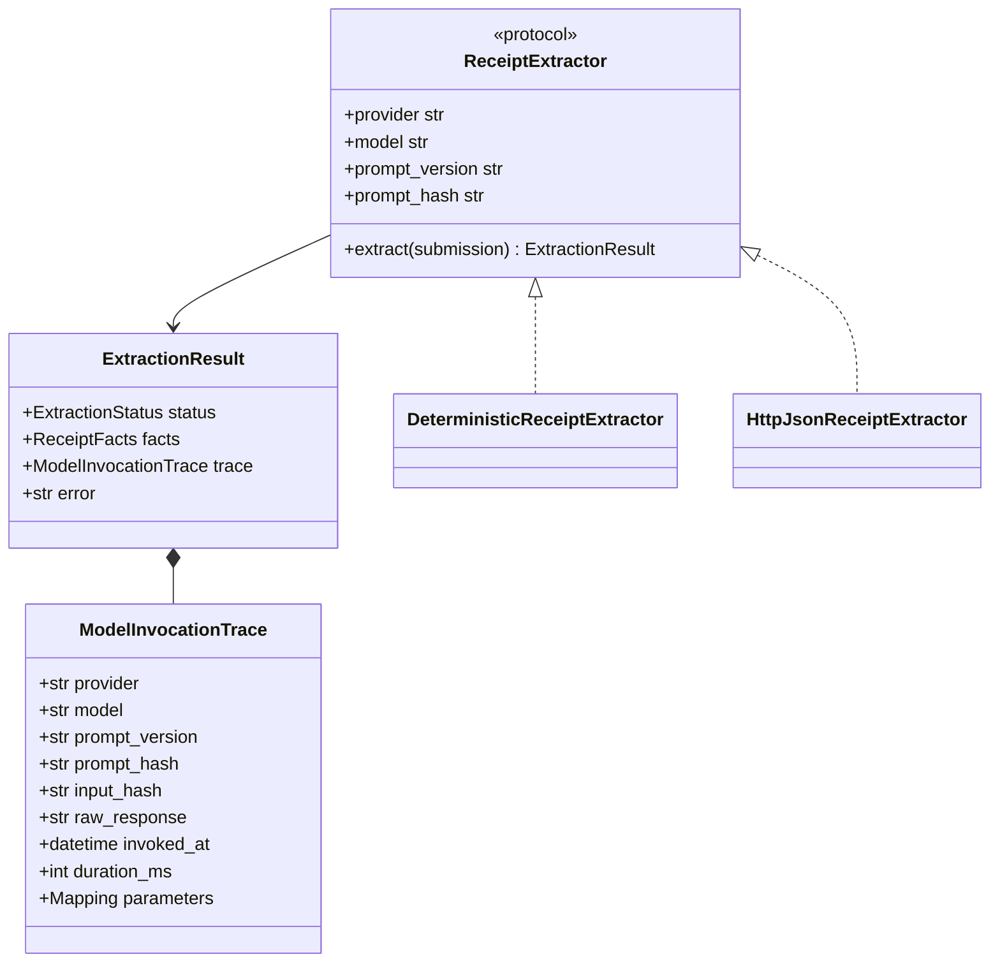
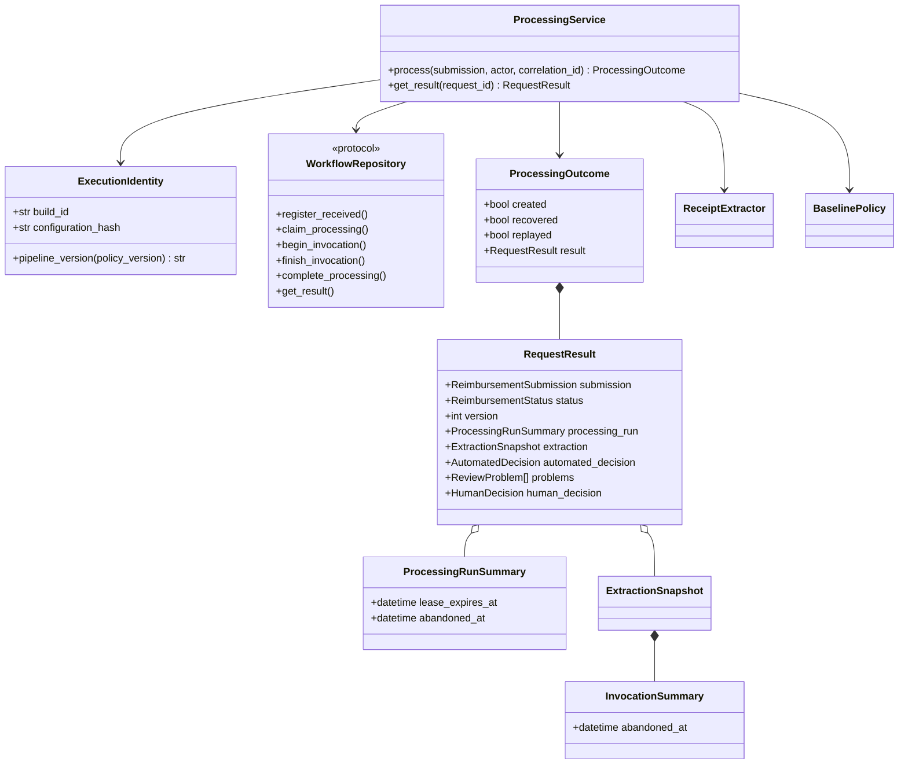

# Domain and application object model

## Modeling approach

The model separates financial facts and rules from transport, persistence, and
provider concerns. Domain constructors enforce invariants immediately; frozen
value objects and tuple/mapping snapshots prevent callers from mutating
historical evidence after construction.

## Core reimbursement objects

### `Money` and `Currency`

- The assessment supports BRL only.
- Amounts are finite, non-negative `Decimal` values with at most two fractional
  digits; `float` construction is rejected in the domain.
- API intake accepts plain decimal notation and normalizes it to two digits.
- Equality includes amount and currency, so policy comparisons are exact.

### `AttachmentReference`

A non-blank business reference retained in the immutable submission. A managed
assessment reference has the form `evidence:att_<opaque UUID hex>` and is checked
against `AttachmentStore` before intake continues. The HTTP adapter rejects new
arbitrary references with `422`; older strings remain readable only in seeded or
upgraded persisted assessment data and do not prove that a file exists.
References never expose an internal filesystem path or act as direct download
locators.

### Managed attachment values and port

- `AttachmentId` accepts only the server-generated `att_` plus 32-lowercase-hex
  shape; filenames and content hashes never become paths.
- `SafeAttachmentFilename` normalizes Unicode, rejects relative/hidden/control
  forms and unsafe punctuation, and is retained only as display metadata.
- `AttachmentMediaType` is a closed JPEG, PNG, or PDF vocabulary.
- `AttachmentMetadata` binds opaque ID, SHA-256, positive byte size, detected
  media type, and safe original filename.
- `StoredAttachment` requires the returned byte length to agree with metadata.
- The `AttachmentStore` application port streams immutable bytes in and retrieves
  an exact object by opaque ID. Its filesystem adapter validates magic/trailer
  signatures, writes atomically without overwrite, keeps private directories and
  read-only blobs, and rechecks checksum/media/identity on every read.
- `FileSystemAttachmentStore.trusted_owner_uid` anchors its private root,
  object, staging, and newly created shard directories to one POSIX owner and
  rejects symlinks or any group/other permission bits. It defaults to the local
  effective UID; deployments may supply a validated UID explicitly.
- Object identity is intentionally opaque rather than content-addressed;
  identical bytes receive distinct IDs, and the assessment performs no
  cross-case duplicate matching.

This is an assessment evidence boundary, not the production object contract. It
does not model S3 version, malware/quarantine state, legal hold, retention,
uploader ownership, a safe preview derivative, or the exact byte-to-OCR input
manifest.

Managed intake verifies references, but that is not treated as permanent proof.
Immediately before a new human decision, the HTTP adapter re-evaluates every
reference and rereads every managed original through `AttachmentStore`, which
repeats identity, media, length, and checksum validation. Human approval requires
the resulting state to be `verified`.

### `ReimbursementSubmission`

The immutable business input contains request ID, submitter email, timezone-
aware submission timestamp, supplied OCR text, claimed category, exact amount,
and ordered attachments. The canonical fingerprint uses all these normalized
fields for idempotency.

`submitted_by` is a claim attribute. The authoritative HTTP intake actor comes
from verified authentication context, is passed separately to the processing
service, and is recorded on the immutable business event with actor type
`submitter`. Clients cannot choose that actor ID in the JSON body. The separate
operational HTTP event uses actor type `authenticated_principal`.

### `ReimbursementCase`

The aggregate protects allowed financial transitions and append-only decision
history:

Each decision must reference the same request. A human decision cannot be
recorded unless an automated decision first placed the case in pending review.
If that automated decision contains any `reject` rule evaluation, the aggregate
rejects a later human approval: high-value review remains mandatory, but the
human outcome is constrained to rejection with rationale. Persistence adds
an optimistic numeric version to every aggregate transition. Without lease
recovery the path is v1 through v4; every recovered lease adds another version,
so version numbers are never inferred from status.

## Extraction and reproducibility objects

`ExtractionResult` is either:

- `succeeded`, with `ReceiptFacts` and no error; or
- `failed`, with a bounded error and no facts.

Both outcomes require a complete `ModelInvocationTrace`. That trace retains the
protected raw output for audit, while normal request/reviewer JSON exposes only
structured evidence and safe metadata. The workflow validates that extractor
provider/model/prompt/input identity matches the invocation registered before
the call.

The default offline adapter parses explicit `DATE`/`DATA`/`CHECK-IN`/
`CHECK-OUT`, final `TOTAL`/`FARE`, BRL, category markers, merchant, and tax ID.
It reports missing or ambiguous information rather than guessing. The optional
HTTP adapter implements the same port and fails closed on insecure configuration,
redirects, timeouts, oversized/non-UTF-8 responses, duplicate JSON keys, or
invalid schema. The composition root selects the HTTP adapter only through an
explicit `http_json` environment mode with validated endpoint/provider/model,
optional secret-safe API key, timeout, response cap, and scalar parameter JSON.
Deterministic mode is the default and rejects unused provider settings instead
of silently accepting a misconfiguration.

## Deterministic policy objects

The policy is pure: it performs no I/O, reads no clock, and generates no IDs.
The caller supplies decision metadata. Receipt age is anchored to the immutable
submission date converted to `America/Sao_Paulo`, so a processing delay cannot
change eligibility. That timestamp is nevertheless client-controlled in the
assignment input. Production must add a server-owned authoritative receipt time
before this rule can govern real money.

Rules evaluate receipt-evidence presence, extraction quality, critical facts,
BRL currency, receipt age, amount consistency, category consistency, and the
claimed amount band. Route precedence is:

1. A `HIGH_VALUE_REVIEW_REQUIRED` reason for an amount above BRL 2,000 always
   produces `human_review`.
2. Otherwise any `reject` evaluation produces `rejected`.
3. Otherwise any `review` evaluation produces `human_review`.
4. Otherwise the request is `auto_approved`.

The high-value route cannot erase another rule's evidence. When a high-value
receipt is also deterministically ineligible—for example, it is too old—the
aggregate prohibits approval and requires the reviewer to record rejection and
rationale. The assignment's simultaneous old-receipt rejection and mandatory
high-value review wording still needs policy-owner confirmation before
production, but the assessment no longer bypasses either control.

Consequences:

- exactly BRL 200.00 may auto-approve only when every other rule passes;
- BRL 200.01 through 2,000.00 requires review;
- above BRL 2,000 requires review with a distinct high-value reason;
- exactly 90 days is valid; more than 90 days is rejected;
- an old receipt above BRL 2,000 still reaches review, but the reviewer cannot
  approve it;
- no attachment reference can auto-approve; missing evidence routes to review;
- extraction failure/warning, missing facts, future date, or amount/category
  mismatch routes to review rather than guessing or auto-rejecting.

## Processing application objects

`InvocationSummary` is intentionally safe: it contains identity, hashes,
provider/model/prompt metadata, timing, status, parameters, and bounded error,
but no raw response. The raw response remains in persistence. The public HTTP
result is narrower still and omits the processing run, invocation metadata, raw
OCR, attachment references, reviewer identity, and provider parameters.

`ExecutionIdentity` validates a portable build identifier and a lowercase
SHA-256 digest of the canonical effective runtime configuration. The application
does not copy cleartext settings into audit events. `ProcessingService` stores
`baseline-v3;build=<build_id>;config=<configuration_hash>` on every processing
run and includes the two identity fields in intake and processing-start business
events. Recovery creates a new run under the current execution identity while
preserving the abandoned run's identity.

`ProcessingOutcome.created` distinguishes a newly registered `201` result from
an existing request. `recovered` identifies the caller that atomically acquired
an expired processing lease and resumed processing. `replayed` is true for an
existing request that is not a lease recovery: terminal and still-active results
return without extractor work, while an existing `received` request may acquire its
first lease and finish under an idempotent `200` response. A
same-ID/different-fingerprint attempt raises a dedicated conflict rather than
being mistaken for a review concurrency error.

A processing lease defaults to five minutes. Recovery preserves a terminal old
invocation, marks an unfinished invocation and old run abandoned, appends
technical abandonment plus business resume events, and creates the next numbered
run. Repository state/run checks fence the stale worker. This is retry-triggered
recovery only: there is no background watchdog, heartbeat, queue retry budget,
DLQ, or reprocessing command.

## Human-review application objects

- `ReviewerIdentity`: canonical ID/email/display-name derived from the
  authenticated principal.
- `ReviewProblem`: stable code, message, and evidence explaining why the case
  needs judgment.
- `ReviewQueueQuery`: validated search, category/problem/amount/time/age filters,
  sort, page size, and signed cursor.
- `ReviewQueueItem`, `ReviewQueueSummary`, `ReviewQueuePage`: bounded operational
  projection and KPIs.
- `ReviewCaseDetails`: claim, attachments, raw OCR, facts, safe invocation
  metadata, automated decision, problems, current version, and
  `submission_actor_id` projected from immutable intake evidence.
- `ReviewEventQuery`, `ReviewBusinessEvent`, `ReviewEventPage`: sanitized
  business history with a separate purpose-bound cursor.
- `ReviewDecisionResult`: immutable human decision, final status/version, audit
  event ID, and whether the original command result was replayed.
- `decision_idempotency_key_hash`: validates an 8–128-character visible ASCII
  transport key and returns an irreversible SHA-256 digest.
- `review_decision_command_fingerprint`: canonical SHA-256 over request,
  reviewer, outcome, normalized rationale, and expected version.

Decision-time evidence integrity uses bounded strings because it crosses an
adapter boundary. The HTTP path emits `verified`, `missing`, `failed` (stored
bytes did not pass integrity checks), `unverifiable` (legacy reference), or
`invalid_reference`; `not_verified` remains a fail-closed application value for
another adapter. Approval accepts only `verified`. Rejection may record a
non-verified state so an unavailable or corrupt-evidence case can be closed
without misrepresenting what the reviewer could verify.

`ReviewService` constructs a `ReimbursementCase` from repository state and asks
the aggregate to perform the human transition before delegating the atomic
write. Identity is a typed argument, not a request-body string. It resolves an
existing matching idempotency binding before requiring the case to remain
pending, which permits a safe retry after response loss. The repository writes a
new binding atomically with decision, next-version state, and business event; a
different fingerprint under the same key conflicts.

Four-eyes separation is defense in depth. The HTTP adapter checks the reviewer
against `ReviewCaseDetails.submission_actor_id`, and `ReviewService` repeats the
same check so a different adapter cannot bypass it. The service fails closed
when that immutable actor is unavailable and also retains a defensive comparison
against the claimed submitter email. It independently rejects every approval
whose evidence-integrity state is not `verified`. A successful decision event
records the observed state together with the current `build_id` and
`configuration_hash`.

The assessment HTTP adapter adds a closed authorization vocabulary around these
application objects. `submitter` may upload and submit, `reviewer` may read and
decide, `auditor` may read review evidence but not decide, and `admin` inherits
all four assessment capabilities. A credential record without explicit roles
retains the historical submitter+reviewer pair for local upgrade compatibility.
Non-admin intake binds `submitted_by` to the
principal email, exact result lookup is owner-only unless a review/audit
capability exists, and no principal may decide a case with the same immutable
intake actor or submitter email. These are adapter controls, not production
actor/team/assignment domain objects.

## Audit objects

`AuditActor` separates actor type from actor ID. Executable intake business
events use the literal type `submitter`; human decisions use `reviewer`; and
processing uses bounded `system` identities. The claimed `submitted_by` value is
never mislabeled as the verified actor. `AuditEvent` requires an event ID,
request ID, type, aware timestamp, actor, correlation ID, and scalar/mapping
payload. The immutable intake actor is also the source of
`ReviewCaseDetails.submission_actor_id` for four-eyes enforcement.

Persistence assigns each event one scope:

- `business`: received, processing started/resumed, automated decision, queue
  enqueue, and human decision; eligible for sanitized reviewer projection.
- `technical`: model/extractor attempt start/completion and expired run/attempt
  abandonment; not returned by the normal reviewer timeline.
- `security`: idempotent replay and divergent-payload rejection; not returned by
  normal business APIs.

The `reimbursement_received`, `reimbursement_processing_started`, and
`human_review_decided` payloads expose `build_id` and `configuration_hash` where
the action occurs; processing runs additionally retain the bound pipeline
version. The human-decision payload includes `evidence_integrity`. These fields
are immutable reproducibility evidence rather than mutable deployment labels.

`OperationalAuditEvent` is a separate application object for one HTTP attempt.
It requires a stable operation type, method, route template/classification,
status/outcome, authentication result, duration, occurrence/correlation IDs,
optional path-derived request/actor identity, and bounded scalar metadata. It
forbids metadata keys associated with bodies, OCR, credentials, cookies,
queries, responses, secrets, or tokens. The FastAPI middleware records one for
authentication failures, authorization denials, reads, searches, uploads,
downloads, validation errors, unmatched routes, and server failures. Its actor
type for an authenticated request is `authenticated_principal`, and each event's
bounded metadata includes the current build and configuration digest.

This closes local HTTP-attempt coverage, not the complete production audit
contract. Operational events use a separate SQLite transaction, carry no exact
search-query replay, have no normal cross-case API/UI, and are not exported to
approved immutable storage. The business event remains authoritative for a
financial transition; infrastructure logs remain corroborating evidence.

## Invariants by boundary

| Boundary | Enforced invariant |
| --- | --- |
| Domain | Exact money, aware timestamps, non-blank IDs, valid state transitions, explainable decisions. |
| Intake DTO | No unknown fields, bounded strings/list, email shape, plain finite decimal, aware ISO timestamp. |
| Processing service | Actor/correlation and execution identity required, invocation identity and lease ownership validated, extractor failures normalized, deterministic policy owns route. |
| Repository | Expected state/version/run, request and decision-command fingerprints, foreign keys, atomic transitions, immutable evidence and events. |
| Attachment adapter | Opaque identity, private path boundary, trusted POSIX directory owner, bounded streaming, media-signature validation, atomic no-overwrite write, checksum-verified read. |
| HTTP | Authentication, closed roles, owner checks, immutable-actor four-eyes enforcement, decision-time original-evidence validation, CSRF/origin for writes, safe errors/results, ETag plus idempotency key for human decision, one operational audit record per attempt. |
| Browser | Server-side bounded discovery; evidence rendered as text; managed file access only on demand; no credentials or sensitive payload in web storage. |

These invariants make the assessment auditable, but production still needs
managed identity/ABAC, versioned and scanned object evidence bound to trusted
OCR, asynchronous queued recovery, an atomic outbox plus immutable audit export,
and measured scale/accuracy. Cross-case duplicate-candidate detection using
object SHA plus normalized merchant/date/amount remains an open production
control target; it is not a current capability or automatic rejection rule.
