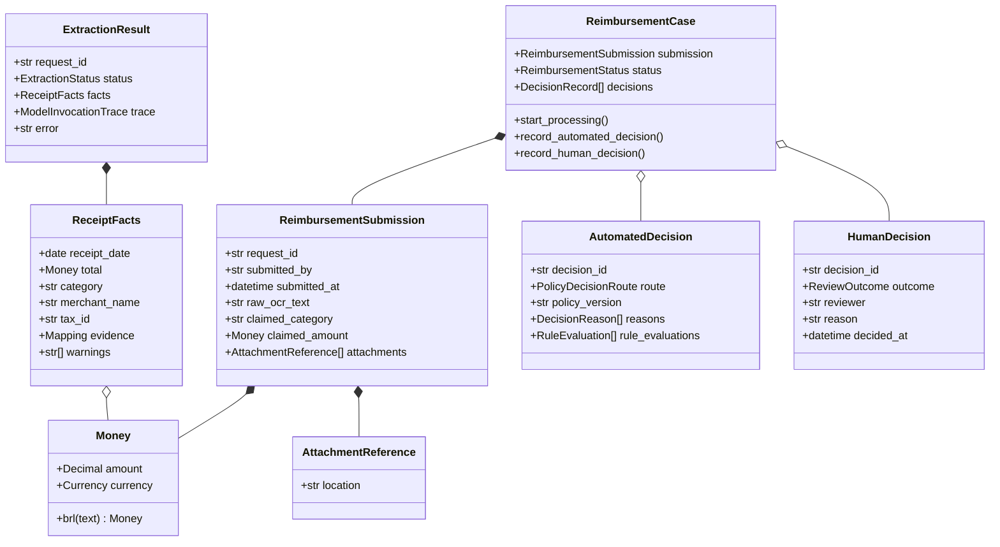
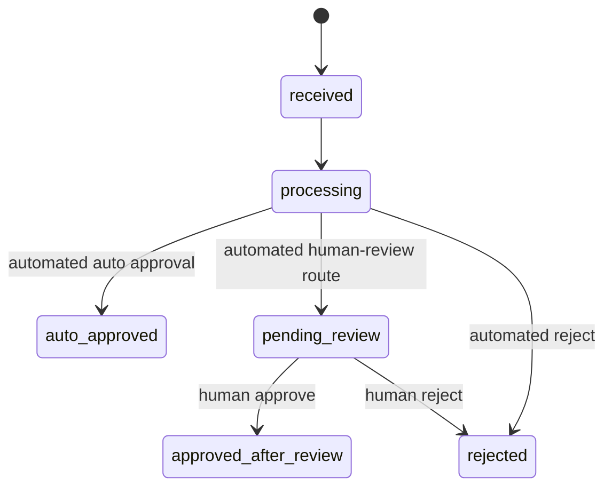
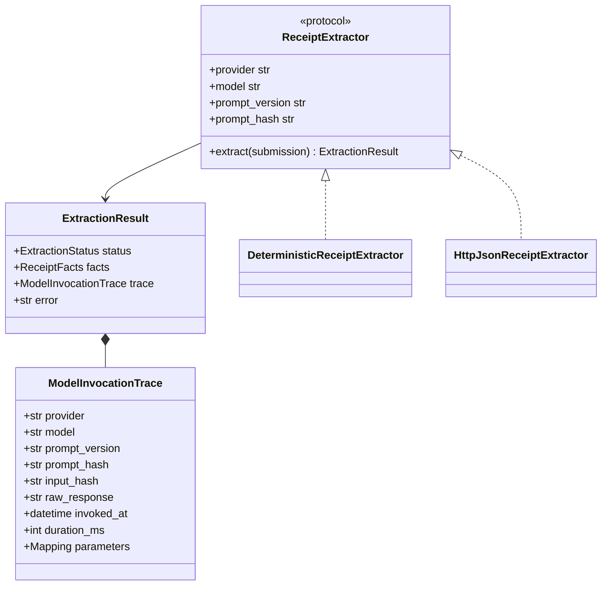
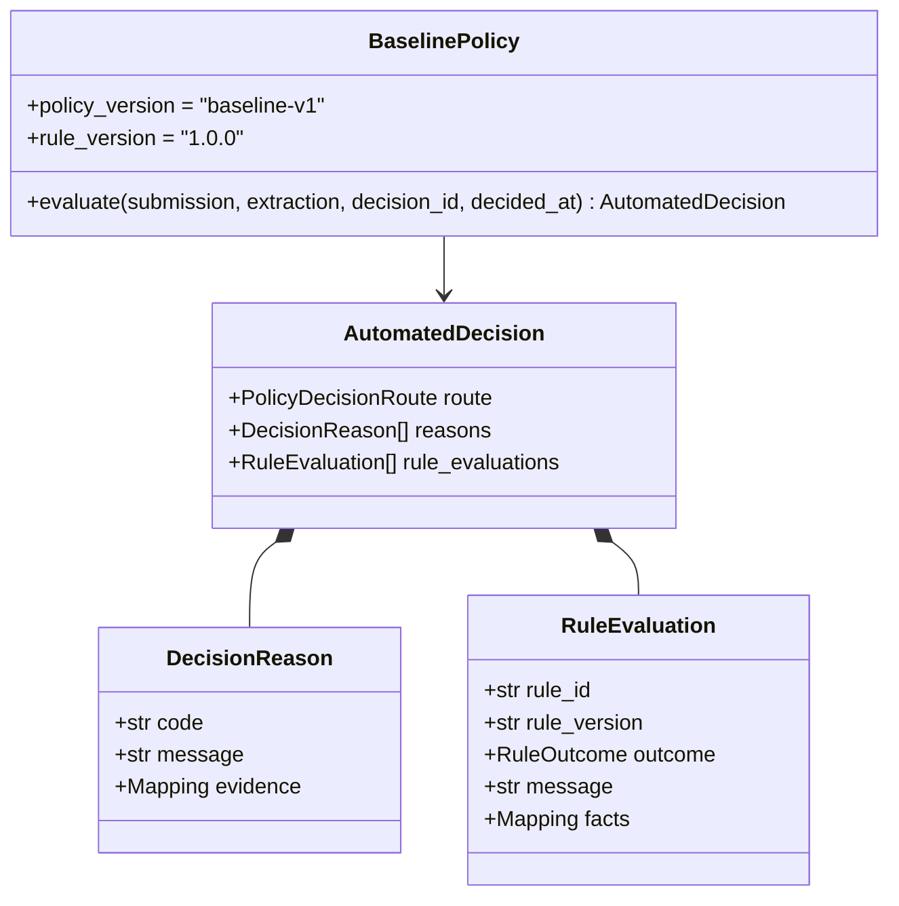
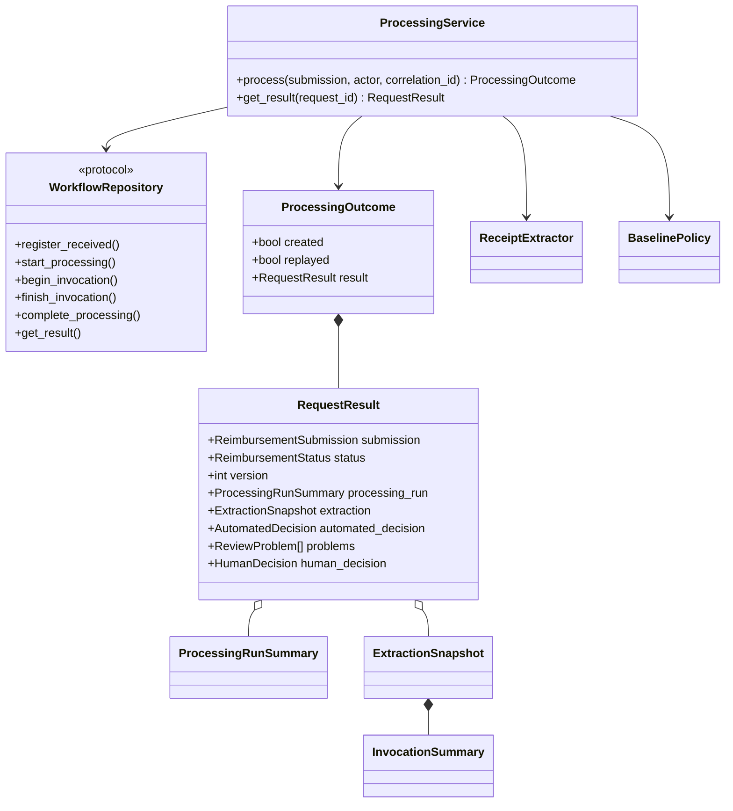

# Domain and application object model

## Modeling approach

The model separates financial facts and rules from transport, persistence, and
provider concerns. Domain constructors enforce invariants immediately; frozen
value objects and tuple/mapping snapshots prevent callers from mutating
historical evidence after construction.

## Core reimbursement objects

### `Money` and `Currency`

- The assessment supports BRL only.
- Amounts are finite, non-negative `Decimal` values with at most two fractional
  digits; `float` construction is rejected in the domain.
- API intake accepts plain decimal notation and normalizes it to two digits.
- Equality includes amount and currency, so policy comparisons are exact.

### `AttachmentReference`

A non-blank string that identifies caller-supplied evidence. In this repository
it is not proof that a file exists and is not an authorized download locator.
Production needs a stable attachment ID plus private object version/checksum,
media/size/scan state, retention class, and access audit.

### `ReimbursementSubmission`

The immutable business input contains request ID, submitter email, timezone-
aware submission timestamp, supplied OCR text, claimed category, exact amount,
and ordered attachments. The canonical fingerprint uses all these normalized
fields for idempotency.

`submitted_by` is a claim attribute. The authoritative audit actor comes from
verified authentication context and is passed separately to the processing
service; clients cannot choose the audit identity in the JSON body.

### `ReimbursementCase`

The aggregate protects allowed financial transitions and append-only decision
history:

Each decision must reference the same request. A human decision cannot be
recorded unless an automated decision first placed the case in pending review.
Persistence adds numeric versions v1 through v4 around these domain states.

## Extraction and reproducibility objects

`ExtractionResult` is either:

- `succeeded`, with `ReceiptFacts` and no error; or
- `failed`, with a bounded error and no facts.

Both outcomes require a complete `ModelInvocationTrace`. That trace retains the
protected raw output for audit, while normal request/reviewer JSON exposes only
structured evidence and safe metadata. The workflow validates that extractor
provider/model/prompt/input identity matches the invocation registered before
the call.

The default offline adapter parses explicit `DATE`/`DATA`/`CHECK-IN`/
`CHECK-OUT`, final `TOTAL`/`FARE`, BRL, category markers, merchant, and tax ID.
It reports missing or ambiguous information rather than guessing. The optional
HTTP adapter implements the same port and fails closed on insecure configuration,
redirects, timeouts, oversized/non-UTF-8 responses, duplicate JSON keys, or
invalid schema.

## Deterministic policy objects

The policy is pure: it performs no I/O, reads no clock, and generates no IDs.
The caller supplies decision metadata. Receipt age is anchored to the immutable
submission date converted to `America/Sao_Paulo`, so a processing delay cannot
change eligibility. That timestamp is nevertheless client-controlled in the
assignment input. Production must add a server-owned authoritative receipt time
before this rule can govern real money.

Rules evaluate extraction quality, critical facts, BRL currency, receipt age,
amount consistency, category consistency, and the claimed amount band. Route
precedence is:

1. Any `reject` evaluation → `rejected`.
2. Otherwise any `review` evaluation → `human_review`.
3. Otherwise → `auto_approved`.

This precedence is the implemented assessment interpretation. The assignment's
simultaneous old-receipt rejection and mandatory high-value review wording is
ambiguous, and a policy owner has not yet confirmed the collision behavior.

Consequences:

- exactly BRL 200.00 may auto-approve only when every other rule passes;
- BRL 200.01 through 2,000.00 requires review;
- above BRL 2,000 requires review with a distinct high-value reason;
- exactly 90 days is valid; more than 90 days is rejected;
- old-receipt rejection wins over amount review, while all evaluations remain
  recorded;
- extraction failure/warning, missing facts, future date, or amount/category
  mismatch routes to review rather than guessing or auto-rejecting.

## Processing application objects

`InvocationSummary` is intentionally safe: it contains identity, hashes,
provider/model/prompt metadata, timing, status, parameters, and bounded error,
but no raw response. The raw response remains in persistence. The public HTTP
result is narrower still and omits the processing run, invocation metadata, raw
OCR, attachment references, reviewer identity, and provider parameters.

`ProcessingOutcome.created` distinguishes a new `201` result from an idempotent
`200` replay. A same-ID/different-fingerprint attempt raises a dedicated
conflict rather than being mistaken for a review concurrency error.

## Human-review application objects

- `ReviewerIdentity`: canonical ID/email/display-name derived from the
  authenticated principal.
- `ReviewProblem`: stable code, message, and evidence explaining why the case
  needs judgment.
- `ReviewQueueQuery`: validated search, category/problem/amount/time/age filters,
  sort, page size, and signed cursor.
- `ReviewQueueItem`, `ReviewQueueSummary`, `ReviewQueuePage`: bounded operational
  projection and KPIs.
- `ReviewCaseDetails`: claim, attachments, raw OCR, facts, safe invocation
  metadata, automated decision, problems, and current version.
- `ReviewEventQuery`, `ReviewBusinessEvent`, `ReviewEventPage`: sanitized
  business history with a separate purpose-bound cursor.
- `ReviewDecisionResult`: immutable human decision, final status/version, and
  audit event ID.

`ReviewService` constructs a `ReimbursementCase` from repository state and asks
the aggregate to perform the human transition before delegating the atomic
write. Identity is a typed argument, not a request-body string.

## Audit objects

`AuditActor` separates actor type (`authenticated_caller`, `system`, reviewer
identity snapshot in a human decision) from actor ID. The claimed
`submitted_by` value is never mislabeled as the verified actor. `AuditEvent`
requires an event ID, request ID, type, aware timestamp, actor, correlation ID,
and scalar/mapping payload.

Persistence assigns each event one scope:

- `business`: received, processing started, automated decision, queue enqueue,
  and human decision; eligible for sanitized reviewer projection.
- `technical`: model/extractor attempt start and completion; not returned by the
  normal reviewer timeline.
- `security`: idempotent replay and divergent-payload rejection; not returned by
  normal business APIs.

These objects cover processing and decision facts, not every service operation.
Authentication success/failure, reads, searches, validation/orchestration
errors, and evidence access do not yet have comprehensive audit objects/flows.
Abandoned running processing also has no recovery model. Both must be designed
before production activation.

## Invariants by boundary

| Boundary | Enforced invariant |
| --- | --- |
| Domain | Exact money, aware timestamps, non-blank IDs, valid state transitions, explainable decisions. |
| Intake DTO | No unknown fields, bounded strings/list, email shape, plain finite decimal, aware ISO timestamp. |
| Processing service | Actor/correlation required, invocation identity validated, extractor failures normalized, deterministic policy owns route. |
| Repository | Expected state/version, canonical hash, foreign keys, atomic transitions, immutable evidence and events. |
| HTTP | Authentication, CSRF/origin for writes, safe errors/results, ETag precondition for human decision. |
| Browser | Server-side bounded discovery; evidence rendered as text; no credentials or sensitive payload in web storage. |

These invariants make the assessment auditable, but production still needs
managed identity/authorization, attachment-byte integrity/access, asynchronous
recovery, an immutable external audit export, and measured scale/accuracy.
