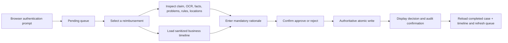
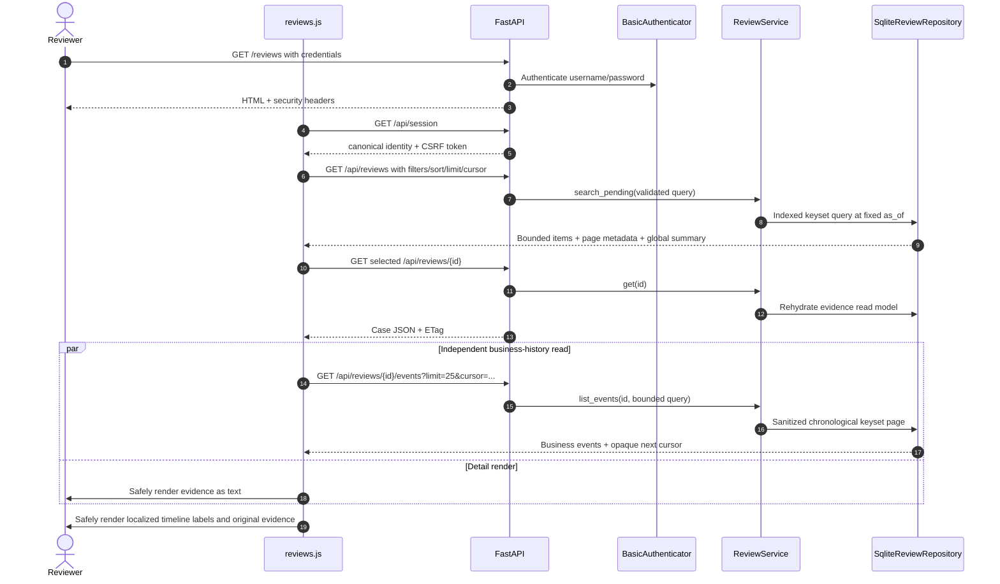
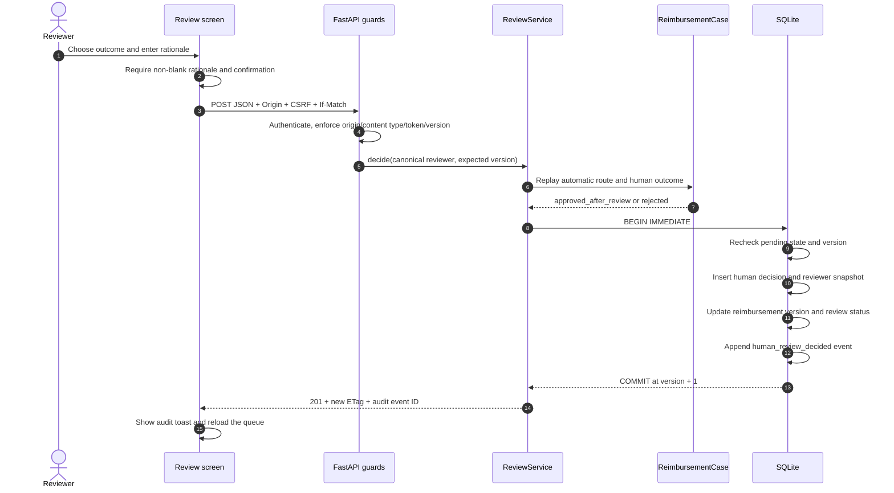
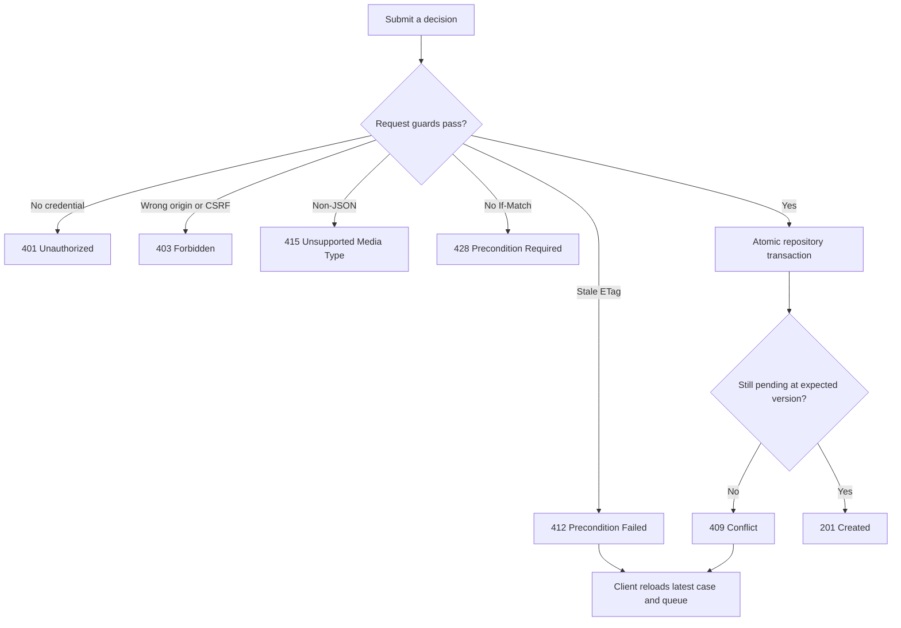
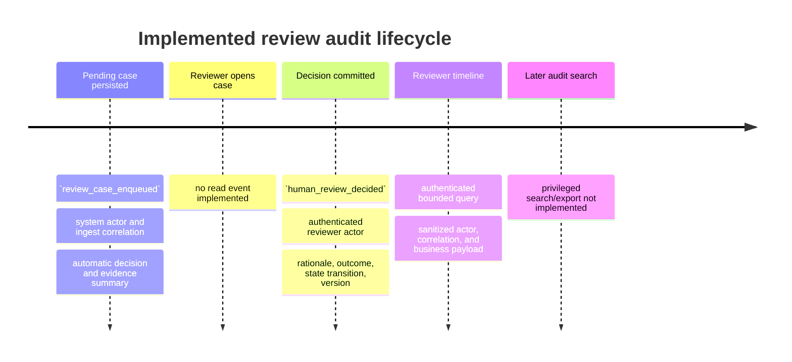
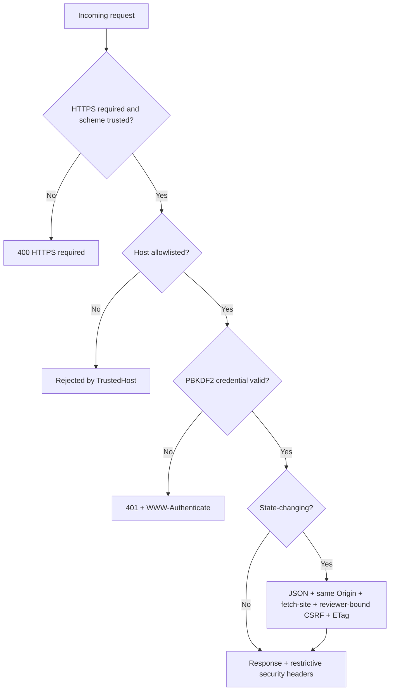
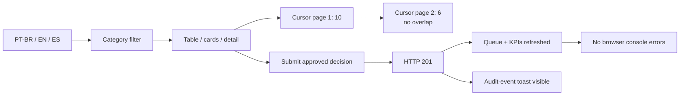

# Feature catalog and flows

## Capability matrix

| Capability | Status | Implemented behavior | Production work or known limit |
| --- | --- | --- | --- |
| Exact BRL money | Implemented | `Money` accepts finite non-negative `Decimal` values with at most two decimals. | Confirm multi-currency requirements before extending. |
| Reimbursement workflow | Implemented domain slice | `ReimbursementCase` protects automatic and human transitions. | Intake and automated pipeline are absent. |
| Structured extraction | Partial | Success/failure, receipt facts, evidence, warnings, and complete invocation trace are modeled and persisted. | No live OCR/LLM adapter or evaluation dataset. |
| Deterministic policy output | Partial | Automated decision, reason, policy-version, and rule-evaluation contracts are enforced and persisted. | Baseline threshold/date/category rules are not implemented. |
| Pending-case ingestion | Implemented repository boundary | Case, evidence, automated decision, problems, and enqueue audit event commit together. | Demo seed is the only producer. |
| Reviewer queue | Implemented backend | Authenticated, bounded server query with prefix search across the complete eligible pending queue, selective filters, five stable sorts, keyset pagination, enriched triage rows, and operational KPIs. | Search is currently limited to pending cases and prefixes of request ID, submitter, and merchant. SQLite summaries are exact assessment behavior; production needs a maintained/materialized aggregate. Assignment and fine-grained queue authorization are not implemented. |
| Evidence view | Implemented, partial trace UI | The screen shows claim, OCR, extracted facts, problems, policy version, rule evaluations, attachment locations, and a separate sanitized business timeline. The detail API additionally returns safe model-invocation metadata and any human decision. | The UI does not render the protected technical trace or original-file preview/download. The privileged raw model response remains protected. |
| Human decision | Implemented | Approve/reject with mandatory rationale and authenticated reviewer identity. | Four-eyes approval or value-based permissions are not implemented. |
| Concurrency control | Implemented | `ETag`/`If-Match`, state/version recheck, unique decision, and `BEGIN IMMEDIATE`. | Production datastore semantics require revalidation. |
| Audit trail | Implemented review lifecycle | Enqueue and human-decision events are append-only with actor, timestamp, correlation, and canonical payload. A dedicated authenticated endpoint and trilingual timeline expose only whitelisted business fields in stable cursor pages. | Full-service event coverage, read auditing, export, retention, completed-case discovery, and privileged audit search remain. |
| Browser security | Implemented assessment slice | Same-origin checks, HMAC CSRF, CSP, no-store, anti-frame, no sensitive browser storage, safe DOM. | Requires deployment validation and security testing. |
| Reviewer authentication | Assessment only | HTTP Basic with configured salted PBKDF2-SHA256 hashes; identity is server-derived. | The accepted AWS target replaces this adapter with Cognito Authorization Code + PKCE through a BFF, opaque HttpOnly sessions, MFA, RBAC/ABAC, recovery, revocation, and access governance. |
| Transport security | Implemented application guard | HTTP is rejected when HTTPS is required; HSTS is added to HTTPS responses. | Trusted production ingress must terminate TLS and set forwarded headers correctly. |

## Reviewer experience

The application serves one responsive page at `/reviews`. It contains a pending
queue, case evidence, an outcome form, and a final confirmation dialog. There is
no separate frontend server, Node build, React runtime, or server-side rendering
framework.



The screen is for human reviewers; the JSON API is its internal application
boundary, not the intended reviewer UI. The static page carries no case data.
JavaScript obtains it after authentication and creates text nodes with
`textContent`. OCR strings such as `<script>` or malicious merchant names are
therefore displayed as inert text.

The reviewer console is not the employee-facing portal. The standalone product
will provide a separate authenticated submitter upload/tracking interface that
shows acknowledgement, state, outcome, and an approved explanation. The rich
OCR, policy, reviewer, and audit evidence stays behind reviewer authorization.
The submitter surface and its intake/status APIs are required but are not
present in the executable.

### Current assessment sign-in

The local operator creates a PBKDF2 hash with
`expense-agent-hash-password`, configures that hash together with `username`,
canonical reviewer ID, email, and display name in
`EXPENSE_AGENT_REVIEWERS_JSON`, exports the environment, and starts
`expense-agent-review`. The service does not auto-load `.env`, and the example
hash is not a usable default credential. Local direct HTTP also requires the
explicit development override `EXPENSE_AGENT_REQUIRE_HTTPS=false`.

Opening `/reviews` triggers the browser's native HTTP Basic prompt. The person
enters the configured username and the original plaintext password; the server
verifies its hash and derives the reviewer identity. The decision body contains
only outcome and rationale, never reviewer identity. This assessment flow has
no application login page, logout, password recovery, MFA, or authorization
roles. The accepted AWS target replaces it with an application-owned Cognito
User Pool and serverless BFF: CloudFront serves the same static UI, Cognito
performs managed login/MFA, and the backend gives the browser only an opaque
HttpOnly cookie backed by a revocable DynamoDB session. A Lambda authorizer
derives the actor; service and SQL rules enforce roles and object scope.

## HTTP endpoint catalog

| Method and path | Purpose | Authentication | Important response/control |
| --- | --- | --- | --- |
| `GET /` | Redirect to the reviewer page. | None at redirect; target is protected. | `307` to `/reviews`. |
| `GET /reviews` | Serve the single static HTML page. | Valid reviewer credential. | No sensitive data embedded; `Cache-Control: no-store`. |
| `GET /assets/*` | Serve static CSS and JavaScript. | Static content only. | CSP permits same-origin assets. |
| `GET /api/session` | Return canonical reviewer identity and a short-lived reviewer-bound CSRF token. | Valid reviewer credential. | Token remains in JavaScript memory. |
| `GET /api/reviews` | Search and page pending review summaries on the server. | Valid reviewer credential. | Bounded JSON page with opaque next cursor and all-pending KPI summary; invalid filters/cursors return `422`. |
| `GET /api/reviews/{request_id}` | Return the current reviewer evidence read model. | Valid reviewer credential. | Current `ETag`; raw model response, original file bytes, and event history are omitted because the timeline has a separate bounded route. |
| `GET /api/reviews/{request_id}/events` | Return the sanitized chronological business timeline for one known case. | Valid reviewer credential. | At most 1–100 events, default 25; opaque purpose-separated cursor; technical/raw fields are omitted. Unknown case is `404`; invalid cursor/query is `422`. |
| `POST /api/reviews/{request_id}/decisions` | Record one authoritative approve/reject action. | Valid reviewer credential, same origin, CSRF. | Requires current `If-Match`; returns `201`, new ETag, correlation ID, decision ID, and audit-event ID. |

OpenAPI/Swagger routes are intentionally disabled. Reviewer operations use the
dedicated screen; API contracts are covered by automated tests and this
documentation.

## Pending-queue API contract

`GET /api/reviews` never returns the complete operational collection. With no
parameters it returns the first 25 cases ordered by oldest pending time. The
validated query surface is:

| Parameter | Accepted value and behavior |
| --- | --- |
| `search` | 1–200 character SQLite `NOCASE` literal prefix across request ID, submitter, and extracted merchant; assessment case folding is ASCII-only. |
| `category` | Case-insensitive exact claimed-category code. |
| `problem_code` | Case-insensitive exact stable problem code. |
| `min_amount`, `max_amount` | Inclusive BRL decimal boundaries with at most two fraction digits; minimum cannot exceed maximum. |
| `submitted_from`, `submitted_to` | Inclusive timezone-aware ISO 8601 boundaries; start cannot follow end. |
| `pending_before` | Exclusive timezone-aware pending boundary. |
| `age_bucket` | `under_4h`, `4h_to_24h`, or `over_24h`; cannot be combined with `pending_before`. |
| `sort` | `pending_oldest` (default), `pending_newest`, `amount_asc`, `amount_desc`, or `submitted_newest`. |
| `limit` | Integer from 10 through 100; default 25. |
| `cursor` | Opaque forward cursor returned by the preceding request. It must be reused with exactly the same filters, sort, and limit. |

Unknown parameters, naive timestamps, invalid ranges, unsupported enum values,
oversized pages, malformed cursors, modified cursors, and cursors reused with a
different query produce `422`. SQL values remain parameterized. API enums and
problem codes are language-neutral; UI localization does not alter query or
audit values.

The response shape is:

```json
{
  "items": [
    {
      "request_id": "RMB-2026-00041",
      "submitted_by": "ana@example.com",
      "submitted_at": "2026-08-10T12:00:00+00:00",
      "claimed_category": "client_meal",
      "claimed_amount": {"amount": "2180.00", "currency": "BRL"},
      "pending_since": "2026-08-10T12:00:04+00:00",
      "version": 1,
      "merchant_name": "Bistro Central",
      "extracted_amount": {"amount": "2160.00", "currency": "BRL"},
      "primary_problem": {
        "code": "AMOUNT_MISMATCH",
        "message": "Original source-language evidence"
      },
      "problem_codes": ["AMOUNT_MISMATCH"]
    }
  ],
  "page": {
    "limit": 25,
    "sort": "pending_oldest",
    "has_more": true,
    "next_cursor": "opaque-server-value"
  },
  "summary": {
    "scope": "all_pending",
    "total_pending": 320,
    "over_24h": 18,
    "high_value": 9,
    "amount_mismatch": 41,
    "high_value_threshold": {"amount": "2000.00", "currency": "BRL"},
    "as_of": "2026-08-10T15:00:00+00:00"
  }
}
```

Nullable extraction and problem fields are returned as `null`; `problem_codes`
is always an array. The primary message is the preserved source evidence, not a
translated replacement. `summary.scope` is deliberately `all_pending`, so its
counts do not change with the active page filters. `high_value` means strictly
greater than BRL 2,000.00, while `amount_mismatch` recognizes
`AMOUNT_MISMATCH` and `TOTAL_MISMATCH`.

Pagination is forward keyset traversal rather than offset paging. The first
response fixes `summary.as_of`; the signed cursor retains it and excludes normal
arrivals with a later pending timestamp from subsequent pages. Every sort uses
request ID as its final unique tie-breaker. Completing a case during traversal
can remove it from a later page—the cursor prevents duplicates caused by sort
movement but is not a long-running database snapshot.

The `search` predicate is executed by the database before `LIMIT`, so it searches
the complete eligible pending set represented by the query snapshot, not only
the rows already displayed in the browser. This is intentionally narrower than
"search every stored field": the implemented endpoint considers pending cases
only and matches literal prefixes of request ID, submitter, or extracted
merchant. It does not currently discover completed requests, arbitrary OCR
fragments, tax identifiers, attachment metadata, reviewer identities, or audit
events.

Keyset pagination is designed for stable next-page traversal and does not offer
random `jump to page N` navigation. At large cardinality, exact lookup and
selective search are safer than walking page numbers backed by increasingly
expensive offsets. The target product therefore separates three read surfaces;
only the first is implemented:

| Read surface | Intended question | Status |
| --- | --- | --- |
| Operational pending queue | "What work needs review now?" | Implemented with bounded server-side search, filters, sort, and forward cursor pagination. |
| Exact-ID request explorer | "Show request X regardless of its current status." | Planned user surface; the existing detail-by-ID read can retrieve a known case, but it is not a discoverable all-status explorer and has no dedicated support/audit authorization contract. |
| Audit search | "Reconstruct events, actors, correlations, and versions across time." | Planned; requires a separately authorized search/timeline/export contract. |

These surfaces must share object-level authorization rules, but they should not
be collapsed into one unrestricted search box. Operational reviewers, support
users, and auditors have different purposes and disclosure boundaries.

## Business-timeline API contract

`GET /api/reviews/{request_id}/events` is deliberately separate from both the
case snapshot and the privileged technical trace. It orders events by
`occurred_at ASC, event_id ASC`, reads `limit + 1`, and returns at most the
requested 1–100 items. Its opaque HMAC cursor is bound to the request ID, page
size, sort, and timeline purpose and remains valid across adapter restarts
because its root secret is persisted in SQLite metadata.

The normal reviewer projection exposes event ID/type/time, actor type/ID,
correlation ID, and an event-specific whitelist of scalar business fields.
Nested objects, arrays, nulls, unknown-event payloads, raw model responses,
tokens, provider parameters, and internal file locations are not returned. The
browser applies a second defensive whitelist and creates only text nodes. The
current timeline contains `review_case_enqueued` and, after a decision,
`human_review_decided`; it is not the complete service trace.

## Feature flow 1 — load identity, queue, and evidence



Queue items contain only triage data: request ID, submitter, submission time,
category, exact claimed and extracted amounts, merchant, pending time, primary
problem, problem codes, and version. Selecting a request loads the heavier OCR,
normalized facts, problems, rule evaluations, policy version, model invocation
metadata, attachment locations, and any persisted human decision. A separate
request loads the sanitized append-only business-event history without blocking
the evidence view. It does not record the read itself, show the protected raw
model response or full technical trace, or retrieve the original attachment
bytes.

## Feature flow 2 — record a human decision



The JSON body has exactly two fields:

```json
{
  "outcome": "approved",
  "reason": "Receipt and statement were verified."
}
```

An extra `reviewer_id` field is rejected with `422`. The authenticated principal
is mapped to `ReviewerIdentity` on the server and stored with the decision.

## Feature flow 3 — conflicts and safe retries



A repeated submit cannot create another decision: the completed state, version
check, and unique `human_decisions.request_id` all reject it. A late audit write
failure rolls back the earlier inserts and updates.

After a successful commit, the confirmation dialog closes but the case drawer
remains open. The client reloads the now-completed case and its business
timeline while refreshing the pending queue, so the reviewer can immediately
see the authoritative `human_review_decided` event that was just recorded. The
decision controls disappear for the completed status. Reopening that case on a
later visit still requires the planned all-status history/explorer.

## Feature flow 4 — review lifecycle audit



Audit records are not editable or deletable through the repository, and direct
SQLite update/delete attempts are rejected by triggers. This satisfies the
implemented review lifecycle; complete operational traceability needs events
for the unimplemented intake and automated-decision pipeline as well.

The target request detail is a read-only composition of four explicitly scoped
sections. Evidence and the limited two-event business timeline are implemented;
the other capabilities remain partial or planned:

- **Evidence:** claim, OCR source text, normalized facts, discrepancies, and
  deterministic rule results.
- **Business timeline:** currently exposes enqueue and human-decision events,
  actors, rationale, timestamps, versions, and correlation identifiers through
  a sanitized cursor-paginated projection. Full lifecycle coverage is planned.
- **Technical trace:** provider/model and prompt versions, input/output hashes,
  parameters, durations, retries, and processing errors. The raw provider
  response remains protected and is available only through a separately
  authorized, purpose-limited, audited access path when policy permits it.
- **Original files:** immutable attachment identity, checksum, object version,
  MIME type, size, malware-scan state, and on-demand preview/download. Delivery
  requires object-level authorization and an access event; a storage location
  alone is never a download grant.

The target may obtain file bytes through a short-lived same-origin stream or
another approved controlled-delivery mechanism. It must not preload file bytes
for every queue row or expose permanent object-store credentials or internal
locations to the browser.

## Browser and transport security flow



Implemented response controls include CSP, HSTS on HTTPS, `nosniff`, framing
denial, `no-referrer`, a restrictive Permissions Policy, same-origin opener and
resource policies, and `no-store`. There is no CORS allowlist because the screen
and API intentionally share one origin.

HTTP Basic is acceptable only for the self-contained assessment and only over
HTTPS. Production replaces it with an application-owned managed OIDC directory
and explicit authorization. HTTPS itself must be provided by a trusted ingress
or directly by the service; application configuration must trust forwarded
headers only from that ingress.

## Demo and operations helpers

| Command | Implemented purpose |
| --- | --- |
| `expense-agent-hash-password` | Interactively generate a salted PBKDF2-SHA256 reviewer hash without echoing the password. |
| `expense-agent-seed-demo` | Insert two deterministic, non-sensitive pending cases and their enqueue audit events; repeated case IDs are retained rather than duplicated. |
| `expense-agent-review` | Compose settings, SQLite repository, application service, auth/CSRF adapters, and Uvicorn. |

Configuration requires a database path, a strict JSON reviewer list, a CSRF
secret of at least 32 bytes, explicit allowed hosts, HTTPS mode, and proxy trust
settings. Reviewer passwords and real secrets must never be committed.

## Automated and browser verification

The automated suite covers:

- exact money and invalid financial values;
- timezone and aggregate transition invariants;
- explained automated decisions and valid/failed extraction objects;
- application-service identity, rationale, missing case, and stale-version
  behavior;
- queue enrichment, every filter and stable sort, exact minor-unit amount
  ranges, bounded limits, forward pagination without duplicates, first-page
  snapshot behavior, a regression that finds a target outside the first
  unfiltered page through a new server-side search, cursor
  persistence/tampering/query binding, HTTP `422` validation, legacy minor-unit
  backfill, index existence, and an indexed query plan;
- round-trip persistence of OCR, extracted facts, model trace, problems, rules,
  and attachment locations;
- WAL/`synchronous=FULL`, correlation propagation, enqueue auditing, atomic
  human decision/status/audit, rollback on late failure, field constraints, and
  database immutability triggers;
- a real two-thread race in which both writers read version 1, exactly one
  commits, the other conflicts, one decision remains, and version becomes 2;
- PBKDF2 salting and verification, strict credential configuration,
  canonical identity, and reviewer-bound expiring CSRF tokens;
- authentication, security headers, HTTPS enforcement, safe detail response,
  origin/CSRF/content-type/precondition failures, and server-derived identity;
- authenticated timeline projection, event-specific field whitelists, unknown
  event handling, chronological tie-breaking, restart-safe cursor traversal,
  tampering/query/purpose binding, and the actual decision-to-event read path;
- static JavaScript use of safe DOM operations and absence of sensitive browser
  storage, plus timeline state/pagination wiring and translation parity.

The recorded browser validation complements the tests:



Packaging was also validated with `uv build`. It produced an sdist and wheel;
the wheel contains `reviews.html`, `reviews.css`, `reviews.js`, and the three
declared CLI entry points.

## Deliberate exclusions

The screen does not imply a completed expense-processing platform. The
following remain absent:

- employee submission endpoints and validation;
- OCR/document-provider calls and model selection;
- deterministic threshold, age, category, and precedence rules;
- attachment content retrieval, preview, upload, antivirus scanning, and
  object-level authorization;
- exact-ID/all-status request exploration, full lifecycle/technical trace
  presentation, audit search/export, and audited evidence-read access;
- reviewer assignment, escalation ownership, and bulk financial decisions;
- standalone managed identity/authorization, production sessions, recovery,
  and role governance;
- a full versioned production migration framework, HA storage, backup/restore,
  audit export, retention, and observability; the implemented startup migration
  is limited to SQLite queue minor-unit compatibility;
- outbound notifications or webhooks.
