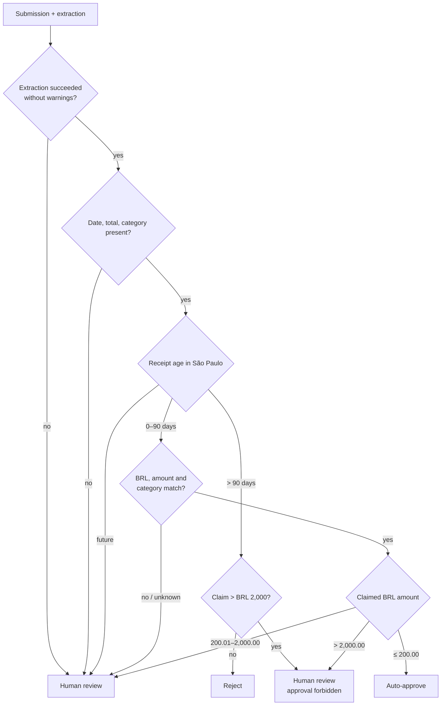
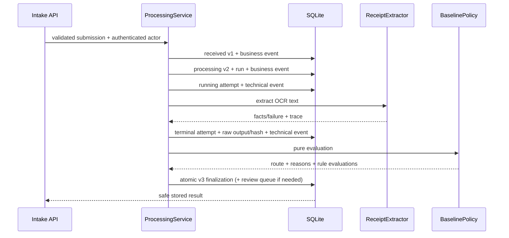

# Feature catalog and flows

## Capability matrix

| Capability | Status | Notes |
| --- | --- | --- |
| Strict reimbursement intake | Implemented | Authenticated/CSRF-protected synchronous JSON endpoint. |
| Exact all-status result lookup | Implemented | Indexed request-ID path; safe response omits raw/technical data. |
| Offline receipt-fact extraction | Implemented | Deterministic parser for the assignment OCR-text shape. |
| Configurable HTTPS+JSON extraction | Implemented and selectable | Bounded, redirect-rejecting, tested, and selected explicitly with environment configuration; deterministic remains the default. |
| Original receipt upload/access | Implemented locally | Raw JPEG/PNG/PDF upload, immutable envelope, opaque reference, SHA-256/media verification, and authorized case download. Binary OCR over those bytes is not implemented. |
| Deterministic baseline policy | Implemented | BRL/age/quality/mismatch/threshold rules with versions and evidence. |
| Processing trace | Implemented locally | Durable run, 1:N immutable attempts, hashes, scoped events, raw output protected in SQLite. |
| Expired-run recovery | Implemented on retry | Five-minute lease, atomic abandonment/resume evidence, one recovery owner, and stale-worker fencing; no background watchdog. |
| Pending review discovery | Implemented | Full-scope server-side search/filter/sort plus signed keyset pagination. |
| Review evidence/detail | Implemented | Claim, raw OCR, structured facts, problems, rules, safe trace metadata, and managed original-file access. |
| Business timeline | Implemented | Sanitized, cursor-paginated business events only. |
| Human decision | Implemented | Individual approve/reject, mandatory rationale, identity, concurrency, evidence revalidation, atomic audit, and durable command idempotency. Approval requires verified originals; degraded evidence can only be rejected. |
| Assessment authorization | Implemented | Submitter/reviewer/auditor/admin roles, owner result reads, and application-layer self-review prohibition bound to the authenticated submission actor. |
| Operational HTTP audit | Implemented locally | One sanitized append-only record for every HTTP attempt, including denied and failed operations, `build_id`, and effective `configuration_hash`. No off-host WORM export/query UI. |
| Execution identity | Implemented | Processing, human decisions, timelines, and HTTP operations retain immutable `build_id` and secret-safe `configuration_hash`; processing runs also bind policy version. |
| Trilingual submitter/reviewer UI | Implemented | `/submit` and `/reviews` support `pt-BR`, `en`, and `es`; source evidence is not translated. |
| Audit/administration UI | Not implemented | Audit events are durable but there is no cross-case privileged search/export surface. |
| AWS assessment sandbox | Implemented and locally validated; not provisioned | SAM packages HTTP API, Lambda, private VPC, encrypted/retained EFS, logs/alarms, and synthetic seed. SQLite/EFS and Basic remain non-production. |
| AWS production deployment | Accepted target only | No Cognito/BFF, Aurora/outbox, S3 evidence, SQS/DLQ, WAF, or CloudFront adapter/resource. |

## Baseline policy behavior



All rules are evaluated. `baseline-v3` makes the literal `> BRL 2,000` review
gate non-bypassable. If such a case also contains a deterministic reject
evaluation, it still reaches a human but the domain forbids approval; the
reviewer must confirm rejection with a rationale. For claims at or below BRL
2,000, an age over 90 days rejects automatically. Exactly 90 days is valid and
age uses the immutable submitted timestamp rather than processing time.

At least one receipt reference is required for automatic approval. The public
HTTP boundary accepts only managed `evidence:att_*` references and verifies the
stored bytes before processing. Empty attachments remain a valid command but
route to review. Caller-controlled `submitted_at` and caller-supplied OCR remain
production blockers; a trusted ingress clock and OCR bound to the exact clean
object are required for monetary use.

The assignment samples are executable acceptance fixtures:

| Request | Extracted evidence | Expected route |
| --- | --- | --- |
| `REQ-0001` | Meals, BRL 93.50, one-day-old receipt, no warning | `auto_approved` |
| `REQ-0002` | Transportation, BRL 64.80, same-day receipt, no warning | `auto_approved` |
| `REQ-0003` | Lodging, BRL 640.00, CHECK-OUT date warning | `human_review` |

## HTTP endpoints

Every endpoint requires valid HTTP Basic credentials in the assessment.
State-changing endpoints additionally require an exact same-origin `Origin`
and an identity-bound `X-CSRF-Token` from `/api/session`. Intake and decisions
use strict JSON; attachment upload uses a raw allowlisted binary body.

| Method | Endpoint | Success | Main errors |
| --- | --- | --- | --- |
| `GET` | `/api/session` | `200` principal + CSRF token | `401` |
| `POST` | `/api/attachments` | `201` opaque reference + checksum metadata | `401`, `403`, `413`, `415`, `422`, `503` |
| `POST` | `/api/requests` | `201` new; `200` exact replay | `401`, `403`, `409`, `415`, `422`, `503` |
| `GET` | `/api/requests/{request_id}` | `200` safe all-status result | `401`, `404`, `422`, `503` |
| `GET` | `/api/reviews` | `200` bounded pending page | `401`, `422` |
| `GET` | `/api/reviews/{request_id}` | `200` evidence + `ETag` | `401`, `404` |
| `GET` | `/api/reviews/{request_id}/attachments/{attachment_id}` | `200` verified bytes | `401`, `403`, `404`, `500`, `503` |
| `GET` | `/api/reviews/{request_id}/events` | `200` business timeline page | `401`, `404`, `422` |
| `POST` | `/api/reviews/{request_id}/decisions` | `201` new; `200` command replay | `401`, `403`, `409`, `412`, `415`, `422`, `428` |

OpenAPI/Swagger routes are disabled in the shipped adapter because they are not
the non-technical reviewer interface.

## Intake contract

`POST /api/requests` accepts exactly these fields; unknown fields fail:

```json
{
  "request_id": "REQ-0003",
  "submitted_by": "rafael.costa@company.com",
  "submitted_at": "2026-04-13T08:45:00Z",
  "raw_ocr_text": "GRAND PLAZA HOTEL\n...\nTOTAL R$ 640.00",
  "claimed_category": "lodging",
  "claimed_amount_brl": "640.00",
  "attachments": ["evidence:att_0123456789abcdef0123456789abcdef"]
}
```

`submitted_by` is preserved as a claimed business field. The intake audit actor
is separately derived from authentication. Business intake events record the
literal actor type `submitter`; the HTTP-operation ledger uses
`authenticated_principal`. The client cannot supply either actor identity.

Validation includes a bounded request ID character set, email-shaped submitter,
aware ISO-8601 timestamp, non-blank OCR/category, at most 250,000 OCR
characters, positive plain decimal with at most two fractional digits, and at
most 20 unique 1–2,048-character managed references. Every non-empty HTTP
reference must use the opaque `evidence:att_*` shape and pass a storage
integrity read before processing. Exponential notation, NaN,
booleans, over-precision, naive timestamps, duplicate attachments, and extra
properties fail with safe `422` errors that do not reflect raw OCR. JSON floats
at or above `2**46` are also rejected because binary64 cannot preserve distinct
cent values there; callers may send the same exact amount as a decimal string.

### Intake result and idempotency

A new request returns `201`, `created: true`, `replayed: false`, a `Location`
header, and the correlation ID. Repeating the same normalized submission returns
the existing result with `200`, `created: false`, `replayed: true`, and does not
call the extractor again. Reusing the ID with different normalized content
returns `409`; both replay and conflict are recorded as security events.

The safe response includes request/submission metadata, claimed value, status,
version, structured extraction facts/error, business problems, automated
decision/reasons/rules, and human result when present. It deliberately omits:

- raw OCR and attachment references;
- raw extractor/provider response;
- processing run and invocation identities/parameters;
- technical/security events;
- reviewer identity in the general request-result API.

The exact-ID GET uses the same safe projection across `received`, `processing`,
`auto_approved`, `pending_review`, `approved_after_review`, and `rejected`.

### Managed attachment contract

`POST /api/attachments` accepts a raw `image/jpeg`, `image/png`, or
`application/pdf` body and requires `X-Attachment-Filename`. Both declared MIME
and file signatures are validated. The response contains `attachment_id`,
`reference`, `sha256`, `byte_size`, `media_type`, and the sanitized original
filename. IDs are random and do not expose paths or content hashes.

The local adapter writes an immutable private envelope atomically. Every read
revalidates envelope structure, size, SHA-256, and media signature. Review
download first proves the reference belongs to the selected case and emits a
safe inline disposition, ETag, checksum header, and `no-store`. Existing seeded
legacy reference strings remain readable as text for migration compatibility;
the public intake no longer accepts them as new evidence, and they cannot
support human approval. A reviewer can still reject such a case with rationale
and the `unverifiable` integrity state is audited.

## Processing and trace flow



Unexpected extractor exceptions are converted to a generic failed extraction,
the attempt remains traceable, and policy routes the request to human review.
Secret provider details are not copied into the public result. Each run owns a
five-minute lease. An identical request retry after expiry atomically closes the
old run and any running attempt as abandoned, appends technical and business
recovery evidence, and starts run N+1. One concurrent caller owns recovery and
the stale worker cannot finalize. The response distinguishes `recovered` from a
normal terminal replay.

Recovery is deliberately bounded assessment behavior: there is no heartbeat,
background watchdog, retry cap, backoff, operator replay screen, SQS, or DLQ. A
provider call lasting longer than the lease may execute twice even though only
one financial decision can persist.

## Reviewer experience

The same Python service serves one HTML document, stylesheet, and JavaScript
module. The console supports:

- PT-BR, English, and Spanish navigation/labels/formatting;
- debounced database-scoped search across the authorized pending set;
- category, problem code, exact amount range, submission range, pending age,
  and pending-before filters;
- oldest/newest pending, highest/lowest amount, and newest-submission sorting;
- 10–100 row pages with signed snapshot-bound keyset cursors and previous/next
  history;
- total pending, over-24-hours, high-value, and mismatch summary metrics;
- dense table, visual card, and focused evidence modes;
- per-case claim/extraction comparison, raw OCR, managed original files,
  problems, deterministic rule evidence, and safe trace metadata;
- independently loaded business timeline with load-more/retry states;
- individual approve/reject confirmation and mandatory rationale.

Search is executed against the full pending database scope before pagination,
not against the current browser page. A specific retained request in any status
is found with `/api/requests/{id}`, not by walking millions of pages. Numeric
page jumps are intentionally avoided because high offsets are unstable and
expensive under concurrent writes.

The separate `/submit` screen provides a friendly upload, strict claim form,
and exact-ID tracking. There is still no privileged technical-trace/audit-
administration screen or navigable completed-case explorer.

## Human-decision flow

```mermaid
sequenceDiagram
    actor R as Reviewer
    participant UI as Browser UI
    participant API as FastAPI
    participant S as ReviewService
    participant DB as SQLite

    R->>UI: open pending case
    UI->>API: GET /api/reviews/{id}
    API-->>UI: evidence + version ETag
    R->>UI: outcome + rationale
    UI->>API: POST decision + CSRF + Origin + If-Match + Idempotency-Key
    API->>API: re-read originals; verify envelope/SHA/media
    API->>S: canonical identity + evidence-integrity state
    S->>S: enforce four-eyes and approval requires verified evidence
    S->>DB: BEGIN IMMEDIATE, verify key + pending/version
    DB->>DB: key binding + decision + next review/status version + audit event
    DB-->>S: commit
    S-->>API: result + audit ID
    API-->>UI: 201 + new ETag + correlation ID
```

Missing `If-Match` or `Idempotency-Key` returns `428`; stale browser state
returns `412`; a competing command returns `409`. Keys must contain 8–128
visible ASCII characters without spaces and only their SHA-256 digest is
stored. The fingerprint binds request, outcome, normalized rationale,
authenticated reviewer, and expected version. An identical retry with the
original ETag returns the original result as `200`, `replayed: true`; reusing the
key for any different command returns `409`. The browser creates one UUID per
confirmed command and reuses it for its single automatic retry.

Every new human event retains the evidence-integrity state observed at decision
time plus executable `build_id` and `configuration_hash`. Approval fails
closed when an original is absent, corrupt, legacy, or otherwise unverifiable.
Rejection remains possible so a missing-evidence case cannot become an
undecidable permanent queue item; its mandatory rationale and degraded state
remain auditable.

## Timeline and evidence exposure

The detail API exposes raw OCR and managed evidence links because a reviewer
needs source evidence. File bytes are returned only through the authenticated,
case-scoped, integrity-checking route. Raw provider response is persisted and
excluded. Technical and security events are excluded from
`GET /api/reviews/{id}/events`; known business event payloads are projected
through server-side whitelists and rendered as text.

The timeline includes processing lifecycle events (`reimbursement_received`,
`reimbursement_processing_started`, optional recovery,
`automated_decision_recorded`, optional `review_case_enqueued`) and the human
decision. Separately, middleware writes one privacy-bounded operational event
for every HTTP request attempt, including authentication failures,
authorization denials, validation errors, reads, searches, static assets,
uploads/downloads, 404s, and 500s. It records no body, OCR text, query value,
credential, token, or raw filename. A cross-case audit query/export UI,
transactional outbox, and approved off-host WORM archive are not implemented.

## Browser, transport, and input security

- HTTP Basic uses salted PBKDF2 hashes and constant-time verification.
- Duplicate configured usernames or canonical reviewer IDs fail startup.
- HTTP is blocked when `EXPENSE_AGENT_REQUIRE_HTTPS=true`; local development
  must explicitly disable it.
- Allowed hosts and trusted forwarded-proxy IPs cannot be bare wildcards.
- Writes require application/json, exact same origin, and a signed/expiring CSRF
  token bound to the principal.
- CSP, HSTS on HTTPS, no framing, `nosniff`, no-referrer, restrictive permissions,
  same-origin isolation, and `Cache-Control: no-store` are emitted.
- The browser uses `textContent`/safe DOM APIs and does not store credentials or
  reimbursement evidence in local/session storage.
- Queue/timeline cursors are HMAC-signed, query/purpose-bound, capped, and
  restart-safe.
- Public errors/results omit raw provider output and sensitive invalid input.
- Explicit roles grant closed capabilities: submitter upload/intake, reviewer
  read/decision, auditor read-only evidence, and admin assessment capabilities.
- Non-admin intake must use the authenticated email; exact result reads are
  owner-only unless the principal can review/audit; self-review is denied by
  both the HTTP adapter and `ReviewService`, including admin-on-behalf intake.

Configuration-backed HTTP Basic roles are meaningful assessment authorization,
but not production identity governance. Cognito/BFF sessions, MFA,
invite/recovery/revocation, durable actor and role tables, team/tenant/case/value
and purpose predicates, uploader ownership, and policy-managed four-eyes rules
remain production work.

## Verification evidence

The final local run passed **254/254 tests with warnings treated as errors**,
Ruff, JavaScript syntax validation, `git diff --check`, package build, SAM lint,
ShellCheck, a containerized x86_64 SAM build, and import from the matching
Lambda Python 3.12 runtime image. Coverage includes:

- value objects, aggregate state machine, policy routes/precedence/boundaries;
- the exact three assignment objects and their expected extraction/routes;
- offline and HTTPS extractor success/failure/security boundaries;
- real SQLite end-to-end automated routes and human v3→v4 review;
- replay/no-second-call, divergent payload conflict, and security events;
- invocation intent/completion, multiple immutable attempts, protected raw data,
  and business-timeline separation;
- finalization rollback after a late audit failure;
- strict intake validation, CSRF/origin/authentication, safe serialization,
  all-status lookup, and no-provider-secret leakage;
- queue filters/sorts/cursors, cross-page discovery, timeline cursors,
  concurrency, immutable rows, localization parity, and safe frontend code.
- Lambda HTTP API v2 adaptation, selectable rollback journal for the sandbox
  EFS constraint,
  exact Lambda dependency pins, minimal build context, SAM safety controls, and
  HTTPS-only synthetic seeding.

The pinned CI workflow runs a frozen install, tests, Ruff, and package build on
push/pull request. These tests establish behavior, not production model
accuracy, throughput, latency, availability, retention compliance, or disaster
recovery.

## Deliberate exclusions and next production steps

1. Replace local evidence with private versioned S3 objects, quarantine,
   checksum/media/malware metadata, OCR-to-object binding, approved lifecycle,
   uploader ownership, signed authorization, and a policy-approved cross-case
   possible-duplicate detector over checksum/version plus merchant/date/amount.
2. Add privileged cross-case audit/administration and completed-case discovery.
3. Replace HTTP Basic with Cognito-backed opaque BFF sessions and enforce
   RBAC/ABAC, team/case assignment, and separation of duties.
4. Replace SQLite with Aurora PostgreSQL, transactional outbox, immutable
   approved export, backups/PITR, and tested recovery.
5. Move processing behind SQS/DLQ with idempotent consumers, heartbeat/watchdog,
   bounded retry/replay controls, provider concurrency, and load tests.
6. Evaluate provider/second-verifier accuracy, unit cost, disagreement, human-
   review rate, and P95/P99 latency on a labeled representative dataset before
   enabling live AI.
7. Implement and provision the accepted AWS production target with reviewed
   IaC only after region, security, data residency, retention, SLO, RPO/RTO, and
   cost inputs are owned. The current SAM sandbox is not that target.
