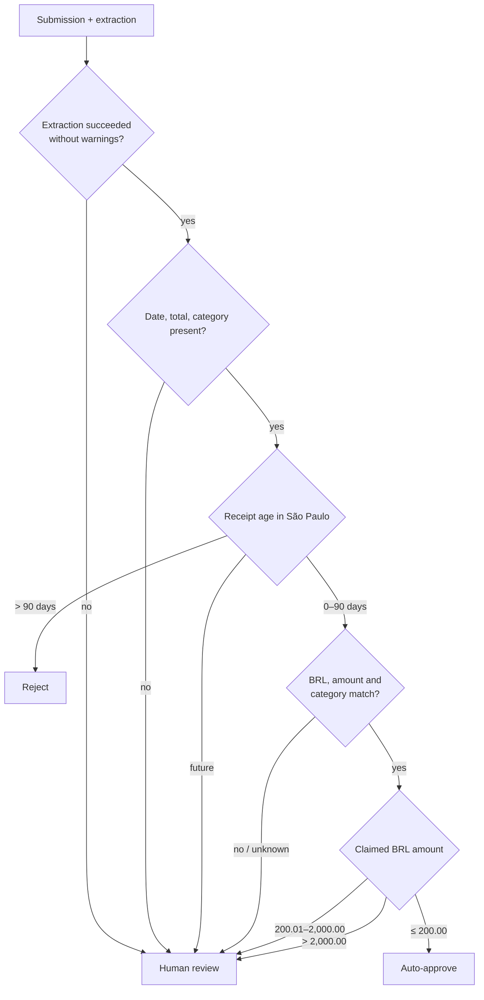
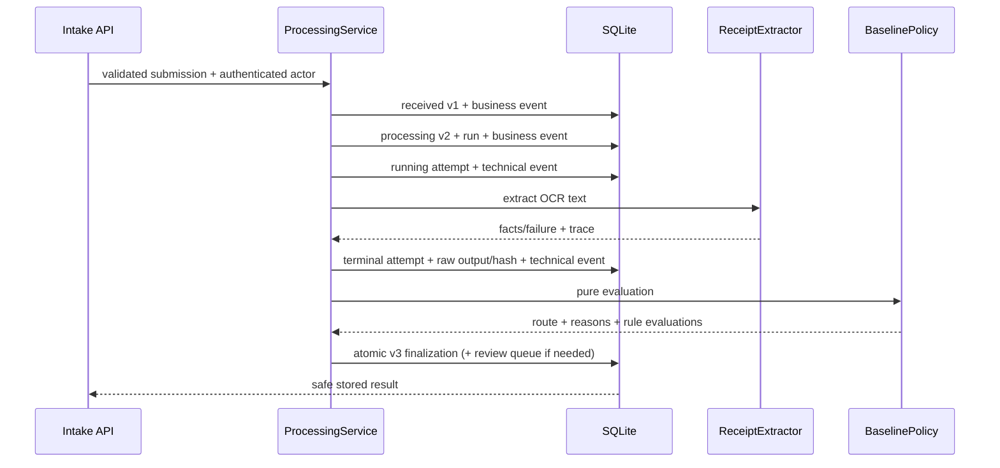
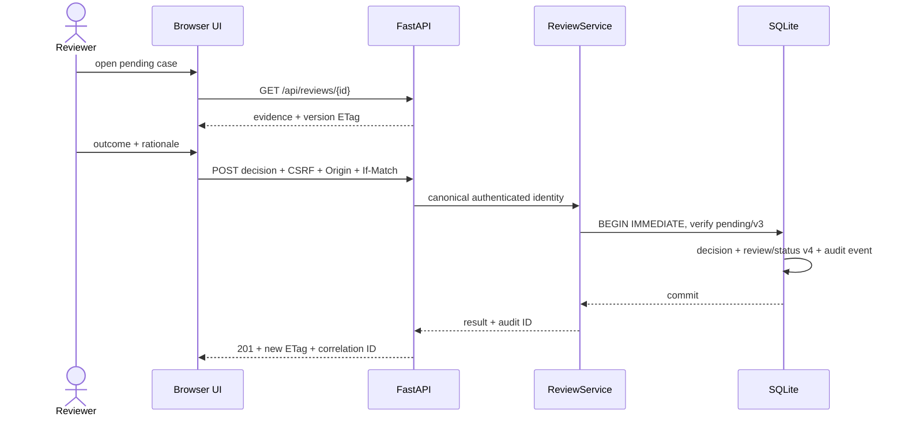

# Feature catalog and flows

## Capability matrix

| Capability | Status | Notes |
| --- | --- | --- |
| Strict reimbursement intake | Implemented | Authenticated/CSRF-protected synchronous JSON endpoint. |
| Exact all-status result lookup | Implemented | Indexed request-ID path; safe response omits raw/technical data. |
| Offline receipt-fact extraction | Implemented | Deterministic parser for the assignment OCR-text shape. |
| Configurable HTTPS+JSON extraction | Implemented adapter | Bounded, redirect-rejecting, and tested, but not selected by the environment composition root. |
| Receipt-image upload/OCR | Not implemented | Intake receives OCR text and attachment references only. |
| Deterministic baseline policy | Implemented | BRL/age/quality/mismatch/threshold rules with versions and evidence. |
| Processing trace | Implemented locally | Durable run, 1:N immutable attempts, hashes, scoped events, raw output protected in SQLite. |
| Pending review discovery | Implemented | Full-scope server-side search/filter/sort plus signed keyset pagination. |
| Review evidence/detail | Implemented with attachment limitation | Claim, raw OCR, structured facts, problems, rules, safe trace metadata, reference strings. |
| Business timeline | Implemented | Sanitized, cursor-paginated business events only. |
| Human decision | Implemented | Individual approve/reject, mandatory rationale, identity, concurrency, atomic audit. |
| Trilingual reviewer UI | Implemented | `pt-BR`, `en`, `es`; source evidence is not translated. |
| Submitter and audit/admin UIs | Not implemented | Intake/result exist as APIs; no upload/tracking or privileged trace UI. |
| AWS assessment sandbox | Implemented and locally validated; not provisioned | SAM packages HTTP API, Lambda, private VPC, encrypted/retained EFS, logs/alarms, and synthetic seed. SQLite/EFS and Basic remain non-production. |
| AWS production deployment | Accepted target only | No Cognito/BFF, Aurora/outbox, S3 evidence, SQS/DLQ, WAF, or CloudFront adapter/resource. |

## Baseline policy behavior



All rules are evaluated, even when one already rejects. Any reject outcome has
route precedence over review. This preserves, for example, both
`RECEIPT_TOO_OLD` and `HIGH_VALUE_REVIEW_REQUIRED` evidence while producing a
single rejected route. Exactly 90 days is valid and age uses the immutable
submission date, not processing/decision time. Because the assignment lets the
caller supply that timestamp, production must replace the policy anchor with a
trusted server-owned `received_at` (or explicitly separated authoritative
timestamp) before monetary use.

Reject-over-review precedence is an implemented assessment interpretation, not
a stakeholder-confirmed rule. The requirement to reject old receipts and always
review high-value claims is ambiguous when both apply; the policy owner must
validate the collision and exact BRL 2,000 semantics before production.

The assignment samples are executable acceptance fixtures:

| Request | Extracted evidence | Expected route |
| --- | --- | --- |
| `REQ-0001` | Meals, BRL 93.50, one-day-old receipt, no warning | `auto_approved` |
| `REQ-0002` | Transportation, BRL 64.80, same-day receipt, no warning | `auto_approved` |
| `REQ-0003` | Lodging, BRL 640.00, CHECK-OUT date warning | `human_review` |

## HTTP endpoints

Every endpoint requires valid HTTP Basic credentials in the assessment.
State-changing endpoints additionally require JSON content type, an exact
same-origin `Origin`, and an identity-bound `X-CSRF-Token` from `/api/session`.

| Method | Endpoint | Success | Main errors |
| --- | --- | --- | --- |
| `GET` | `/api/session` | `200` principal + CSRF token | `401` |
| `POST` | `/api/requests` | `201` new; `200` exact replay | `401`, `403`, `409`, `415`, `422`, `503` |
| `GET` | `/api/requests/{request_id}` | `200` safe all-status result | `401`, `404`, `422`, `503` |
| `GET` | `/api/reviews` | `200` bounded pending page | `401`, `422` |
| `GET` | `/api/reviews/{request_id}` | `200` evidence + `ETag` | `401`, `404` |
| `GET` | `/api/reviews/{request_id}/events` | `200` business timeline page | `401`, `404`, `422` |
| `POST` | `/api/reviews/{request_id}/decisions` | `201` human result | `401`, `403`, `409`, `412`, `415`, `422`, `428` |

OpenAPI/Swagger routes are disabled in the shipped adapter because they are not
the non-technical reviewer interface.

## Intake contract

`POST /api/requests` accepts exactly these fields; unknown fields fail:

```json
{
  "request_id": "REQ-0003",
  "submitted_by": "rafael.costa@company.com",
  "submitted_at": "2026-04-13T08:45:00Z",
  "raw_ocr_text": "GRAND PLAZA HOTEL\n...\nTOTAL R$ 640.00",
  "claimed_category": "lodging",
  "claimed_amount_brl": "640.00",
  "attachments": ["receipt_0003.pdf"]
}
```

`submitted_by` is preserved as a claimed business field. The intake audit actor
is separately derived from authentication and recorded as
`authenticated_caller`; the client cannot supply that actor identity.

Validation includes a bounded request ID character set, email-shaped submitter,
aware ISO-8601 timestamp, non-blank OCR/category, at most 250,000 OCR
characters, positive plain decimal with at most two fractional digits, and at
most 20 unique 1–2,048-character references. Exponential notation, NaN,
booleans, over-precision, naive timestamps, duplicate attachments, and extra
properties fail with safe `422` errors that do not reflect raw OCR. JSON floats
at or above `2**46` are also rejected because binary64 cannot preserve distinct
cent values there; callers may send the same exact amount as a decimal string.

### Intake result and idempotency

A new request returns `201`, `created: true`, `replayed: false`, a `Location`
header, and the correlation ID. Repeating the same normalized submission returns
the existing result with `200`, `created: false`, `replayed: true`, and does not
call the extractor again. Reusing the ID with different normalized content
returns `409`; both replay and conflict are recorded as security events.

The safe response includes request/submission metadata, claimed value, status,
version, structured extraction facts/error, business problems, automated
decision/reasons/rules, and human result when present. It deliberately omits:

- raw OCR and attachment references;
- raw extractor/provider response;
- processing run and invocation identities/parameters;
- technical/security events;
- reviewer identity in the general request-result API.

The exact-ID GET uses the same safe projection across `received`, `processing`,
`auto_approved`, `pending_review`, `approved_after_review`, and `rejected`.

## Processing and trace flow



Unexpected extractor exceptions are converted to a generic failed extraction,
the attempt remains traceable, and policy routes the request to human review.
Secret provider details are not copied into the public result. The current
service performs only one attempt; the 1:N storage model allows later retries
without overwriting earlier evidence. It does not implement that recovery:
a crash can leave processing v2/running attempt stranded. A lease/watchdog,
idempotent resume/retry, and replay/DLQ path are production blockers.

## Reviewer experience

The same Python service serves one HTML document, stylesheet, and JavaScript
module. The console supports:

- PT-BR, English, and Spanish navigation/labels/formatting;
- debounced database-scoped search across the authorized pending set;
- category, problem code, exact amount range, submission range, pending age,
  and pending-before filters;
- oldest/newest pending, highest/lowest amount, and newest-submission sorting;
- 10–100 row pages with signed snapshot-bound keyset cursors and previous/next
  history;
- total pending, over-24-hours, high-value, and mismatch summary metrics;
- dense table, visual card, and focused evidence modes;
- per-case claim/extraction comparison, raw OCR, attachment references,
  problems, deterministic rule evidence, and safe trace metadata;
- independently loaded business timeline with load-more/retry states;
- individual approve/reject confirmation and mandatory rationale.

Search is executed against the full pending database scope before pagination,
not against the current browser page. A specific retained request in any status
is found with `/api/requests/{id}`, not by walking millions of pages. Numeric
page jumps are intentionally avoided because high offsets are unstable and
expensive under concurrent writes.

The screen is currently reviewer-only. There is no friendly form for a
submitter to upload a receipt or track a claim, and no privileged technical-
trace/audit-administration screen.

## Human-decision flow



Missing `If-Match` returns `428`; stale browser state returns `412`; a race
detected inside the serialized transaction returns `409`. A decision cannot be
repeated or overwritten. The reviewer identity comes only from configured,
verified credentials and is stored with the mandatory rationale.

## Timeline and evidence exposure

The detail API exposes raw OCR and attachment reference strings because a
reviewer needs source evidence, but does not transfer any attachment bytes.
Raw provider response is persisted and excluded. Technical and security events
are excluded from `GET /api/reviews/{id}/events`; known business event payloads
are projected through server-side whitelists and rendered as text.

The timeline currently includes processing lifecycle events produced by the
new pipeline (`reimbursement_received`, `reimbursement_processing_started`,
`automated_decision_recorded`, optional `review_case_enqueued`) and the human
decision. Legacy seeded fixtures also remain readable. A full cross-case audit
search/export surface is not implemented. Authentication success/failure,
ordinary reads, searches, validation/orchestration failures, and evidence
access are not comprehensively audited, so this is processing/decision
traceability rather than “all operations” traceability.

## Browser, transport, and input security

- HTTP Basic uses salted PBKDF2 hashes and constant-time verification.
- Duplicate configured usernames or canonical reviewer IDs fail startup.
- HTTP is blocked when `EXPENSE_AGENT_REQUIRE_HTTPS=true`; local development
  must explicitly disable it.
- Allowed hosts and trusted forwarded-proxy IPs cannot be bare wildcards.
- Writes require application/json, exact same origin, and a signed/expiring CSRF
  token bound to the principal.
- CSP, HSTS on HTTPS, no framing, `nosniff`, no-referrer, restrictive permissions,
  same-origin isolation, and `Cache-Control: no-store` are emitted.
- The browser uses `textContent`/safe DOM APIs and does not store credentials or
  reimbursement evidence in local/session storage.
- Queue/timeline cursors are HMAC-signed, query/purpose-bound, capped, and
  restart-safe.
- Public errors/results omit raw provider output and sensitive invalid input.

HTTP Basic authenticates but does not provide production-grade authorization.
All configured assessment users currently share the same queue and can decide
any pending case. Cognito/BFF sessions, MFA, role/team/assignment predicates,
four-eyes, revocation, and access audit are production work.

## Verification evidence

The final local run passed **151/151 tests with warnings treated as errors**,
Ruff, JavaScript syntax validation, `git diff --check`, ShellCheck, SAM lint,
containerized x86_64 SAM build, and Lambda-runtime artifact import. Coverage includes:

- value objects, aggregate state machine, policy routes/precedence/boundaries;
- the exact three assignment objects and their expected extraction/routes;
- offline and HTTPS extractor success/failure/security boundaries;
- real SQLite end-to-end automated routes and human v3→v4 review;
- replay/no-second-call, divergent payload conflict, and security events;
- invocation intent/completion, multiple immutable attempts, protected raw data,
  and business-timeline separation;
- finalization rollback after a late audit failure;
- strict intake validation, CSRF/origin/authentication, safe serialization,
  all-status lookup, and no-provider-secret leakage;
- queue filters/sorts/cursors, cross-page discovery, timeline cursors,
  concurrency, immutable rows, localization parity, and safe frontend code.
- Lambda HTTP API v2 adaptation, selectable rollback journal for the sandbox
  EFS constraint,
  exact Lambda dependency pins, minimal build context, SAM safety controls, and
  HTTPS-only synthetic seeding.

The pinned CI workflow runs a frozen install, tests, Ruff, and package build on
push/pull request. These tests establish behavior, not production model
accuracy, throughput, latency, availability, retention compliance, or disaster
recovery.

## Deliberate exclusions and next production steps

1. Add application-owned receipt upload, private versioned S3 objects, checksum/
   malware/media metadata, safe preview/download, authorization, and access audit.
2. Add submitter upload/tracking and privileged audit/admin experiences.
3. Replace HTTP Basic with Cognito-backed opaque BFF sessions and enforce
   RBAC/ABAC, team/case assignment, and separation of duties.
4. Replace SQLite with Aurora PostgreSQL, transactional outbox, immutable
   approved export, backups/PITR, and tested recovery.
5. Move processing behind SQS/DLQ with idempotent consumers, retry/replay
   controls, abandoned-run recovery, provider concurrency, and load tests.
6. Evaluate provider/second-verifier accuracy, unit cost, disagreement, human-
   review rate, and P95/P99 latency on a labeled representative dataset before
   enabling live AI.
7. Implement and provision the accepted AWS production target with reviewed
   IaC only after region, security, data residency, retention, SLO, RPO/RTO, and
   cost inputs are owned. The current SAM sandbox is not that target.
