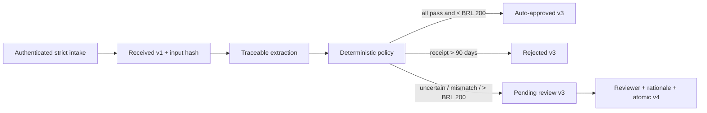
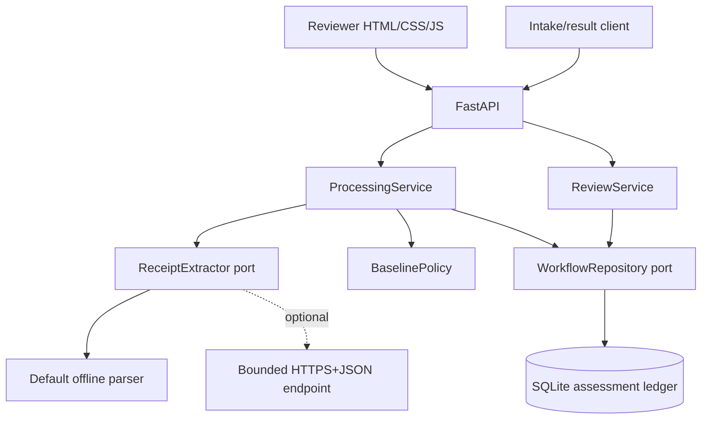
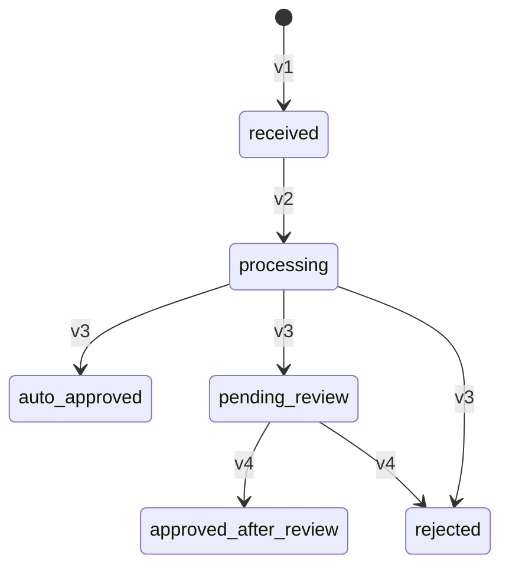

# Expense Agent — final design and implementation report

## Executive summary

Expense Agent is an auditable Python reimbursement service designed for a
mission-critical financial domain. The implemented assessment receives a
strict request, records immutable normalized input, extracts receipt facts from
the supplied OCR text, applies a deterministic/versioned policy, and either
auto-approves, rejects, or creates an internal human-review case. A reviewer can
search the bounded queue, inspect evidence and business history, and make one
authenticated approve/reject decision with a mandatory rationale.

The central design choice is that extraction may be heuristic or provider-
backed, but it never owns a monetary decision. `BaselinePolicy` is pure,
deterministic, versioned, and produces reason codes plus rule evaluations.

The code-assessment path is implemented and locally executable. The accepted
AWS hybrid serverless production topology is documented but deliberately not
claimed as deployed.

## Requirements and implementation result

| Assignment concern | Result |
| --- | --- |
| Receive reimbursement objects | Implemented through strict authenticated `POST /api/requests`. |
| Extract receipt information | Implemented for supplied OCR text through an offline deterministic parser; a bounded HTTPS+JSON adapter is optional. Binary receipt OCR is not implemented. |
| Auto-approve eligible claims at or below BRL 200 | Implemented only when every validation rule passes. |
| Human-review monetary/uncertain cases | Implemented assessment interpretation. All amounts above BRL 200 route to review; `> 2,000` has explicit high-value evidence, pending policy-owner validation. |
| Reject receipts older than 90 days | Implemented relative to submission date in `America/Sao_Paulo`; exactly 90 days is valid. Collision precedence versus mandatory high-value review remains an interpretation to validate. |
| Record human judgment and reviewer | Implemented inside the service with canonical authenticated identity and mandatory rationale. |
| Processing and decision traceability | Implemented across normalized input/fingerprint, versions, run, 1:N attempts, hashes/raw output, policy reasons/rules, scoped processing events, and human decision. This is not traceability of every operation. |
| Reproducible behavior | Policy is pure/versioned; exact input and output hashes/configuration are retained. Provider stochastic output itself is evidence, not assumed reproducible. |
| User access to results | Exact all-status API is implemented; reviewer web UI is implemented. Submitter and privileged audit UIs remain absent. |
| Original receipt file | Not implemented: attachment values are references, not uploaded/authorized bytes. |
| High-volume navigation | Server-side search/filter/sort and signed keyset pagination are implemented; production cardinality/SLO has not been load-tested. |

## Architecture

The repository follows domain/application/infrastructure/presentation
boundaries. FastAPI validates and authenticates HTTP commands. Application
services orchestrate ports. The domain owns money, state transitions, evidence,
and policy. SQLite and extractor implementations are replaceable adapters.

Processing is synchronous for the assessment, but no SQL transaction spans an
extractor call. The repository first records a running attempt and technical
event, calls the adapter outside a transaction, then records terminal output and
hash. Final extraction, automated decision, financial status, review enqueue,
and business events commit atomically.

See [architecture.md](architecture.md), [database.md](database.md), and
[domain-model.md](domain-model.md) for the detailed diagrams and invariants.

## Baseline policy and ambiguity resolution

The assignment leaves several boundaries implicit. The implemented decisions
are recorded as versioned evidence. They are assessment interpretations, not a
claim that a RecargaPay policy owner confirmed every ambiguous collision:

- BRL only, exact `Decimal`, Brazilian receipt dates interpreted as
  `DD/MM/YYYY`.
- Receipt age uses the immutable submission date converted to
  `America/Sao_Paulo`; processing delays do not change the route.
- Exactly 90 days is valid; only age greater than 90 rejects.
- Exactly BRL 200 may auto-approve if all extraction, fact, currency, age,
  amount, and category checks pass.
- BRL 200.01 through 2,000 and exactly 2,000 route to human review.
- Above BRL 2,000 routes to human review with a distinct mandatory high-value
  reason.
- A reject evaluation currently has precedence over review. Therefore an old
  high-value receipt is rejected, while both old/high-value evaluations remain
  in the audit evidence. The assignment's simultaneous “reject old” and “always
  review high value” wording is ambiguous; this precedence needs stakeholder
  validation before production.
- Extraction failure/warning, missing facts, future receipt date, unsupported
  currency, and amount/category disagreement route to review rather than being
  guessed or silently approved.

Every automated decision carries a policy version, at least one reason, and all
rule ID/version/outcome/facts. The three assignment samples and critical
boundaries are executable acceptance tests.

## Idempotency, concurrency, and auditability

`request_id` is the public idempotency key. A canonical SHA-256 hash covers the
normalized immutable input. The same ID/hash returns the stored result without
another extraction; the same ID with a different hash returns `409`. Replay and
conflict attempts are preserved as security events.

Processing runs and invocation attempts have independent IDs. Attempts are
one-to-many by run/stage/attempt and retain provider, model, prompt version/hash,
input/output hashes, timing, parameters, status, bounded error, and protected
raw response. Terminal rows and audit events are immutable by database trigger.

Human review combines an HTTP ETag precondition with a serialized state/version
check. One SQLite transaction inserts the immutable decision, closes the review,
updates the reimbursement, and appends its business event. A competing or
repeated command cannot create a second decision.

Audit events are separated into business, technical, and security scopes. The
reviewer timeline returns a whitelisted, cursor-paginated business projection;
raw provider data and replay/conflict details stay outside normal browser APIs.
The ledger does **not** currently audit successful/failed authentication,
ordinary reads, searches, validation failures, every orchestration exception,
or evidence access. Claims of “full traceability of all operations” therefore
remain unmet beyond the implemented processing and decision path.

## Human experience

The reviewer console is a same-origin static HTML/CSS/vanilla-JavaScript screen,
served by the Python service. It supports:

- Portuguese, English, and Spanish presentation;
- server-side search across the complete pending scope, not the visible page;
- category/problem/amount/time/age filters and five stable sort orders;
- 10–100 row signed keyset pages, table/cards/focused detail, and queue KPIs;
- raw OCR, claim-versus-extraction evidence, policy problems/rules, attachment
  reference strings, and a separately loaded business timeline;
- individual approve/reject with a rationale and conflict feedback.

This avoids an unnecessary React/Next.js runtime for one operational screen.
The API remains replaceable if product complexity later justifies another
frontend. The current absence of a submitter upload/tracking screen is explicit,
not hidden behind an assumption about an existing RecargaPay product.

## Security and privacy

Implemented assessment controls include PBKDF2 HTTP Basic authentication,
server-derived actors, CSRF tokens, exact origin checks, HTTPS fail-closed
configuration, host/proxy restrictions, restrictive browser headers, safe DOM
text rendering, strict/bounded input, safe error projection, protected raw
provider output, and no sensitive browser storage.

HTTP Basic and a global assessment reviewer scope are not production identity/
authorization. Production needs managed OIDC/MFA, invitation and recovery,
revocation/session policy, role/team/case/purpose predicates, separation of
duties, and identity/access audit.

Attachment references also do not fulfill the evidence-file requirement.
Production must preserve exact private object bytes/version/checksum, validate
media and malware state, authorize each preview/download, and audit access
without exposing storage credentials/keys.

### Production blockers — not optional backlog

The assessment correctly follows the input contract in the assignment, but the
following conditions **prevent real monetary use** until corrected:

1. **Client-controlled age anchor.** `submitted_at` arrives in the request and
   currently anchors the 90-day rule. A caller could choose it. Production must
   record a server-owned `received_at` at trusted ingress (or explicitly
   separate claimed and authoritative timestamps), define timezone/clock
   ownership, and make policy use the authoritative value.
2. **Self-attested OCR without receipt bytes.** `raw_ocr_text` also arrives in
   the request. The current service can auto-approve from that text without
   receiving the original file, verifying its checksum/version, or running
   controlled OCR on the exact scanned bytes. Production must own the upload,
   bind trusted OCR/model inputs to the immutable clean object, and preserve
   that evidence chain before any automatic payment decision.
3. **Global authenticated scope without authorization.** Every configured
   Basic account can currently read every request/evidence/timeline and decide
   every pending case. There are no owner/role/team/tenant/case/value/purpose
   predicates or separation of duties. Production must enforce and audit those
   object-level rules in the service and SQL query boundary; Cognito login alone
   would not solve this.
4. **Incomplete all-operations audit.** Processing and financial decisions are
   traceable, but authentication success/failure, reads, searches, validation
   failures, every orchestration error, and protected evidence access are not.
   Production must define and implement complete, privacy-aware security/access/
   business audit coverage and immutable export for the required operations.
5. **No crash/replay recovery.** A process crash after the durable v2 transition
   or running-attempt insert can leave the request/run/attempt stranded. The
   synchronous API has no lease, watchdog, resume command, retry policy, or DLQ
   replay. Production must implement idempotent recovery that appends attempts
   without duplicating a financial decision.

These are release gates, alongside independent legal/security approval; they
are not cosmetic hardening or optional future features.

## Alternatives and decisions

| Alternative | Decision and rationale |
| --- | --- |
| ClickUp/email as review core | Rejected. An external SaaS cannot be the authoritative financial decision/audit boundary. |
| Internal API only | Rejected as the user experience. Non-technical reviewers need a screen; the API remains the application boundary underneath it. |
| React/Next.js | Not selected for one bounded screen; vanilla assets reduce runtime/build/deployment scope. |
| n8n | Technically viable orchestration, but rejected for this Python assessment because it does not remove domain, identity, transaction, UI, or audit work. |
| OCR plus two LLMs for every request | Not selected without labeled accuracy/cost/latency evidence. Agreement does not prove correctness when inputs share an OCR error. |
| One extractor plus optional verifier | Current assessment uses one offline deterministic extractor. A risk-based secondary verifier remains a future experiment, not a claim. |
| VPS/EC2 | Not selected as the accepted default for bursty unknown production load; it creates capacity and HA operations. |
| AWS hybrid serverless | Accepted production target because APIs/jobs are short/bursty and relational audit authority is retained. Not deployed here. |
| Kubernetes/EKS | Feasible but explicitly closed as a current choice: no measured long-running/GPU/platform requirement offsets cluster ownership. |
| One NoSQL database for everything | Rejected. Financial relationships/transactions belong in SQL; receipt bytes belong in versioned object storage. |

The full rationale and chronological feedback are in
[decision-log.md](decision-log.md) and [project-journal.md](project-journal.md).

## Verification evidence

The final local quality run passed **140/140 tests with warnings treated as
errors**, Ruff, JavaScript syntax validation, and `git diff --check`. The suite
covers:

- exact money and domain transitions;
- deterministic policy rules, precedence, and amount/age boundaries;
- the three assignment request objects and expected routes;
- offline/HTTPS extractor success, schema failures, timeout, response caps,
  redirect rejection, and secret-safe behavior;
- FastAPI authentication, CSRF/origin, strict intake, safe all-status results,
  replay/conflict semantics, and no raw/secret leakage;
- real SQLite automated routes, failed extraction, durable 1:N attempts,
  scoped timelines, human v3→v4 decision, immutability, and forced rollback;
- pending queue search/filter/sort/snapshot cursors and cross-page discovery;
- trilingual catalog parity and safe frontend rendering.

The GitHub Actions workflow uses commit-pinned actions, a frozen lockfile and
pinned build-system packages, then performs tests, Ruff, and package build on
every push/pull request. Dependabot monitors pip and Actions dependencies.
Milestone commits separate policy, extractors, acceptance/CI,
persistence/workflow, and HTTP APIs instead of obscuring the work in one final
change.

| Commit | Milestone |
| --- | --- |
| `b6d22bd` | Auditable human-review baseline. |
| `f368b4f` / `0bc7132` | Deterministic policy and traceable extractor adapters. |
| `f64c1fb` / `c6bd9d4` | Assignment acceptance suite and pinned CI. |
| `36d4370` / `fad709e` | Durable processing persistence and authenticated intake/results. |
| `1994c1e` | Exclude confidential temporary artifacts from packages. |
| `8220c76` / `2352e62` | Intake/transport/identity hardening and atomic legacy migration. |
| `b4ed985` | Pinned packaging backend and automated Python dependency updates. |
| `2459f30` | Preserve minor-unit immutability when upgrading an existing database. |

These are real logical milestones with normal Git timestamps; no commit was
backdated or delayed to simulate time invested.

This evidence validates the repository contract. It does not establish model
accuracy on production receipts, million-request P95/P99 latency, a production
availability target, or compliance approval.

## Accepted production target and honest gaps

The accepted standalone AWS target is CloudFront/WAF plus private S3 for the
shell, API Gateway/Lambda for short paths, SQS/DLQs for asynchronous processing,
versioned private S3 for evidence, Aurora PostgreSQL Serverless v2 through RDS
Proxy for the authoritative ledger/outbox, Cognito plus an opaque BFF session,
and DynamoDB only for short-lived session/OAuth state. Immutable approved audit
export complements—but never replaces—the relational business record.

Nothing in that sentence is deployed by this repository. There is no IaC,
Cognito, S3 byte path, SQS worker, Aurora adapter, transactional outbox, or cloud
account evidence. Before production, accountable owners must confirm region and
data residency, threat/authorization model, peak workload and provider limits,
SLO/RPO/RTO, retention/legal hold/deletion, accuracy thresholds, cost, and
incident/recovery operations.

## Recommended next steps

1. Add receipt-byte upload, version/checksum/scan metadata, authorized preview/
   download, and access audit.
2. Add standalone submitter tracking and privileged audit/administration UI.
3. Evaluate extractor and optional verifier on a labeled representative dataset
   using field accuracy, false automated decisions, disagreement/review rate,
   unit cost, and P95/P99 latency.
4. Add asynchronous idempotent processing, retry/DLQ/replay and abandoned-run
   recovery.
5. Implement PostgreSQL/outbox and managed identity/authorization adapters.
6. Provision reviewed AWS IaC only after the open governance and capacity inputs
   are owned; then load, security, backup/restore, and disaster-recovery test it.

## Time invested

Earlier exploration and implementation were not timed precisely, so this report
does not fabricate a total. The final completion block began at
`2026-08-10T19:47:09Z`; its real finish time and duration are recorded in
[time-log.md](time-log.md). Historical untimed areas remain explicitly marked
`estimate required`.

## Conclusion

The assessment demonstrates the core financial safety properties requested:
deterministic decisions, exact money, explicit ambiguity handling, durable
idempotency, per-attempt traceability, atomic human judgment, and honest
separation between implemented local behavior and a future production stack.
Its most important remaining gap is not another LLM—it is the production
evidence, identity/authorization, asynchronous operations, and governance path
around the working core.
