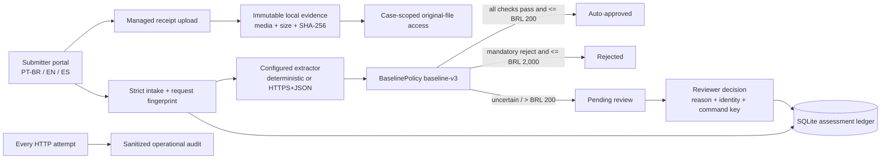
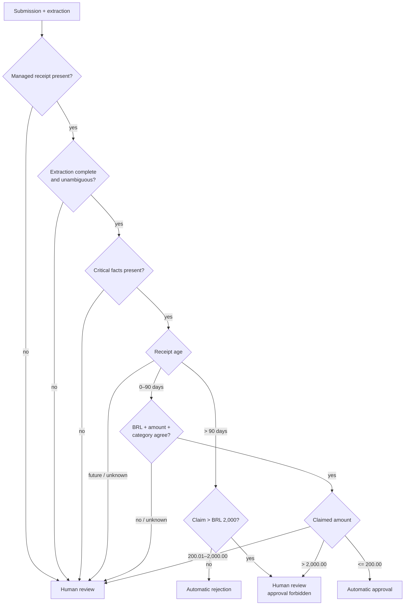
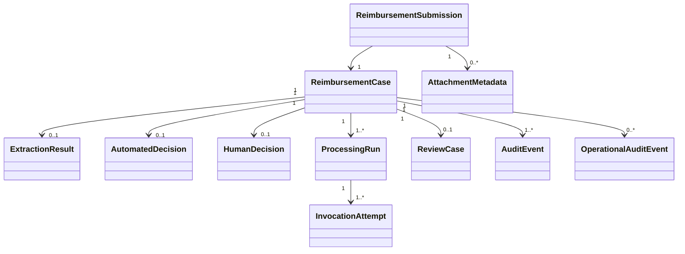

# Expense Agent — final design and implementation report

## Executive summary

Expense Agent is a standalone Python reimbursement service built for the code
assessment. It accepts an authenticated claim, preserves the original receipt,
extracts structured facts from the supplied OCR text, applies a deterministic
versioned policy, and produces one of three routes: automatic approval, human
review, or rejection. Human judgment lives inside the service and records who
decided, what they decided, why, when, and against which immutable case version.

The implementation deliberately separates probabilistic extraction from
financial authority. A model may produce evidence; `BaselinePolicy
baseline-v3` owns the monetary route. The same validated facts and policy
version produce the same rule evaluations and outcome.

The repository also packages a one-command AWS SAM assessment sandbox. That
sandbox is locally validated but was not provisioned. The accepted production
topology—CloudFront/WAF, Cognito/BFF, API Gateway/Lambda, SQS/DLQ, private
versioned S3, Aurora PostgreSQL/outbox, and approved immutable export—remains a
documented target, not implemented infrastructure.

## Assignment compliance

| Assignment concern | Implemented result | Honest boundary |
| --- | --- | --- |
| Python implementation | Domain, application, infrastructure, and FastAPI presentation layers | None for the assessment |
| Receive reimbursement requests | Strict authenticated `POST /api/requests`; framework-free `/submit` portal | Processing is synchronous |
| Extract receipt information | Offline deterministic OCR-text parser and an environment-selectable bounded HTTPS+JSON adapter | No binary OCR bound to the uploaded bytes; no live provider evaluation |
| Auto-approve eligible claims at or below BRL 200 | Only when extraction, facts, currency, age, claim consistency, and receipt evidence all pass | Production needs trusted time and trusted OCR |
| Human-review uncertain/monetary cases | BRL 200.01–2,000 and every `> BRL 2,000` claim route to review; extraction uncertainty and mismatches also review | Intermediate-band interpretation still needs policy-owner confirmation |
| Reject receipts older than 90 days | At or below BRL 2,000, age over 90 days rejects; exactly 90 days is valid | The assessment age anchor is client-supplied `submitted_at` |
| High-value gate cannot be ignored | `> BRL 2,000` always reaches a person. If another rule mandates rejection, the domain forbids approval | Reviewer must record the confirming rejection reason |
| Human decision and reviewer | Canonical authenticated actor, outcome, mandatory rationale, timestamp, version, evidence-integrity state, and audit event commit atomically; application-layer four-eyes blocks self-review | Config-backed Basic identity is assessment-only |
| Full local traceability | Business/technical/security events plus one sanitized operational event for every HTTP request attempt | No outbox, audit-search UI, or approved off-host WORM archive |
| Reproducibility | Input/output hashes, provider/model, prompt version/hash, parameters, timing, protected raw response, policy/rule versions, `build_id`, and `configuration_hash` over the secret-safe effective configuration | A stochastic provider response is preserved evidence, not assumed reproducible |
| Original receipt | Managed JPEG/PNG/PDF upload; opaque ID; immutable envelope; checksum/media verification; case-scoped audited access | No malware scan, uploader ownership, S3 object version, OCR binding, or retention workflow |
| Usable human interface | Separate trilingual submit/track and review/triage surfaces | No privileged audit-administration UI or completed-case browser |
| Large collections | Database-scoped search/filter/sort and signed keyset pagination; exact-ID all-status lookup | No million-row load/SLO result |
| Documentation in English | Architecture, model, database, feature, decisions, assumptions, costs, runbook, and report | Source OCR/free text remains original evidence |

This follows the evaluator's guidance: ClickUp, email, and external SaaS are not
the authoritative review mechanism. A human action becomes a first-class
application record in the same decision and audit path as automated work.

## Deterministic policy

The implemented policy identifier is `baseline-v3`; each rule evaluation uses
version `1.2.0`. Money uses exact `Decimal` through `Money`, and receipt dates
are interpreted in `America/Sao_Paulo`.

Every decision carries reason codes and all rule evaluations. Missing evidence
produces `MISSING_RECEIPT_EVIDENCE`; high value produces
`HIGH_VALUE_REVIEW_REQUIRED`; old receipts produce `RECEIPT_TOO_OLD`. Rules are
not short-circuited, so an auditor can see all facts that influenced the route.

The three supplied examples and critical threshold/age collisions are
executable acceptance tests. They prove the assessment contract, not model
accuracy on a representative production dataset.

## Architecture and object model

The code follows ports and adapters:

- domain: money, submission, attachment references, extraction result,
  automated/human decisions, reimbursement aggregate, and policy;
- application: processing/recovery and review use cases plus repository,
  extraction, attachment, and operational-audit ports;
- infrastructure: SQLite repository, deterministic/HTTP extractors, and the
  immutable filesystem evidence adapter;
- presentation: FastAPI, configuration/security composition, Lambda adapter,
  and the two static browser surfaces.

Detailed diagrams are in [architecture.md](architecture.md),
[domain-model.md](domain-model.md), [database.md](database.md), and the central
[diagram gallery](diagrams.md).

## Persistence, idempotency, and recovery

Request idempotency and human-command idempotency solve different failure
modes:

1. `request_id` plus a canonical immutable-input SHA-256 prevents duplicate
   extraction and detects ID reuse with different payload data.
2. Human decisions require `If-Match` plus `Idempotency-Key`. Only the key hash
   is stored; a command fingerprint binds request, outcome, normalized reason,
   reviewer ID, and expected version.

An identical request retry returns the stored result. An identical decision
retry with the original ETag returns the original decision/event/version as
`200`, `replayed: true`. A reused key with different command data returns `409`.
Binding, human decision, status transition, and business audit event commit in
one transaction. Concurrency tests prove one decision and one replay.

Immediately before a new decision, the HTTP service re-reads every original and
revalidates its immutable envelope, size, SHA-256, and media signature. The
application service independently requires `verified` evidence for approval
and rechecks the authenticated submission actor. Missing, corrupt, legacy, or
otherwise unverifiable evidence may only be rejected; the integrity state and
mandatory rationale are stored so the case is safely closable rather than
stuck forever.

Processing never holds a SQL transaction across provider I/O. A running attempt
is durable before the call, terminal evidence is appended after the call, and
v3 finalization commits extraction, automated decision, status, problems, and
optional review enqueue atomically.

Each run has a five-minute lease. An identical retry after expiry atomically
marks the old run and unfinished attempt abandoned, appends recovery evidence,
and creates run N+1. One caller owns recovery; a stale worker cannot finalize.
There is no heartbeat or background watchdog, so production still needs an
asynchronous queue, bounded retry/backoff, DLQ, and operator replay controls.

## Human and submitter experience

`/submit` supports:

- English, Brazilian Portuguese, and Spanish presentation;
- authenticated, non-editable submitter identity;
- exact decimal claim input and one required JPEG/PNG/PDF;
- upload-first managed evidence and strict intake;
- assessment OCR text with an explicit warning that it is not derived from the
  selected file;
- safe ambiguous-network recovery with the same request ID; and
- exact-ID tracking across pending and final states.

`/reviews` supports:

- full-database pending search before pagination;
- category, problem, amount, date, and pending-age filters;
- stable sort modes, 10–100 row keyset pages, table and card views;
- queue KPIs without loading millions of records into the browser;
- claim-versus-extraction comparison, raw OCR, structured object, problems,
  deterministic rules, original file, and sanitized business timeline; and
- individual approve/reject with rationale, confirmation, ETag conflict
  handling, idempotent retry, decision-time evidence verification, and a
  visible mandatory-rejection constraint.

API codes and stored evidence remain language-neutral/original. Only labels and
known status/problem descriptions are localized. Untrusted values are rendered
as bounded text, not executable HTML, and sensitive data is not stored in
browser local/session storage.

## Identity, authorization, and audit

Assessment credentials use salted PBKDF2 hashes and carry explicit roles:

| Role | Current capability |
| --- | --- |
| `submitter` | Upload evidence, submit under its authenticated email, and read its own exact-ID result |
| `reviewer` | Search/read review cases, original evidence and timeline; record decisions except self-review |
| `auditor` | Read-only queue, evidence, original file, and timeline |
| `admin` | All assessment capabilities, still subject to self-review denial |

The server derives the actor; decision JSON cannot forge it. The immutable
business intake event records the authenticated submitter actor separately
from claimed `submitted_by`, and both the HTTP adapter and `ReviewService`
enforce the four-eyes rule. Origin/CSRF checks,
explicit hosts/proxy trust, HTTPS fail-closed configuration, restrictive CSP and
browser headers, bounded inputs, safe error projection, and no-store responses
support the assessment boundary.

Every HTTP request attempt appends one sanitized operational record, including
authentication failure, denied authorization, validation error, read/search,
static asset, upload/download, 404, or 500. Each row includes immutable
`build_id` and a secret-safe `configuration_hash`. Processing runs bind those
values to the policy version, and human events retain them with the
evidence-integrity state. Business, technical, and security
events remain separately scoped. The normal timeline exposes only whitelisted
business history; raw provider responses and security detail stay protected.

SQLite triggers prevent normal update/delete of decisions, terminal invocation
evidence, audit rows, and decision-key bindings. This is application/database
immutability, not administrator-resistant WORM. Production requires an Aurora
transactional outbox and an approved off-host immutable archive.

## AI/OCR trade-off

Two LLMs plus OCR were evaluated and intentionally not made the default. Two
models can inherit the same OCR error, so agreement is not proof of correctness.
Calling both on every request roughly doubles model calls and makes tail latency
track the slower dependency when called in parallel; sequential calls add their
latencies. It also adds provider availability, privacy, rate-limit, and
reconciliation failure modes.

The accepted experiment is evidence-driven: compare one primary extractor and
an optional risk-based verifier on labeled receipts. Measure field accuracy,
false automated decisions, disagreement/review rate, tokens and unit cost,
P50/P95/P99 latency, and provider failures before enabling any live model. The
detailed parametric AWS and AI cost discussion is in
[aws-deployment-study.md](aws-deployment-study.md).

## AWS delivery and scale

The SAM sandbox creates API Gateway HTTP API, Python 3.12 Lambda, a private VPC,
encrypted/retained EFS for SQLite and managed evidence, logs, X-Ray, alarms, and
bounded concurrency. The deploy script validates prerequisites and AWS identity,
requires a clean commit (or an explicitly audited CI build ID), binds the Git
and `uv.lock` hashes, prompts before billable changes, builds with pinned
dependencies, deploys, and uses a distinct one-run synthetic actor to upload
in-memory PDFs and seed the three examples. It prints both `/submit` and
`/reviews` URLs. The single interactive sandbox admin can review seeded cases;
its own new submissions require another reviewer because self-review remains
blocked.

No AWS account was mutated during repository work. A successful local SAM
build is not a live EFS/Lambda smoke test. SQLite over EFS is an experimental
packaging bridge and cannot support the stated million-request scenario.

The production target uses direct private S3 upload, SQS/DLQ workers for OCR and
model calls, Aurora PostgreSQL Serverless v2 through RDS Proxy for the
authoritative ledger/outbox, Cognito plus opaque BFF sessions, and
CloudFront/WAF. It must be implemented and measured only after region, data
residency, SLO/RPO/RTO, peak traffic, provider limits, retention/legal hold,
authorization, and cost ownership are approved.

## Production release gates

These are not optional polish:

1. Replace client-controlled policy time with a trusted server-owned timestamp.
2. Run approved OCR on the exact quarantined clean object and bind every model
   input to its immutable S3 version and checksum.
3. Add malware scanning, uploader ownership, lifecycle/legal hold/deletion, KMS
   ownership, and tested evidence recovery.
4. Replace Basic/config roles with managed identity, MFA, recovery/revocation,
   durable actors/grants, and team/tenant/assignment/value/purpose rules.
5. Replace SQLite with PostgreSQL, transactional outbox, approved immutable
   export, backup/PITR, restore, and disaster-recovery exercises.
6. Add asynchronous backpressure, heartbeat/watchdog, bounded retries, DLQs,
   replay controls, provider concurrency limits, and incident operations.
7. Add cross-case audit search/export and formally approved privacy, retention,
   and access policies.
8. Persist an object-version/checksum reuse index and route policy-approved
   `POSSIBLE_DUPLICATE_RECEIPT` signals using merchant/date/amount context;
   identical bytes under distinct requests are not currently classified.
9. Validate model accuracy, financial false-decision rate, security, failure
   injection, and P95/P99 behavior on representative scale.

## Alternatives retained in the decision history

| Alternative | Result |
| --- | --- |
| ClickUp/email as the review core | Rejected: the application must own the human act and audit record |
| API only for non-technical operators | Rejected: the service now owns both browser surfaces |
| React/Next.js | Not selected for two bounded same-origin screens |
| n8n | Viable automation tool, rejected as the Python assessment runtime |
| OCR plus two LLMs for every request | Not justified without labeled quality/cost/latency evidence |
| VPS/EC2 | Not selected as the default for unknown bursty production load |
| Kubernetes/EKS | Feasible, explicitly closed until a long-running/GPU/platform need is measured |
| One NoSQL store for everything | Rejected: relational financial authority and object bytes have different requirements |

The complete chronology is preserved in [decision-log.md](decision-log.md),
[assumptions.md](assumptions.md), and [project-journal.md](project-journal.md).

## Verification evidence

The release-candidate run passed **254 automated tests with warnings treated as
errors**, Ruff, JavaScript syntax checks for every browser asset,
`git diff --check`, and Python package build. Focused tests cover:

- exact money, age/amount boundaries, high-value collisions, and missing
  evidence;
- the three assignment examples and deterministic/HTTPS extractor behavior;
- strict intake, managed upload/download integrity, authorization, CSRF/origin,
  safe projections, and every-HTTP operational audit;
- request replay/conflict, expired-lease recovery, stale-worker fencing, and
  human-command replay/conflict/concurrency;
- atomic SQLite finalization/rollback, append-only triggers, queue filters,
  signed cursors, cross-page discovery, and business timelines;
- trilingual catalog parity, safe DOM construction, responsive assets, Lambda
  adaptation, AWS build pins, template controls, and synthetic HTTPS seeding.

The same release-candidate run passed package build, SAM lint, ShellCheck, a
containerized x86_64 SAM build, and import from the matching Lambda Python 3.12
runtime image. No live AWS deployment, representative load test, provider
accuracy study, penetration test, or disaster-recovery test is claimed.

## Time invested

The user reports **between 8 and 12 hours total**. Historical activities were
not reconstructed into invented per-task durations. The record in
[time-log.md](time-log.md) preserves known milestones and marks unknown values
as `estimate required`.

## Conclusion

The repository now satisfies the code-assessment scope with a working,
traceable Python flow and an internal human-decision mechanism aligned with the
evaluator's feedback. Its strongest properties are deterministic financial
authority, exact money, explicit high-value/age semantics, managed original
evidence, durable retry behavior, role-aware human judgment, and honest
implemented-versus-production boundaries.

It should be presented as a complete assessment and demonstrable AWS sandbox,
not as a production RecargaPay financial platform or a proven million-request
deployment.
