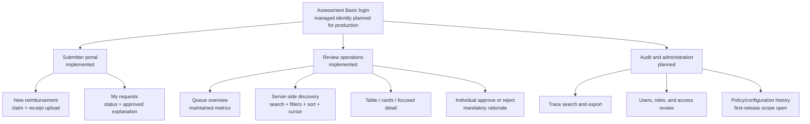
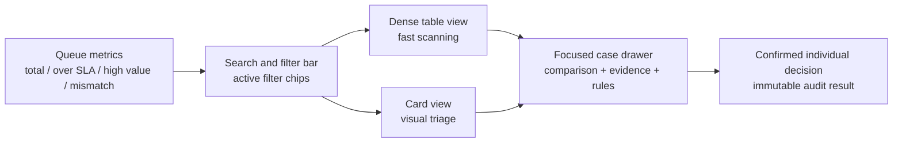
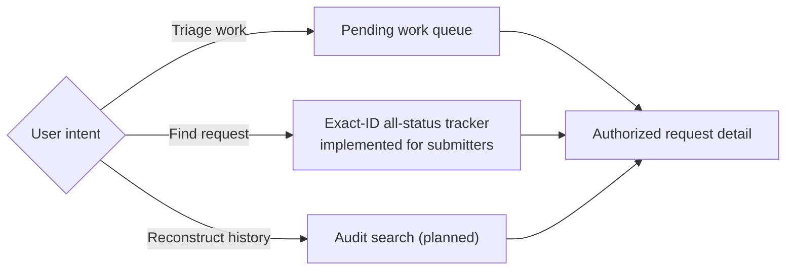
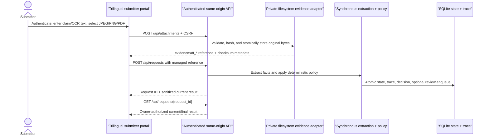

# Standalone UX, scale, and localization specification

This document defines the standalone product experience accepted in D-032
through D-035. It does not assume any existing RecargaPay frontend, identity
provider, database, CRM, or notification channel.

The implemented repository provides a trilingual submitter portal, authenticated
managed-file intake, an owner-scoped all-status tracker, and the reviewer
workspace. A privileged cross-case audit/administration surface remains
planned. The assessment stores receipt bytes in a private immutable filesystem
adapter and serves them only through a case-bound, authenticated, audited route;
versioned S3, malware scanning, and approved retention remain production work.

## Product information architecture

## Role-specific information

| Role | Primary job | Visible information | Explicitly excluded |
| --- | --- | --- | --- |
| Submitter | Create and track their own reimbursement | Their uploaded receipt, submitted facts, processing state, final outcome, and approved explanation | Model prompts/responses, another user's cases, reviewer identity, internal rule trace |
| Reviewer | Resolve cases that require judgment | Searchable pending queue, OCR source evidence, controlled original file, claimed/extracted comparison, problems, rules, policy version, and decision form | Identity administration and unrestricted technical-audit export |
| Auditor | Inspect case evidence without changing a monetary outcome | Pending queue, case detail, controlled original file, and sanitized business timeline | Decision controls and unrestricted cross-case technical-audit export |
| Administrator | Exercise all assessment capabilities for setup and demonstration | Submitter, reviewer, and auditor routes, still subject to self-review denial | A production account-lifecycle or policy-administration UI, which is not implemented |

Authentication does not imply every permission. The assessment uses closed
submitter, reviewer, auditor, and administrator roles. A submitter can read only
a request whose `submitted_by` email matches the authenticated principal;
reviewers and auditors can read review evidence; only reviewers and
administrators can decide; and no identity may decide its own reimbursement.
Reviewer/auditor visibility is still global rather than team-, region-, or
legal-entity-scoped. Production must replace Basic authentication and add those
database predicates, managed account lifecycle, MFA, and access review.

## Review operations layout

The reviewer starts from an operational worklist, not an unbounded stack of
cards. Summary metrics help select a queue; search and filters narrow it; table
or card mode changes density; case detail opens only after selection.

No bulk approve/reject control is provided. A financial decision remains an
individual, version-checked command with an authenticated actor, mandatory
rationale, and a durable `Idempotency-Key`. A transport retry reuses the same
key and original ETag; only an identical normalized command can replay the
original decision result.

## Server-side discovery contract

The browser requests a bounded page. It never downloads the complete queue and
does not perform security or policy filtering locally.

Search is applied by the server before pagination. Consequently, a matching
pending request can be returned even when it would have appeared on a later
unfiltered page; the browser does not search only its currently rendered rows.
The queue boundary is nevertheless narrow: only pending cases participate, and
free text is a literal prefix over request ID, submitter, and extracted merchant.
The separate exact-ID result API covers all retained statuses; neither endpoint
is full-text OCR/attachment/audit search.

| Control | Server behavior | Scale note |
| --- | --- | --- |
| Search | Prefix search over request ID, submitter, and merchant in the assessment | Production may use PostgreSQL trigram/full-text indexes when measured needs justify it |
| Category | Exact stable category code | Display label is localized; stored code is not |
| Problem | Exact stable problem code | Indexed relationship lookup |
| Amount | Exact minimum/maximum in minor units or fixed-scale numeric | Never use binary floating point |
| Submission date | Timezone-aware inclusive range | UI converts local calendar input to explicit UTC bounds |
| Pending age | Operational buckets calculated from one query snapshot | Cursor pages retain the first-page snapshot |
| Sort | Oldest/newest pending, amount ascending/descending, submitted newest | Every order adds request ID as a unique tie-breaker |
| Page size | 10, 25, 50, or 100 | Backend rejects values outside the bounded range |
| Pagination | Opaque query-bound keyset cursor | No increasingly expensive `OFFSET n` scans |

The first implementation may calculate queue summaries directly in SQLite for
the assessment. Production must maintain or materialize these metrics so a page
request does not scan millions of pending rows to render four cards.

Keyset navigation intentionally provides next-page traversal rather than a
random `jump to page N`. Page numbers are volatile in a live queue, and a deep
offset becomes more expensive as the queue grows. A reviewer should find a
specific request through an indexed lookup or a selective query, not by opening
pages one at a time.

## Discovery surfaces: implemented and target

The implemented pending queue answers an operational question and stays bounded
by server-side filters, stable ordering, and a cursor. The submitter portal's
exact-ID tracker calls `GET /api/requests/{request_id}` across all retained
statuses without queue traversal and relies on server-side ownership checks;
reviewers and auditors may use the same API for investigation. It is not a
completed-case list or full-text explorer. The target audit search remains a
privileged specification across events, actors, correlations, and versions; no
cross-case operational-audit screen/API exists.

Search and pagination remain subject to authorization before ordering or
limiting. A future team, region, legal-entity, or separation-of-duty scope must
therefore be part of the database predicate, not a browser-side filter.

## Case detail and original evidence

Today, the explicit request action in a table row or card opens a detail drawer.
It shows the claim, OCR source text, normalized facts, detected problems,
claimed-versus-extracted comparison, deterministic rule evaluations, policy
version, managed attachment metadata, and an independently loaded sanitized
business timeline. A managed attachment exposes an authenticated case-bound
open action; the service re-reads the immutable envelope, verifies its SHA-256
and media signature, returns the original bytes with `no-store`, and records
the file access in the operational ledger. Historical references that were
persisted before managed intake remain text-only. New HTTP intake rejects every
non-empty reference that is not a valid existing `evidence:att_*` object.

The timeline has localized labels, preserves original codes/rationale, and
exposes actor, time, event/correlation IDs, transitions, and approved scalar
payload fields with bounded cursor pagination. The API response also carries
safe model-invocation metadata and any persisted human decision, but the drawer
does not render the protected technical trace. Business events cover receipt,
processing and recovery, automated decision, review enqueue, and human
decision. A separate privacy-bounded operational ledger records every HTTP
attempt, including authentication/authorization failures, searches, case reads,
validation and server errors, upload, and file access.

The complete detail model has four sections:

1. **Evidence** — original OCR text, normalized object, claim comparison,
   problems, and deterministic rules.
2. **Business timeline** — implemented for intake, processing start/recovery,
   automated decision, review enqueue, and human decision with actors,
   timestamps, versions, and correlations. Model attempts remain separately
   protected technical records.
3. **Technical trace** — provider/model and prompt versions, hashes,
   parameters, latency, attempts, and errors. Raw provider responses remain in
   protected storage and require a separately authorized, purpose-limited,
   audited reveal when policy permits access.
4. **Original files** — the assessment implements on-demand controlled delivery
   with attachment identity, checksum, MIME type, size, case authorization, and
   an access event. Production must add S3 object-version identity, quarantine,
   malware/active-content state, approved derivatives, and lifecycle policy.

Queue and card responses must never contain original bytes, permanent signed
links, object-store credentials, or unrestricted internal storage locations.
File delivery is deliberately on demand so a reviewer retrieves only the
evidence for the selected case.

## Scale, concurrency, and consistency scenarios

The design and its production validation must account for scenarios beyond a
simple next-page demonstration:

- a request outside the first unfiltered page must still be found through the
  server-side query;
- a newly enqueued case is excluded from an already-started cursor traversal,
  while a concurrently completed case may disappear because the cursor is not
  a cross-request MVCC snapshot;
- two reviewers can open the same case; ETag/version checks allow one state
  transition, while durable command idempotency makes an identical retry return
  the original decision and rejects reuse for a different reviewer, outcome,
  rationale, request, or version. Assignment, presence, and an expiring human
  work claim remain planned to avoid duplicated effort;
- a process crash can leave an active run until its lease expires; the next
  identical intake atomically marks the old run/attempt abandoned, appends a
  recovery run and event, and prevents the late worker from deciding;
- previous-page navigation currently depends on in-memory cursor history, so a
  reload or a shared link does not restore a deep traversal;
- old cursor expiry, signing-key rotation, multi-instance key sharing, and a
  visible "new cases available" recovery path remain production requirements;
- broad one-character searches, Unicode/diacritic matching, skewed merchants,
  filter-and-sort index combinations, and authorization scopes require measured
  query plans and rate/cost controls;
- global and filtered metrics need explicit scope and freshness; calculating an
  exact global count on every keystroke or page request is not acceptable at
  million-row scale;
- original-file access needs independent latency, authorization, malware,
  expiry, failure, and audit tests rather than being coupled to queue loading.

## Localization contract

The first presentation locales are:

- `pt-BR` — Brazilian Portuguese;
- `en` — English;
- `es` — Spanish, pending confirmation of a regional content variant.

The interface uses a visible language switcher. A stored user preference may be
added after standalone identity exists; until then, a supported browser language
is used with a deterministic fallback.

### Localized

- navigation, headings, field labels, controls, and help text;
- workflow status and outcome labels;
- known category, rule, and problem labels;
- validation, loading, empty, conflict, and error messages;
- dates, times, relative durations, numbers, and currency presentation;
- accessibility names and confirmation copy.

### Never rewritten by a locale switch

- request IDs, status enums, rule IDs/versions, problem codes, and event types;
- exact stored monetary values and currency;
- original receipt and OCR text;
- raw provider responses and invocation trace;
- a human reviewer's original rationale;
- audit timestamps, identities, hashes, and correlations.

If a future feature produces a translation of evidence, it is a separately
labeled derivative with source language, target language, provider/version,
input/output hashes, and timestamp. It never replaces the original.

## Implemented standalone submitter journey

The portal derives `submitted_by` from the authenticated session rather than a
free-form identity field. The browser submits one bounded file, and public HTTP
intake accepts only the managed reference returned by the upload route; an
empty list remains valid but prevents automatic approval. The exact-ID tracker
searches the retained database, not only the current page, and the API returns
`404` for another submitter's request. The assessment still depends on
caller-supplied OCR text and runs synchronously. Production replaces the local
store and synchronous pipeline with versioned S3 quarantine and durable queue
workers while preserving the same domain and authorization invariants.

## Accessibility and safe interaction

- Full form labels, semantic tables, live regions, visible focus, skip links,
  and keyboard shortcuts complement pointer interaction.
- Table and card views expose the same cases and actions; neither is the only
  accessible path.
- Color is never the only status signal.
- All OCR, merchant, filename, and rationale values are inserted as text nodes,
  never executable HTML.
- Sensitive case data and tokens are not persisted in browser storage.
- Loading, empty, filtered-empty, server error, stale version, and competing
  decision are separate states with actionable recovery.
- Managed evidence opens only through the authenticated case-bound route;
  legacy reference strings are explicitly identified as unavailable.

## Current validation evidence

Both the submitter and reviewer slices were exercised in a real browser with
`pt-BR`, `en`, and `es`. The submitter run verified session-derived identity
survives locale changes, canonical `transportation`, a 128-bit request-ID
suffix, and same-origin API construction. The reviewer run covered queue search,
table/card and focused detail, claimed-versus-extracted comparison, OCR,
structured extraction, rules, managed original, business timeline, and one
confirmed individual decision. A prior 16-case QA dataset produced a 10-item
first cursor page and a six-item second page with no repeated request ID. The
decision returned HTTP 201, refreshed the queue and KPI summary, and displayed
its audit-event ID. Final browser warnings/errors were empty.

Automated coverage checks translation-catalog key parity, bounded controls,
cursor navigation wiring, safe DOM use, absence of sensitive browser storage,
distinct loading/error/empty/result states, arbitrary stable category/problem
codes, the absence of dead external navigation, and a target that is outside
the first unfiltered page but found by a new server-side search. Timeline tests
also cover its independent loading/error/empty/content states, retry/load-more
wiring, defensive payload whitelist, trilingual catalog parity, deduplication,
and signed pagination contract. Authorization tests cover route capabilities,
cross-submitter concealment, auditor read-only behavior, and self-review denial.
Evidence tests cover bounded uploads, media signatures, checksum revalidation,
case-bound reads, decision-time fail-closed approval, reasoned degraded-evidence
rejection, and operational access audit. This is functional and UX
evidence for the assessment; it is not a production load test.

## Scale and usability validation still required

Before claiming production readiness, test with representative distributions
at one million and ten million cases, including skewed categories, old queues,
large merchants, and concurrent decisions. Record:

- P50/P95/P99 queue query and detail latency;
- rows examined and query plans for each filter/sort combination;
- cursor duplicate/omission behavior during concurrent intake and decisions;
- summary freshness and update cost;
- initial page weight, render time, keyboard task completion, and screen-reader
  behavior;
- task-completion time and error rate for real reviewers in all three locales.

Targets must be approved with product and infrastructure owners; the
architecture alone is not proof that the million-case SLO has been met.
