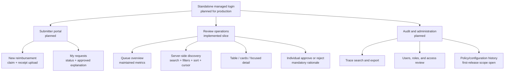
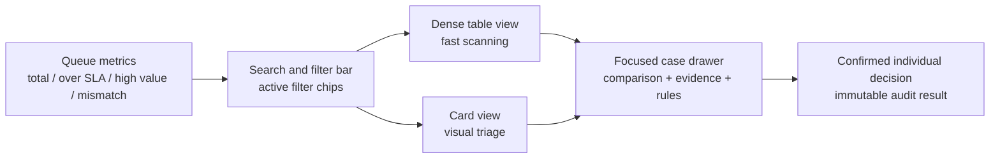
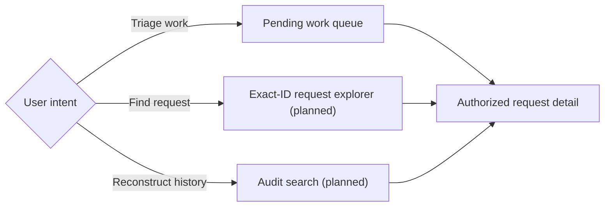
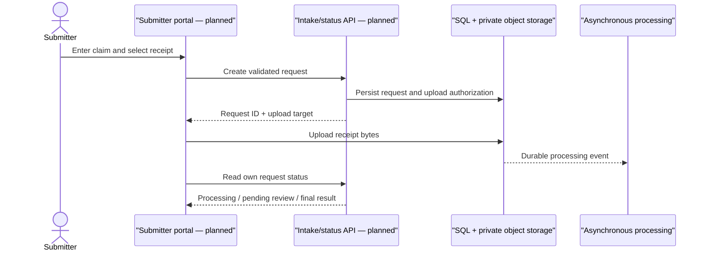

# Standalone UX, scale, and localization specification

This document defines the standalone product experience accepted in D-032
through D-035. It does not assume any existing RecargaPay frontend, identity
provider, database, CRM, or notification channel.

The implemented repository still covers the authenticated reviewer slice. The
submitter and audit/administration surfaces below are required product scope but
remain planned until their APIs and persistence are implemented.

## Product information architecture

## Role-specific information

| Role | Primary job | Visible information | Explicitly excluded |
| --- | --- | --- | --- |
| Submitter | Create and track their own reimbursement | Uploaded receipt, submitted facts, processing state, final outcome, approved explanation | Model prompts/responses, another user's cases, reviewer identity, internal rule trace |
| Reviewer | Resolve cases that require judgment | Searchable pending queue, OCR source evidence, attachment references, claimed/extracted comparison, problems, rules, policy version, decision form | Identity administration and unrestricted audit export |
| Auditor | Reconstruct who did what, when, why, and with which versions | Immutable decisions/events, actors, correlations, policy/model/input/output hashes, before/after states | Ability to alter a financial decision |
| Administrator | Operate access and approved configuration | Invitations, roles, deprovisioning, access reviews, operational configuration history | Financial approval merely because the user is an administrator |

Authentication does not imply every permission. Authorization is enforced by
route and object, and separation-of-duty rules remain an explicit production
policy decision.

## Review operations layout

The reviewer starts from an operational worklist, not an unbounded stack of
cards. Summary metrics help select a queue; search and filters narrow it; table
or card mode changes density; case detail opens only after selection.

No bulk approve/reject control is provided. A financial decision remains an
individual, version-checked command with an authenticated actor and mandatory
rationale.

## Server-side discovery contract

The browser requests a bounded page. It never downloads the complete queue and
does not perform security or policy filtering locally.

Search is applied by the server before pagination. Consequently, a matching
pending request can be returned even when it would have appeared on a later
unfiltered page; the browser does not search only its currently rendered rows.
The current boundary is nevertheless narrow: only pending cases participate,
and free text is a literal prefix over request ID, submitter, and extracted
merchant. This assessment behavior must not be described as all-status,
full-text, OCR, attachment, or audit search.

| Control | Server behavior | Scale note |
| --- | --- | --- |
| Search | Prefix search over request ID, submitter, and merchant in the assessment | Production may use PostgreSQL trigram/full-text indexes when measured needs justify it |
| Category | Exact stable category code | Display label is localized; stored code is not |
| Problem | Exact stable problem code | Indexed relationship lookup |
| Amount | Exact minimum/maximum in minor units or fixed-scale numeric | Never use binary floating point |
| Submission date | Timezone-aware inclusive range | UI converts local calendar input to explicit UTC bounds |
| Pending age | Operational buckets calculated from one query snapshot | Cursor pages retain the first-page snapshot |
| Sort | Oldest/newest pending, amount ascending/descending, submitted newest | Every order adds request ID as a unique tie-breaker |
| Page size | 10, 25, 50, or 100 | Backend rejects values outside the bounded range |
| Pagination | Opaque query-bound keyset cursor | No increasingly expensive `OFFSET n` scans |

The first implementation may calculate queue summaries directly in SQLite for
the assessment. Production must maintain or materialize these metrics so a page
request does not scan millions of pending rows to render four cards.

Keyset navigation intentionally provides next-page traversal rather than a
random `jump to page N`. Page numbers are volatile in a live queue, and a deep
offset becomes more expensive as the queue grows. A reviewer should find a
specific request through an indexed lookup or a selective query, not by opening
pages one at a time.

## Discovery surfaces: implemented and target

The implemented pending queue answers an operational question and stays bounded
by server-side filters, stable ordering, and a cursor. The target exact-ID
request explorer answers a support or investigation question across all
statuses without requiring queue traversal. The target audit search answers a
privileged evidentiary question across events, actors, correlations, and
versions. The latter two user experiences are specifications only. The existing
detail-by-ID route can retrieve a known case, but there is no discoverable
all-status explorer, dedicated support/audit authorization contract, or audit
search screen/API.

Search and pagination remain subject to authorization before ordering or
limiting. A future team, region, legal-entity, or separation-of-duty scope must
therefore be part of the database predicate, not a browser-side filter.

## Case detail and original evidence

Today, the explicit request action in a table row or card opens a detail drawer.
It shows the claim, OCR source text, normalized facts, detected problems,
claimed-versus-extracted comparison, deterministic rule evaluations, policy
version, attachment-location strings, and an independently loaded sanitized
business timeline. The timeline has localized labels, preserves original
codes/rationale, and exposes actor, time, event/correlation IDs, transitions,
and approved scalar payload fields with bounded cursor pagination. The API
response also carries safe model-invocation metadata and any persisted human
decision, but the current drawer does not render the technical trace. This is
useful decision context, but it is not yet a complete traceability workspace:
only enqueue and human-decision events exist, the read is not recorded as an
audit event, the protected raw model response is withheld, and original file
bytes cannot be previewed or downloaded.

The target detail experience has four sections:

1. **Evidence** — original OCR text, normalized object, claim comparison,
   problems, and deterministic rules.
2. **Business timeline** — implemented for enqueue and human-decision events
   with state changes, actors, rationale, timestamps, request versions, and
   correlations; intake/OCR/model/retry/access events remain future coverage.
3. **Technical trace** — provider/model and prompt versions, hashes,
   parameters, latency, attempts, and errors. Raw provider responses remain in
   protected storage and require a separately authorized, purpose-limited,
   audited reveal when policy permits access.
4. **Original files** — on-demand controlled preview or download with attachment
   identity, checksum, version, MIME type, size, scan status, object-level
   authorization, short-lived delivery, and an immutable access event.

Queue and card responses must never contain original bytes, permanent signed
links, object-store credentials, or unrestricted internal storage locations.
File delivery is deliberately on demand so a reviewer retrieves only the
evidence for the selected case.

## Scale, concurrency, and consistency scenarios

The design and its production validation must account for scenarios beyond a
simple next-page demonstration:

- a request outside the first unfiltered page must still be found through the
  server-side query;
- a newly enqueued case is excluded from an already-started cursor traversal,
  while a concurrently completed case may disappear because the cursor is not
  a cross-request MVCC snapshot;
- two reviewers can open the same case; the implemented ETag and transactional
  version check prevent two final decisions, but assignment, presence, and an
  expiring work claim remain planned to avoid duplicated effort;
- previous-page navigation currently depends on in-memory cursor history, so a
  reload or a shared link does not restore a deep traversal;
- old cursor expiry, signing-key rotation, multi-instance key sharing, and a
  visible "new cases available" recovery path remain production requirements;
- broad one-character searches, Unicode/diacritic matching, skewed merchants,
  filter-and-sort index combinations, and authorization scopes require measured
  query plans and rate/cost controls;
- global and filtered metrics need explicit scope and freshness; calculating an
  exact global count on every keystroke or page request is not acceptable at
  million-row scale;
- original-file access needs independent latency, authorization, malware,
  expiry, failure, and audit tests rather than being coupled to queue loading.

## Localization contract

The first presentation locales are:

- `pt-BR` — Brazilian Portuguese;
- `en` — English;
- `es` — Spanish, pending confirmation of a regional content variant.

The interface uses a visible language switcher. A stored user preference may be
added after standalone identity exists; until then, a supported browser language
is used with a deterministic fallback.

### Localized

- navigation, headings, field labels, controls, and help text;
- workflow status and outcome labels;
- known category, rule, and problem labels;
- validation, loading, empty, conflict, and error messages;
- dates, times, relative durations, numbers, and currency presentation;
- accessibility names and confirmation copy.

### Never rewritten by a locale switch

- request IDs, status enums, rule IDs/versions, problem codes, and event types;
- exact stored monetary values and currency;
- original receipt and OCR text;
- raw provider responses and invocation trace;
- a human reviewer's original rationale;
- audit timestamps, identities, hashes, and correlations.

If a future feature produces a translation of evidence, it is a separately
labeled derivative with source language, target language, provider/version,
input/output hashes, and timestamp. It never replaces the original.

## Planned standalone submitter journey

This is a required standalone experience, but the current executable does not
yet provide these routes or screens.

## Accessibility and safe interaction

- Full form labels, semantic tables, live regions, visible focus, skip links,
  and keyboard shortcuts complement pointer interaction.
- Table and card views expose the same cases and actions; neither is the only
  accessible path.
- Color is never the only status signal.
- All OCR, merchant, filename, and rationale values are inserted as text nodes,
  never executable HTML.
- Sensitive case data and tokens are not persisted in browser storage.
- Loading, empty, filtered-empty, server error, stale version, and competing
  decision are separate states with actionable recovery.
- The detail view identifies attachment preview as unavailable until an
  authenticated object-level path is implemented.

## Current validation evidence

The reviewer slice is implemented and was exercised in a real browser with
`pt-BR`, `en`, and `es`; a `client_meal` filter and localized chip; table, card,
and focused-detail views; claimed-versus-extracted comparison; and an individual
confirmed decision. A 16-case QA dataset produced a 10-item first cursor page
and a six-item second page with no repeated request ID. The decision returned
HTTP 201, refreshed the queue and KPI summary, displayed its audit-event ID, and
produced no browser log errors.

Automated coverage checks translation-catalog key parity, bounded controls,
cursor navigation wiring, safe DOM use, absence of sensitive browser storage,
distinct loading/error/empty/result states, arbitrary stable category/problem
codes, the absence of dead external navigation, and a target that is outside
the first unfiltered page but found by a new server-side search. Timeline tests
also cover its independent loading/error/empty/content states, retry/load-more
wiring, defensive payload whitelist, trilingual catalog parity, deduplication,
and signed pagination contract. This is functional and UX evidence for the
reviewer slice; it is not a production load test, and this timeline increment
did not receive a new manual browser run.

## Scale and usability validation still required

Before claiming production readiness, test with representative distributions
at one million and ten million cases, including skewed categories, old queues,
large merchants, and concurrent decisions. Record:

- P50/P95/P99 queue query and detail latency;
- rows examined and query plans for each filter/sort combination;
- cursor duplicate/omission behavior during concurrent intake and decisions;
- summary freshness and update cost;
- initial page weight, render time, keyboard task completion, and screen-reader
  behavior;
- task-completion time and error rate for real reviewers in all three locales.

Targets must be approved with product and infrastructure owners; the
architecture alone is not proof that the million-case SLO has been met.
